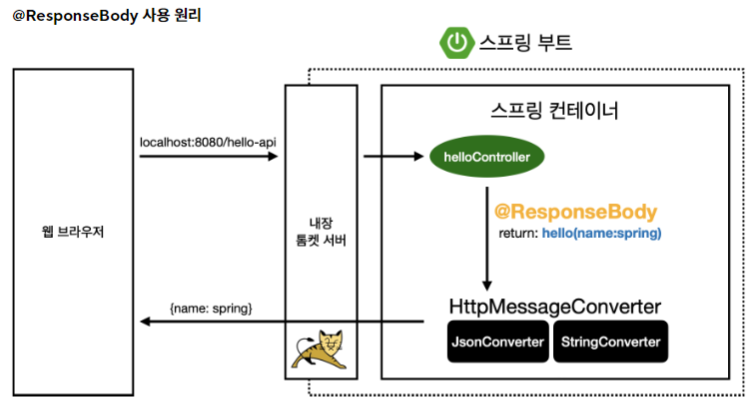

## HTTP 메세지 컨버터란?
- **뷰 템플릿**으로 **HTMl을 생성하는게 아니라**, HTTP API처럼 JSON 데이터를 **HTTP 메시지 바디에서 직접 읽거나 쓰는 경우** 사용하는 기능


## ResponseBody 동작 흐름
- HTTP 컨버터가 작동하는 시기를 알려면, **ResponseBody의 동작 흐름**을 알아야한다. 

### ResponseBody 흐름도




1. `@ResponseBody`가 HTTP의 Body에 있는 **문자 내용을 그대로 반환**한다.
2. `viewResolver` 대신 `StringHttpMessageConverter`가 동작한다.
3. 기본적으로 문자는 `StringHttpMessageConverter`, 객체는 `MappingJackson2HttpMessageConverter`가 동작한다.
4. Response의 경우 HTTP Accept 헤더로 반환타입을 조회해서 선택한다. `Content-Type Header와는 다르다!`


### HttpMessageConverter 구조

``` java
public interface HttpMessageConverter<T> {  
    boolean canRead(Class<?> clazz, @Nullable MediaType mediaType);  
  
    boolean canWrite(Class<?> clazz, @Nullable MediaType mediaType);  
  
    List<MediaType> getSupportedMediaTypes();  
  
    default List<MediaType> getSupportedMediaTypes(Class<?> clazz) {  
        return !this.canRead(clazz, (MediaType)null) && !this.canWrite(clazz, (MediaType)null) ? Collections.emptyList() : this.getSupportedMediaTypes();  
    }  
  
    T read(Class<? extends T> clazz, HttpInputMessage inputMessage) throws IOException, HttpMessageNotReadableException;  
  
    void write(T t, @Nullable MediaType contentType, HttpOutputMessage outputMessage) throws IOException, HttpMessageNotWritableException;  
}
```

- canRead(), canWrite() : 메세지 컨버터가 해당 **클래스 타입**, **미디어 타입**을 지원하는지 체크한다.
- read(), write() : 메세지 컨버터를 통해서 메세지를 읽고 쓰는 기능이다.


#### 스프링 부트 기본 메시지 컨버터
- 기본 컨버터의 종류에는 여러가지가 있다.

``` 
0 = ByteArrayHttpMessageConverter
1 = StringHttpMessageConverter
2 = MappingJackson2HttpMessageConverter
...
```


#### 1. HTTP 요청 데이터 읽기
- HTTP 요청이 들어오면, 컨트롤러에서 `@RequestBody`, `HttpEntity` 파라미터를 호출하고 `canRead()`로 검사한다. `클래스 타입 지원 여부, Content-Type 지원 여부`
- 만약 `canRead()`의 조건을 만족하면 read()를 호출해 객체를 생성하고 반환한다.
- 조건을 만족하지 못하면 다음 우선순위 컨버터로 넘어간다.

#### 2. HTTP 응답 데이터 생성
- 컨트롤러에서 `@RequestBody`, `HttpEntity`로 값을 반환하고 `canWrite()`로 조건을 검사한다. `클래스 타입 지원 여부, Accept 미디어 타입 지원여부 `
- 조건을 만족하면 `write()`를 호출하고, HTTP 응답 메세지 바디에 데이터를 생성한다.
- 조건을 만족하지 못하면 다음 우선순위 컨버터로 넘어간다.


#### 예시)
```
content-type: application/json

@RequestMapping
void hello(@RequetsBody String data){}
```
1. `canRead()`로 **0번 기준으로 검사** => Byte 형식이 아님 => **다음 컨버터로 넘어감**
2. `canRead()`로 **1번 기준으로 검사** => String 형식이 맞음 => Content-Type 맞음  
3. 조건에 다 부합하므로 **1번 메세지 컨버터로 동작**


이것이 어디에 쓰이는지를 알기 위해서는 `핸들러 어댑터 구조`에 대해 자세히 알아야 한다. 


출처: https://www.inflearn.com/course/스프링-mvc-1/dashboard
