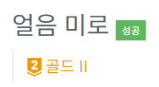

[문제 링크](https://www.acmicpc.net/problem/20926)
# created : 2024-06-03

``` java
import java.util.*;
import java.io.*;
public class Main {

    static int N,M,ans;

    public static void main(String[] args) throws IOException{
        BufferedReader br= new BufferedReader(new InputStreamReader(System.in));

        StringTokenizer st= new StringTokenizer(br.readLine());
        ans = Integer.MAX_VALUE;
        N = Integer.parseInt(st.nextToken());
        M = Integer.parseInt(st.nextToken());

        int[][] arr = new int[M][N];

        int y = 0;
        int x = 0;


        for (int i = 0; i < M; i++) {
            String s = br.readLine();
            for (int j = 0; j < N; j++) {
                if(0<=s.charAt(j) && s.charAt(j)<='9') arr[i][j] = Integer.parseInt(s.charAt(j)+"");
                if(s.charAt(j)=='T'){
                    arr[i][j] = -1; // 테라 자신
                    y = i;
                    x = j;
                }
                if(s.charAt(j)=='R') arr[i][j] = -2; // 바위
                if(s.charAt(j)=='H') arr[i][j] = -3; // 구멍
                if(s.charAt(j)=='E') arr[i][j] = -4; // 출구


            }
        }


        GoToExit(y,x,arr);
        if(ans==Integer.MAX_VALUE) System.out.println(-1);
        else System.out.println(ans);
    }

    static void GoToExit(int y, int x, int[][] arr) {

        PriorityQueue<int[]> q = new PriorityQueue<>((o1, o2) -> o1[2]-o2[2]);

        int[][] check =new int[M][N];

        for (int i = 0; i < M; i++) {
            for (int j = 0; j < N; j++) {
                check[i][j] = Integer.MAX_VALUE;
            }
        }

        int [][] dx = {{0,1},{1,0},{0,-1},{-1,0}}; // 좌 하 우 상 순으로 이동

        q. add(new int[]{y,x,0});
        check[y][x] = 0;


        while(!q.isEmpty()){
            int[] now = q.poll();

            int v = now[2];

            if(v>=ans)break;
            for (int i = 0; i < 4; i++) {
                int dt = v;
                int dely = now[0];
                int delx = now[1];
            while(true){
                dely += dx[i][0];
                delx += dx[i][1];
                if(dely<0 || dely>=M || delx<0 || delx>=N) break;
                if(dt>=ans)break;


                if(arr[dely][delx]==-2){
                    int nowy = dely-dx[i][0];
                    int nowx = delx-dx[i][1];

                    if(check[nowy][nowx]<=dt)break;
                    else{
                    q.add(new int[]{nowy,nowx,dt});

                        check[nowy][nowx] = dt;
                        break;
                    }

                }

                if(arr[dely][delx] ==-3)break;
                if(arr[dely][delx]==-4){
                    ans = Math.min(ans,dt);
                    break;
                }

                dt = dt+arr[dely][delx];
            }
        }

    }

    }
}
```
## 떠올린 접근 방식, 과정

**최단경로**이므로 기본적으로 `BFS`로 조건에 맞게 탐색한 후, 
**시간 복잡도 최적화**를 위해 check 배열을 사용해 **최소값을 갱신**한다.

## 알고리즘과 판단 사유

`다익스트라(Dijkstra)`

## 시간복잡도

우선순위 큐로 최적화 시켰으므로 `O(NlogN)`

## 오류 해결 과정

``` java
                if(arr[dely][delx] ==-3)break;
```
해당 부분을 check 배열로 잘못써서 계속 시간초과가 났었다....

## 개선 방법
없을 것 같다!
