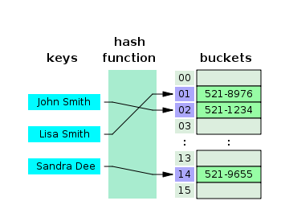
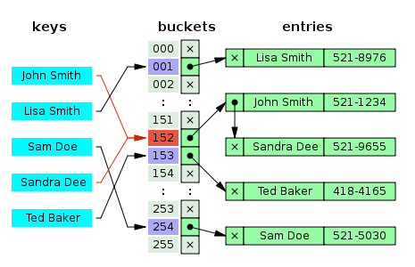
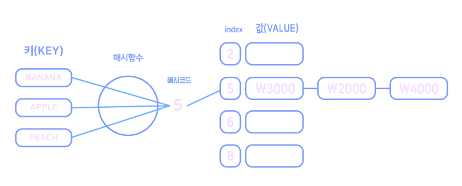
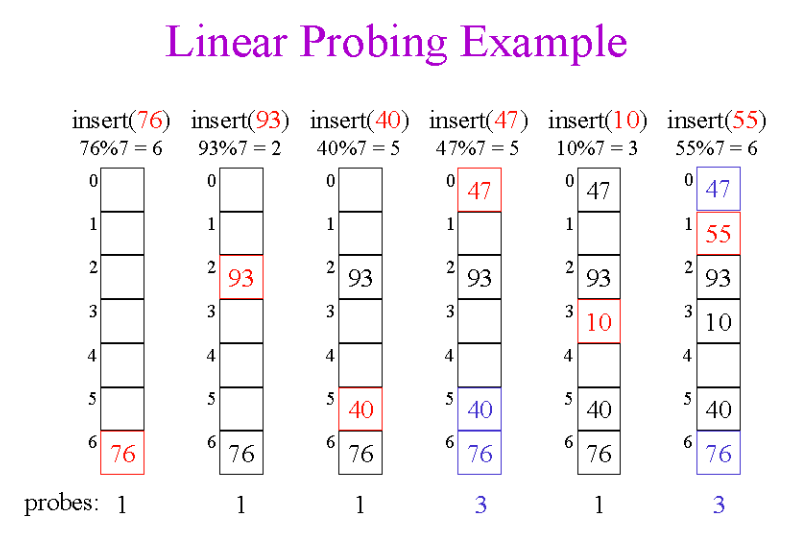
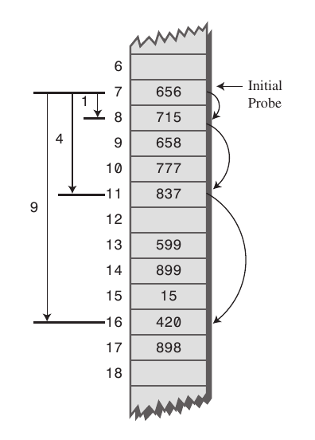

# 해시 테이블

**Key**, **Value**로 데이터를 저장하는 자료 구조 중 하나로
데이터를 빠르게 검색할 수 있는 자료구조를 말한다!

검색속도가 빠른 이유는, **내부적**으로 **배열**을 사용해서 데이터를 저장하기 때문이다.
각각의 **Key 값에 해시 함수**를 적용해 배열의 고유한 index를 지정하고, 
이 값을 이용해 저장, 검색 등이 이루어진다.

여기서 실제 저장되는 위치를 `버킷` 또는 `슬롯` 이라고 한다.

	해시 테이블의 평균 시간 복잡도는 O(1)이지만, 
	충돌이 발생할 경우 최대 O(N)까지 증가한다.

## 해시 함수 

대표적인 해시 함수 몇 가지를 설명하면,
1. **Devision Method** : 입력값을 테이블의 크기로 나누어 사용
2. **Digit Folding** : 각 Key 문자열을 ASCII 코드로 바꾸고 합한 데이터를 주소로 사용
3. **Multiplication Method** : 숫자로 된 Key 값과 0과1 사이의 실수, 2의 제곱수인 m을 가지고 계산$$h(k)=(kAmod1) × m$$
4. **Univeral Hashing** : 다양한 해시함수를 미리 만들고, 그중에서 무작위로 선택
...

자바는 기본적으로 **Object()** 객체에 **hashCode()** 메서드를 제공하고, 
오버라이딩 하지 않을 경우에는 **메모리를 기반**으로 작동한다!

# Hash값 충돌

하지만 우연히, 극악의 확률로 분명 다른 값으로 해시코드를 생성했는데, 
**동일한 해시 값**이 나올 수도 있다.
이런 경우에는 어떻게 해결할까?

## 1. 분리 연결법 `Separate Chaining`

동일한 버킷에 저장되어야 하는 데이터에 자료구조`Linked List / Tree`를 사용해 체인을 걸어, 추가 메모리를 사용해 다음 데이터의 주소를 저장해 놓는 방식이다.

#### 장점 

테이블의 **확장**을 상대적으로 늦출 수 있다.
	**확장**은 O(m) `m은 Key의 개수`의 시간복잡도가 걸리기 때문에 **최적화**에 좋지 않다.

#### 단점

동일 버킷에 체인되는 데이터가 많아지면 **캐시의 효율성**이 감소한다.

## 2.개방 주소법 `Open Addressing`

개방 주소법은 분리 연결법과는 다르게 **추가적인 메모리**를 사용하지 않고, 
비어있는 해시테이블의 **공간**을 사용하는 방법이다.

### Linear Probing

현재의 버킷 index로부터 고정폭 만큼 **순서대로** 이동하며  검색 비어있는 버킷을 찾으면, 그 곳에 데이터를 저장한다.

#### 장점

	계산이 단순하다
	캐시 효율이 좋다

#### 단점

	최악의 경우 탐색을 시작한 위치로 다시 되돌아 온다 `O(N)`
	특정 해시 값 버킷 근처에 값들이 뭉쳐, 
	평균 검색시간이 늘어난다 `Primary Clusting`

### Quadratic Probing 

해시의 저장 순서 폭을 **제곱근** 방식을 사용한다. `1,4,9...`

#### 장점

	선형 탐사에 비해 폭 넓게 탐사해 앞선 문제들이 해결된다.

#### 단점

	Primary Clustering 보다는 덜 하지만 Secondary Clustering 문제가 발생한다.
	Secondary Clustering : 충돌한 위치가 같으면 계속 같은곳에 충돌하는 문제

### Double Hashing Probing  

충돌이 생기면 해싱된 값에 한번더 **이중**으로 해싱하는 방법

#### 장점
	클러스터링에 영향이 없다.

#### 단점
	값이 퍼지게 되어 캐시 측면에서 비효율적이다
	연산을 두번씩하므로 비효율적이다

## 해시 테이블 주의 사항

1. 충돌을 방지하는 방법들은 **데이터 규칙성**을 유지하기 위한 방식이지만, 공간을 많이 차지한다.
2. 테이블의 크기를 잘못 설계해서 중간에 **확장**을 하게되면 **심각한 성능 저하**가 발생한다.
   `공간 사용률 70~80%에서 충돌이 빈번하게 일어나고, 성능저하가 시작된다.`
3. 자주 사용하는 데이터를 캐시`Cache` 해놓으면 성능이 향상 된다.

 
 
 

#### 참고 내용 : 
https://velog.io/@dlgosla/CS-자료구조-해시-테이블-Hash-Table-개념-정리-wb6g3iw0
https://mangkyu.tistory.com/102
