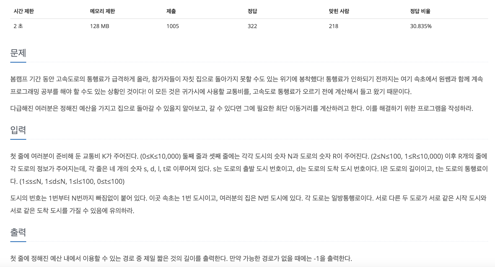

[문제 링크](https://www.acmicpc.net/problem/1884)
# created : 2024-06-07

## 문제




## 떠올린 접근 방식, 과정

시작점이 정해진 **최단경로**이므로 **다익스트라**를 사용한다!
하지만 **조건이 두개 이상**이기 때문에 한가지 기준에 따른 다익스트라를 돌린후, 
조건에 맞추어 순회해서 정답을 구한다.

## 알고리즘과 판단 사유

다익스트라

## 시간복잡도

O(NlogN)

## 오류 해결 과정

조건이 여러개인 다익스트라는 처음이라 2차원 배열로 결과값을 저장하는걸 떠올리지 못했다...
## 개선 방법

점화식을 생성해서 DP로도 가능할 것 같다!

## 풀이 코드

``` java
import java.util.*;
import java.io.*;
public class Main {
    public static void main(String[] args) throws IOException{
        BufferedReader br = new BufferedReader(new InputStreamReader(System.in));

        int K = Integer.parseInt(br.readLine()); //교통비
        int N = Integer.parseInt(br.readLine()); //도시의 개수
        int R = Integer.parseInt(br.readLine()); //도로의 개수

        List<int[]>[] arr = new List[N+1]; //0은 사용하지 않음

        for (int i = 0; i < N + 1; i++) {
            arr[i] = new ArrayList<>();
        }

        int max = 0;
        for (int i = 0; i < R; i++) {
            StringTokenizer st= new StringTokenizer(br.readLine());

            int s = Integer.parseInt(st.nextToken()); //출발 도시
            int e = Integer.parseInt(st.nextToken()); //도착 도시
            int dt = Integer.parseInt(st.nextToken()); //도시간의 거리
            int v = Integer.parseInt(st.nextToken()); //해당 도로의 통행료
            
            max = Math.max(max,v);
            
            arr[s].add(new int[]{e,dt,v});
        }

        int[][] dt = new int[N+1][K+1];

        for (int i = 0; i < N + 1; i++) {
            for (int j = 0; j < K + 1; j++) {
                dt[i][j] =Integer.MAX_VALUE; //다익스트라 위한 최대값으로 초기화
            }
        }

        Dijkstra(1,dt,arr,K);

        int ans = Integer.MAX_VALUE;

        for (int i = 1; i <K+1 ; i++) {
            ans = Math.min(ans,dt[N][i]); //기준에 맞게 도착한 값 중에 최소값 구하기
        }
        if(ans==Integer.MAX_VALUE) System.out.println(-1);
        else System.out.println(ans);
    }
    static void Dijkstra(int start,int[][]dt,List<int[]>[]arr,int max) {

        PriorityQueue<int[]> pq = new PriorityQueue<>((o1, o2) -> o1[1]-o2[1]);
        pq.add(new int[]{start,0,0});

        while (!pq.isEmpty()) {
            int[] temp = pq.poll();
            
            int nowDt = temp[1];
            int nowV = temp[2];
            
            if(nowV>max)continue;

            for (int[] ints : arr[temp[0]]) {
                int e = ints[0]; // 목적지
                int distance = ints[1]; //거리
                int v = ints[2]; // 통행료
                
                int nextDt = nowDt + distance;
                int nextV = nowV+v;
                
                if(nextV>max)continue;

                if(dt[e][nextV]>nextDt){
                    dt[e][nextV] = nextDt;
                    pq.add(new int[]{e,distance+nowDt,nextV});
                }
            }


        }

    }
}
```
