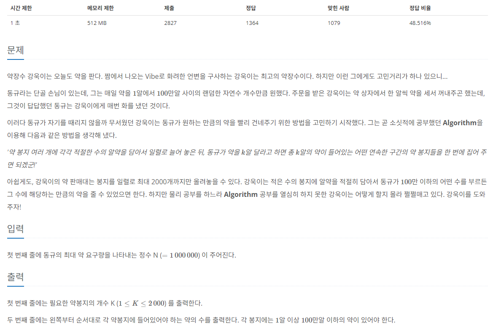

[문제 링크](https://www.acmicpc.net/problem/15311)
# created : 2024-06-08

## 문제




## 떠올린 접근 방식, 과정

100만 까지의 수를 특정 숫자의 합으로 나타내는 문제이다.
처음에는 범위가 2000까지여서 **1부터 2000까지 전부 더해봤는데 100만**이 넘었다.
그래서 1부터 차례대로 넣고 뽑는 식으로 구현할려 했는데, **연속된 범위**가 발목을 잡았다..
100만까지의 수를 표현하는데 필요한 숫자를 대략적으로 더해보면서 **범위를 좁혔고**,
1000이 **1000개만 있어도 100만까지 표현**이 가능하다는 것을 알게되었다! `사실 너무나 당연한 내용`
따라서 1~1000까지는 1을 1000개에 포장해서 표현하고, 
1000~100만 까지는 1000을 1000개에 포장해서 표현하기로 했다!

## 알고리즘과 판단 사유

구현

## 시간복잡도

O(N)

## 오류 해결 과정

문제 이해를 잘못해서 해당 수가 주어지면, 
그에 해당하는 약 봉투의 수와 알약 수를 출력하는 줄 알고 시간을 날렸다...

## 개선 방법

없을 것 같다!


## 풀이 코드

``` java
import java.util.*;
import java.io.*;
public class Main {
    public static void main(String[] args) throws IOException{
        BufferedReader br = new BufferedReader(new InputStreamReader(System.in));

        int N = Integer.parseInt(br.readLine());
        StringBuilder sb = new StringBuilder();
        int cnt =0;

        while(N>=1000){ // 1000개 개수 측정
            N-=1000;
            cnt+=1;
        }


        System.out.println(1999);


        for (int i = 0; i < 999; i++) {
            sb.append(1).append(" ");
        }

        for (int i = 0; i < 1000; i++) {
            sb.append(1000).append(" ");
        }
        System.out.println(sb.toString().trim());
    }
}
```
