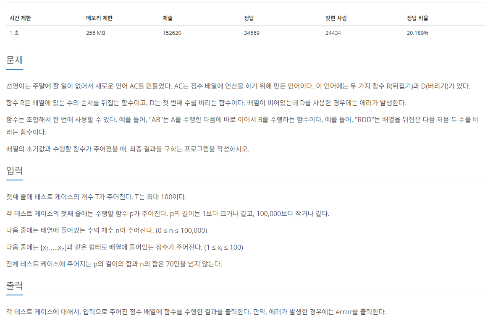

[문제 링크](https://www.acmicpc.net/problem/5430)
# created : 2024-06-08

## 문제




## 떠올린 접근 방식, 과정

조건에 맞추어 **문자열을 파싱**해서 출력한다!

## 알고리즘과 판단 사유

구현

## 시간복잡도

O(N)

## 오류 해결 과정

처음에는 아무생각없이 일반 구현인 줄 알고 회전 명령이 들어오는대로 처리를 했더니 **시간초과**가 났다...
**일괄적으로 명령을 받아** 범위만 확정지은 후에 파싱하는 방법으로 해결했다!
또한 **O(N)**의 시간 복잡도를 유지하기위해 **자바 컬렉션의 Deque**를 사용했다.
## 개선 방법

잘 모르겠다

## 풀이 코드

``` java
import java.util.*;
import java.io.*;
public class Main {
    public static void main(String[] args) throws IOException {
        BufferedReader br = new BufferedReader(new InputStreamReader(System.in));

        int N = Integer.parseInt(br.readLine());
        StringBuilder sb = new StringBuilder();

        for (int i = 0; i < N; i++) {
            String method = br.readLine();
            int len = Integer.parseInt(br.readLine());
            String arr = br.readLine();
            arr = arr.substring(1, arr.length() - 1);

            Deque<String> deque = new LinkedList<>(Arrays.asList(arr.split(",")));
            boolean rot = false;
            boolean isError = false;

            for (char cmd : method.toCharArray()) {
                if (cmd == 'R') {
                    rot = !rot;
                } else {
                    if (deque.isEmpty() || deque.peek().equals("")) {
                        sb.append("error\n");
                        isError = true;
                        break;
                    }
                    if (rot) {
                        deque.removeLast();
                    } else {
                        deque.removeFirst();
                    }
                }
            }

            if (!isError) {
                sb.append("[");
                while (!deque.isEmpty()) {
                    if (rot) {
                        sb.append(deque.removeLast());
                    } else {
                        sb.append(deque.removeFirst());
                    }
                    if (!deque.isEmpty()) {
                        sb.append(",");
                    }
                }
                sb.append("]\n");
            }
        }
        System.out.print(sb);
    }
}
```
