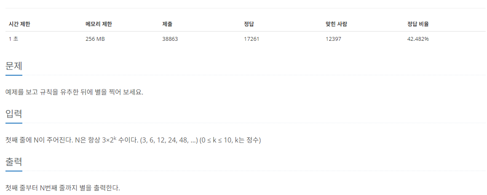
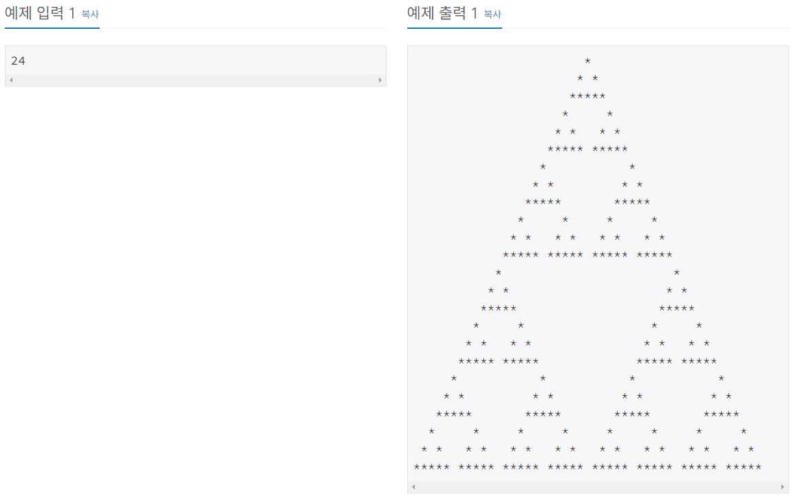

[문제 링크](https://www.acmicpc.net/problem/2448)
# created : 2024-06-09

## 문제




## 떠올린 접근 방식, 과정

먼저 구간별로 반복되는 형태를 찾아 **반복되는 로직**을 정했다.
찾다보니 **삼각형**이 반복되는 것을 알 수 있었고, 그 좌표의 규칙을 찾아
**재귀**로 반복시켰다!

## 알고리즘과 판단 사유

재귀

## 시간복잡도

O(N^2)

## 오류 해결 과정

처음 로직을 떠올리는게 오래걸렸다..

## 개선 방법

없을 것 같다!

## 풀이 코드

``` java
import java.util.*;
import java.io.*;
public class Main {
    public static void main(String[] args) throws IOException{
        BufferedReader br = new BufferedReader(new InputStreamReader(System.in));

        int N = Integer.parseInt(br.readLine());

        int size = (int)Math.pow(2,N)*3;
        String[][] arr = new String[N][N*2];
        for (int i = 0; i < arr.length; i++) {
            Arrays.fill(arr[i], " ");
        }
        makeStar(N,0,N,arr);

        BufferedWriter bw = new BufferedWriter(new OutputStreamWriter(System.out));
        for (int i = 0; i < arr.length; i++) {
            for (int j = 1; j < arr[i].length; j++) {
                bw.write(arr[i][j]);
            }
            bw.newLine();
        }
        bw.flush();
        bw.close();
    }

    static void makeStar(int h,int y, int x,String[][]arr){
        if(h<3)return;
        if(h==3){
            printStar(h, y, x,arr);
        }
        makeStar(h/2,y,x,arr);
        makeStar(h/2,y+h/2,x+h/2,arr);
        makeStar(h/2,y+h/2,x-h/2,arr);
    }

    static void printStar(int h, int y, int x,String[][]arr){
        arr[y][x] ="*";
        arr[y+1][x-1]="*";
        arr[y+1][x+1]="*";
        for (int i = 0; i < 5; i++) {
            arr[y+2][x-2+i]="*";
        }
    }
}
```
