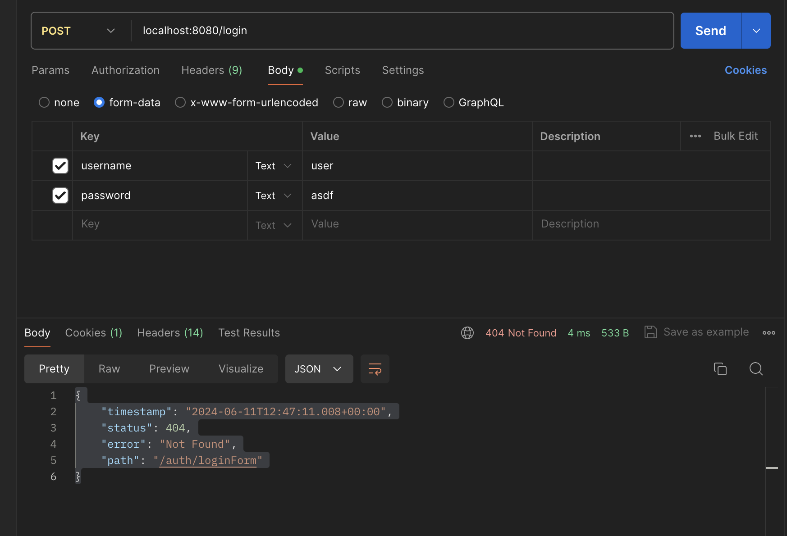
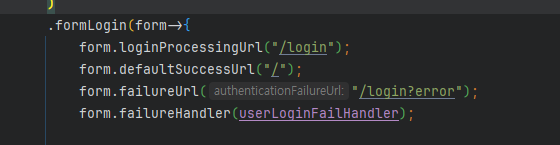
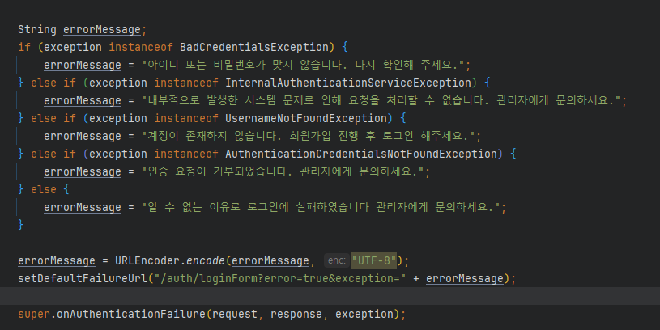
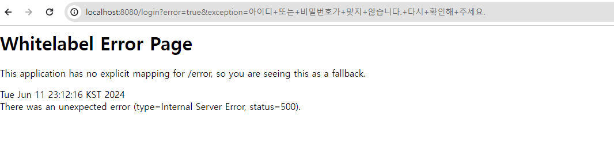
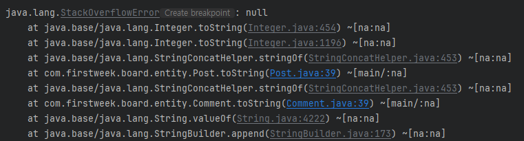
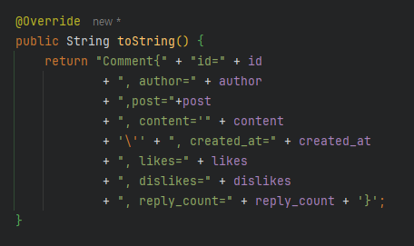
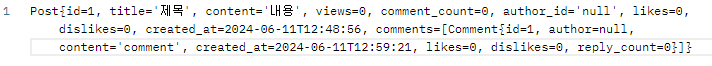
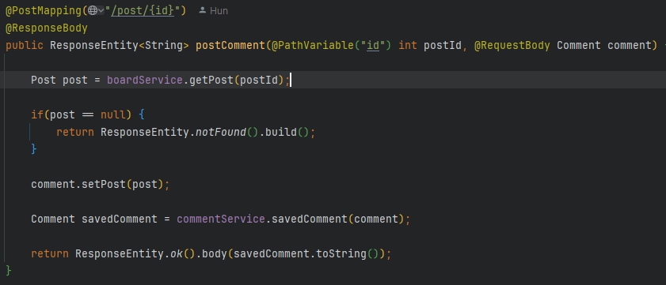
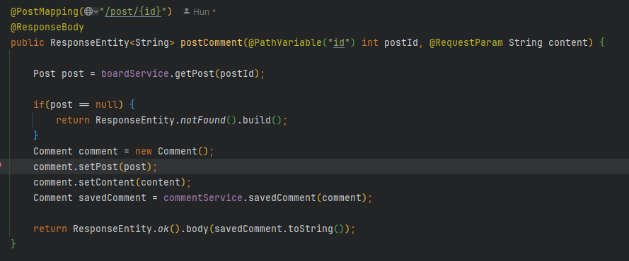
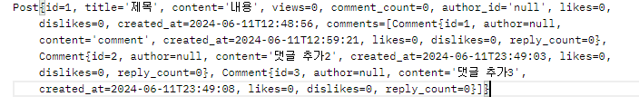

# 문제 1 : 로그인 실패 지점 오류
---

## 문제 내용
- 시큐리티를 사용한 로그인을 구현할때, SecurityConfig를 설정해줘도, 로그인을 실패할시, Default Url 로 요청을 계속해서 보내는 문제



## 해결방안 도출
- 로그인이 실패할때, auth/loginForm로 이동하는 것을 보고 failureUrl 설정


- 하지만 이래도 해결되지 않았고, 추가적 원인으로 userLoginFailHandler 설정이 덮어쓰고 있다고 생각되어 Handler를 수정


- 여기서 setDefaultFailureUrl을 수정
``` java
setDefaultFilureUrl("login?error=true & exception="+errorMessage)
```

## 결과 




올바른 url과 에러메세지가 출력되는걸 확인!


## 추가 학습 내용

`failureUrl()`과 `failureHandler()`를 모두 지정한 경우, `failureHandler()`가 우선순위가 더 높다는걸 학습했다.
`failureUrl()`은 단순 리다이렉트 URL만 지정하고, 
`failureHandler()`은 로그인 실패시, 다양한 로직을 커스텀하기 때문에 Spring Security에서는 `failureHandler()`을 우선시 처리한다!


<br><br><br>
# 문제 2 : 게시글 조회 순환 참조
---

## 문제내용



- 게시글 조회시 댓글이 있을경우 무한 참조 `무한 루프` 발생
## 해결방안 도출
- 먼저 출력하는 부분인 댓글 Entity의 `toString()`을 다시 한번 검토했다


- 해당 entity에서 post를 출력하게 되어있어 서로 무한 참조가 되는 원인을 발견하고 **post를 제거**했다

## 결과 


무한 루프에 빠지지 않고 잘 출력이 되는것을 확인했다!

## 추가 학습내용

난 아직 `DTO`를 제대로 학습하지 못해서 Entity에 직접 구현하는 방식으로 사용했다. 하지만 이렇게 되면 생기는 **단점**이 여러가지가 있다.

1. 단일 책임 원칙 `Single Responsibility Principle` 위배
	- 엔티티 클래스는 비즈니스 도메인의 상태를 나타내는 것에 초점을 맞춰야하는데 비즈니스 또는 뷰 관련 로직을 추가하면 **SOLID 원칙 중에 하나인 단일 책임 원칙을 위배**하게 된다
2. 의존성 강화
	- 이런 로직이 추가되고, 특정 라이브러리에 사용되게 되면 `ex) @RequestParam 등` **특정 기술 스택에 종속**되는 코드가 된다.
	  이는 **유연성**, **재사용성**, **코드 유지보수**에 많은 문제를 일으킨다.

<br><br><br>

# 문제 3 : 댓글 작성 Media Type 오류
---
## 문제내용

``` json
{

    "timestamp": "2024-06-11T14:41:14.361+00:00",

    "status": 415,

    "error": "Unsupported Media Type",

    "path": "/post/1"

}
```
- `form-data` 방식으로 댓글을 생성 요청할 시, **미디어 타입**을 지원하지 않는 문제 발생
## 해결방안 도출


- @RequestBody가 아닌 @RequestParam을 사용하여 데이터 지원 형식 폭을 늘려서 해결


## 결과 



무사히 댓글 추가가 완료되는 것을 확인했다!

## 추가 학습내용

- `@ModelAttribute`
	- HTTP 요청을 처리하고 응답을 생성할 때 사용되는 데이터를 나타냄
	- **하나의 모델 객체**로 바인딩함
	- 주로 여러개의 데이터를 한번에 바인딩해 **복잡한 데이터 처리**에 사용
- `@RequestParam`
	- 쿼리 문자열 `query string` 또는 폼 데이터 `form data`에서 **특정한 파라미터 값을 추출**해 반영함
	- **주로 간단한 데이터를 처리**하는데 사용
- `@RequestBody`
	- 본문에 있는 데이터를 **자바 객채로 변환**할때 사용 
	- **주로 `Json` 데이터를 자바 객체로 매핑**할 때 사용
	- `form-data`형식으로도 받고 싶다면, `HttpMessageConverter`를 추가 설정 해줘야함
<br><br><br>


**프로젝트 깃허브** : https://github.com/Hun425/4week_spring
