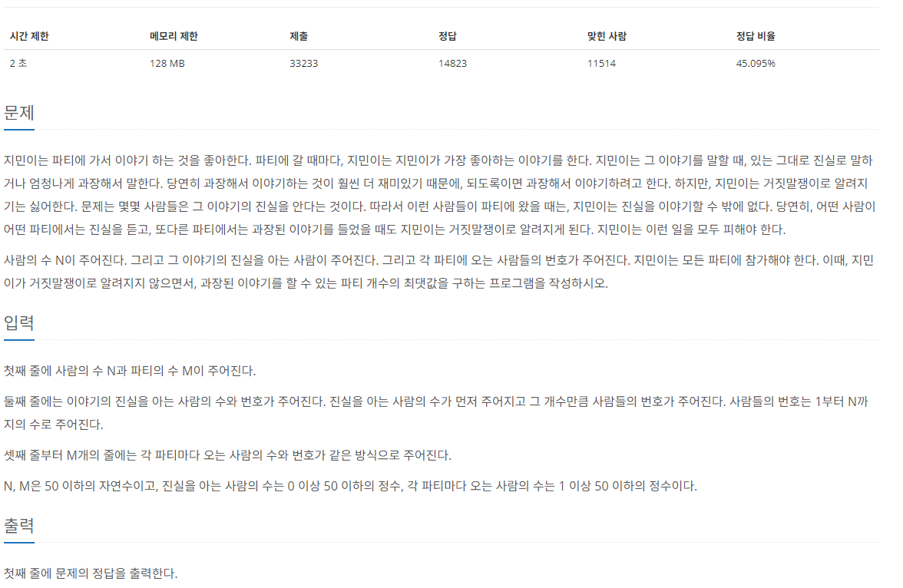

[문제 링크](https://www.acmicpc.net/problem/1043)
# created : 2024-06-11

## 문제



## 떠올린 접근 방식, 과정

**파티의 수와 거짓말**을 판단해야하므로, 그룹화 `Union Find` 알고리즘을 사용하면 되겠다고 생각했다!

## 알고리즘과 판단 사유

유니온 파인드 `Union Find`

## 시간복잡도

O(NlogN)

## 오류 해결 과정

처음에 아무생각없이 find값들을 서로 비교하지 않고, **초기값과 find값**을 비교해서 틀리는 문제가 있었다.
그룹화가 어떻게 진행되는지에 따라 부모값이 설정되는게 다르기 때문에 **그룹화를 비교할때는 find값 끼리 비교**해야한다!

## 개선 방법

다른 로직으로도 풀 수 있을것 같다 `BFS`


## 풀이 코드

``` java
import java.io.*;
import java.util.*;

public class Main {
    public static void main(String[] args) throws IOException{
        BufferedReader br = new BufferedReader(new InputStreamReader(System.in));

        StringTokenizer st = new StringTokenizer(br.readLine());

        int N = Integer.parseInt(st.nextToken());//사람명수
        int M = Integer.parseInt(st.nextToken());//그룹수

        int[]person = new int[N+1];//0포함 안함

        for (int i = 0; i < N + 1; i++) { //그룹화를 위한 배열 생성
            person[i] = i;
        }

        st= new StringTokenizer(br.readLine());// 진실을 아는사람
        int K = Integer.parseInt(st.nextToken());

        int[]true_person = new int[K];
        List<Integer>check = new ArrayList<>();

        for (int i = 0; i < K; i++) {
            true_person[i] = Integer.parseInt(st.nextToken());
            check.add(true_person[i]);
        }

        for (int i = 0; i < K - 1; i++) {
            Union(true_person[i],true_person[i+1],person);
        }

        List<int[]> list = new ArrayList<>();

        for (int i = 0; i < M; i++) {
            st = new StringTokenizer(br.readLine());
            int n = Integer.parseInt(st.nextToken());

            int[] group = new int[n];

            for (int j = 0; j < n; j++) {
                group[j] = Integer.parseInt(st.nextToken());

            }

            list.add(group);
            if(n>=2){
                for (int j = 0; j < n-1; j++) {
                    Union(group[j],group[j+1],person);
                }
            }
        }


        int cnt= 0;
        if(true_person.length==0){
            System.out.println(M);
        }
        else{

            for (int[] ints : list) {
                boolean lie = false;
                for (int anInt : ints) {
                    if(find(true_person[0],person)==find(anInt,person)){
                    lie = true;
                    break;
                }
                }
                if(lie)continue;
                else cnt++;
            }

            System.out.println(cnt);
        }

    }
    static int find(int a,int[]person){
        if(a==person[a])return a;
        else return person[a] = find(person[a],person);
    }

    static void Union(int a, int b, int[]person){
        a = find(a,person);
        b = find(b,person);

        if(a==b)return;
        else person[b]=a;
    }


}
```
