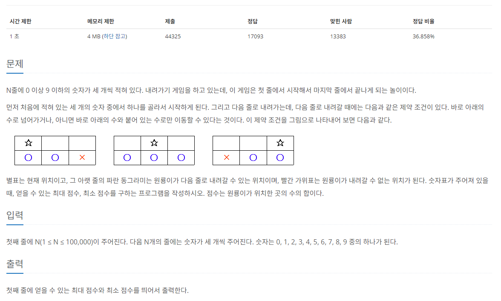

[문제 링크](https://www.acmicpc.net/problem/2096)
# created : 2024-06-12

## 문제



## 떠올린 접근 방식, 과정

처음에는 일반적인 브루트포스인줄 알고 DFS, 또는 BFS를 사용하려 했지만
**입력 범위와 메모리 조건**을 보니 일반적인 **완전탐색**으로는 안될 것 같았다.
따라서 **DP**로 접근하기로 했다!

## 알고리즘과 판단 사유

DP `동적 프로그래밍`

## 시간복잡도

O(N)

## 오류 해결 과정

없다!
## 개선 방법

어떻게 로직을 잘 자면 메모리를 더 줄일 수 있을거 같은데...
아직 내 실력으로는 잘 모르겠
## 풀이 코드

``` java
import java.util.*;
import java.io.*;

public class Main {
    static int max, min;

    public static void main(String[] args) throws IOException {
        BufferedReader br = new BufferedReader(new InputStreamReader(System.in));

        int N = Integer.parseInt(br.readLine());

        int[][] arr = new int[N][3];
        int[][]max_dp = new int[N][3];
        int[][]min_dp = new int[N][3];
        for (int i = 0; i <N ; i++) {
            StringTokenizer st= new StringTokenizer(br.readLine());

            int a = Integer.parseInt(st.nextToken());
            int b = Integer.parseInt(st.nextToken());
            int c = Integer.parseInt(st.nextToken());

            arr[i][0]=a;
            arr[i][1]=b;
            arr[i][2]=c;

        }
        max =0;
        min = Integer.MAX_VALUE;

        max_dp[0][0]=arr[0][0];
        max_dp[0][1]=arr[0][1];
        max_dp[0][2]=arr[0][2];

        min_dp[0][0]=arr[0][0];
        min_dp[0][1]=arr[0][1];
        min_dp[0][2]=arr[0][2];

        for (int i = 1; i <N ; i++) {


            max_dp[i][0]=Math.max(max_dp[i-1][0],max_dp[i-1][1])+arr[i][0];
            max_dp[i][1]=Math.max(max_dp[i-1][1],max_dp[i-1][2]);
            max_dp[i][1]=Math.max(max_dp[i-1][0],max_dp[i][1])+arr[i][1];
            max_dp[i][2]=Math.max(max_dp[i-1][1],max_dp[i-1][2])+arr[i][2];


            min_dp[i][0]=Math.min(min_dp[i-1][0],min_dp[i-1][1])+arr[i][0];
            min_dp[i][1]=Math.min(min_dp[i-1][1],min_dp[i-1][2]);
            min_dp[i][1]=Math.min(min_dp[i-1][0],min_dp[i][1])+arr[i][1];
            min_dp[i][2]=Math.min(min_dp[i-1][1],min_dp[i-1][2])+arr[i][2];
        }


        for (int i = 0; i < 3; i++) {
            min = Math.min(min,min_dp[N-1][i]);
        }

        for (int i = 0; i < 3; i++) {
            max = Math.max(max,max_dp[N-1][i]);
        }

        System.out.println(max+" "+min);
    }

}
```
