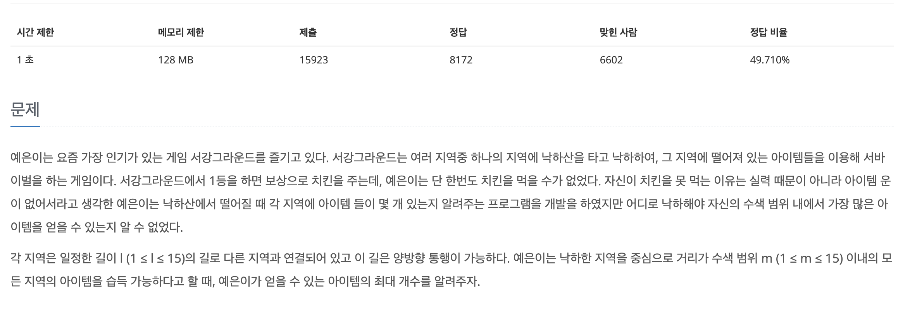

[문제 링크](https://www.acmicpc.net/problem/14938)
# created : 2024-06-13

## 문제




## 떠올린 접근 방식, 과정

기본 최단경로라서 `다익스트라`를 떠올렸다.
근데 이미 BFS로 구현중에 떠올라서 로직만 조금 수정했다..

## 알고리즘과 판단 사유

`다익스트라` 


## 시간복잡도

O(V+E)

## 오류 해결 과정

처음에 문제를 잘못읽어서 갱신 방법을 잘못 설정했었다...

## 개선 방법

없을 것 같다!

## 풀이 코드

``` java
import java.util.*;
import java.io.*;

public class Main {
    static int ans,result;
    public static void main(String[] args) throws IOException{
        BufferedReader br = new BufferedReader(new InputStreamReader(System.in));

        StringTokenizer st = new StringTokenizer(br.readLine());

        int n = Integer.parseInt(st.nextToken());//지역의 개수
        int m = Integer.parseInt(st.nextToken());//수색범위
        int r = Integer.parseInt(st.nextToken());//길의 개수

        int[] map = new int[n+1];

        st = new StringTokenizer(br.readLine());
        for (int i = 1; i < n+1; i++) {
            map[i] = Integer.parseInt(st.nextToken());
        }

        List<int[]>[] list = new List[n+1];

        for (int i = 0; i < n+1; i++) {
            list[i] = new ArrayList<>();
        }

        for (int i = 0; i < r; i++) {
            st = new StringTokenizer(br.readLine());

            int s = Integer.parseInt(st.nextToken());
            int e = Integer.parseInt(st.nextToken());
            int v = Integer.parseInt(st.nextToken());

            list[s].add(new int[] {e,v}); //무방향 간선
            list[e].add(new int[] {s,v});
        }
        for (int i = 0; i < list.length; i++) {
            // 거리 순으로 정렬
            Collections.sort(list[i], new Comparator<int[]>() {
                @Override
                public int compare(int[] a, int[] b) {
                    return a[1]-b[1];
                }
            });
        }
        
        
        for (int i = 1; i <n+1 ; i++) {

            ans=0;
            BFS(list,i,m,map);


            result= Math.max(ans,result);
        }

        System.out.println(result);

    }
    static void BFS(List<int[]>[]list,int s,int m,int[]map){
        Queue<int[]>q = new LinkedList<>();

        q.add(new int[]{s,0});//출발좌표,아이템개수,거리
        boolean[] visited = new boolean[list.length];
        visited[s] = true;

        while(!q.isEmpty()){
            int[]que = q.poll();

            int now_cdn = que[0];
            int now_dt = que[1];

            for (int i = 0; i < list[now_cdn].size(); i++) {
                int next_cdn = list[now_cdn].get(i)[0];

                int next_dt = list[now_cdn].get(i)[1];

                if(now_dt+next_dt>m)continue;

                q.add(new int[]{next_cdn,now_dt+next_dt});
                visited[next_cdn]=true;

            }
        }

        for (int i = 1; i < visited.length; i++) {
            if(visited[i])ans+=map[i];
        }
    }
}
```
