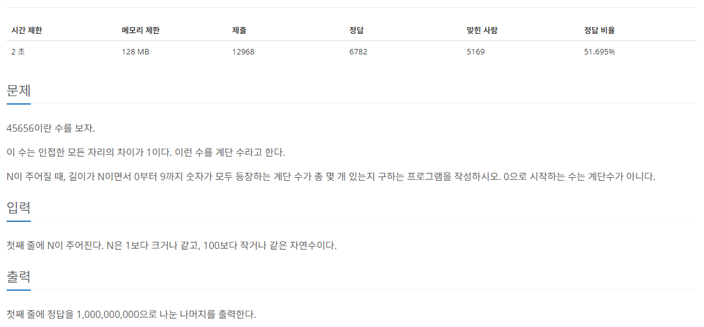

[문제 링크](https://www.acmicpc.net/problem/1562)
# created : 2024-06-14

## 문제



## 떠올린 접근 방식, 과정

이 문제는 풀이를 떠올리지 못해서 정답을 참고했다...
처음에 DP유형의 문제인건 눈치챘지만, 어떤식으로 로직을 짜야할지 감이 오지 않았다.
풀이를 공부하던 도중에, `비트마스크` 알고리즘에 대해서 알게되었다.
다행히 어느정도 이해하게 되어서 다음에 한번 더 풀어보기로 했다!


## 알고리즘과 판단 사유

`DP`

## 시간복잡도

O(N)

## 오류 해결 과정

정답 풀이를 참고했다!

## 개선 방법

없다!

## 풀이 코드

``` java
풀이 코드
```
