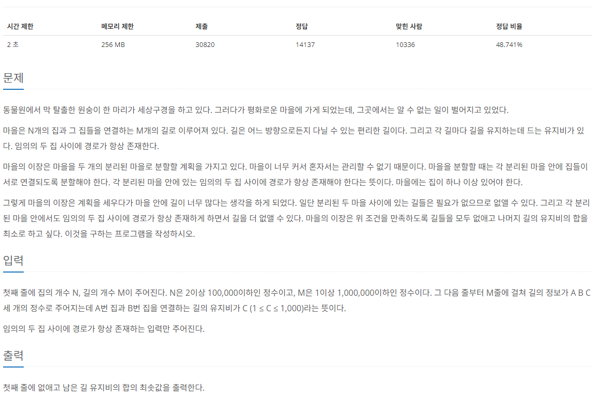

[문제 링크](https://www.acmicpc.net/problem/1647)
# created : 2024-06-15

## 문제



## 떠올린 접근 방식, 과정

그룹화를보고 **일반적인 `MST`**에 마지막 한단계만 더 생각하면 될 것 같았다!


## 알고리즘과 판단 사유

`MST` 최소신장트리

## 시간복잡도

`O(NlogN)`

## 오류 해결 과정

Union할때** find 되지 않은 값**을 합쳐줘서 틀리는 문제가 있었다..
바로 수정해서 통과했다!

## 개선 방법

없을 것 같다!

## 풀이 코드

``` java
import java.io.*;
import java.util.*;

public class Main {
    public static void main(String[] args) throws IOException{
        BufferedReader br = new BufferedReader(new InputStreamReader(System.in));

        StringTokenizer st= new StringTokenizer(br.readLine()); //입력값 받기

        int N = Integer.parseInt(st.nextToken()); // 마을 개수
        int M = Integer.parseInt(st.nextToken()); // 도로 개수

        int[] town = new int[N+1];

        for (int i = 0; i < N+1; i++) {
            town[i] = i;
        }

        List<int[]>[] cdn = new List[N+1]; // 도로를 표현할 인접리스트
        PriorityQueue<int[]> pq = new PriorityQueue<>((o1, o2) -> o1[2]-o2[2]);

        for (int i = 0; i < cdn.length; i++) {
            cdn[i] = new ArrayList<>();
        }

        for (int i = 0; i < M; i++) {
            st = new StringTokenizer(br.readLine());

            int start = Integer.parseInt(st.nextToken());
            int end = Integer.parseInt(st.nextToken());
            int weight = Integer.parseInt(st.nextToken());

            pq.add(new int[]{start,end,weight});
        }

        int ans = MST(N,M,town,pq);

        System.out.println(ans);

    }

    static int find(int a, int[]town){
        if(town[a]==a)return a;
        else return town[a] = find(town[a],town); //경로 압축
    }

    static void Union(int a, int b, int[]town){
        a = find(a,town);
        b = find(b,town);
        
        if(a==b)return;
        else town[b] = a;
    }

    static int MST(int N, int M, int[]town,PriorityQueue<int[]>pq){

        int cnt = 0;
        int result = 0;
        while(cnt<N-2){
            int[] now = pq.poll();

            int s = now[0];
            int e = now[1];
            int v = now[2];

            if(find(s,town)!=find(e,town)){
                Union(s,e,town);
                result+=v;
                cnt++;
            }
        }

        return result;
    }
}
```
