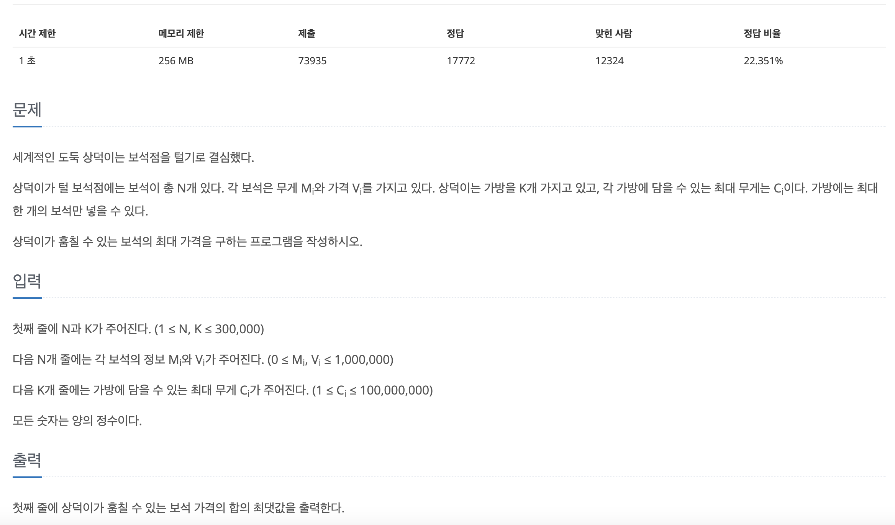

[문제 링크](https://www.acmicpc.net/problem/1202)
# created : 2024-06-16

## 문제



## 떠올린 접근 방식, 과정

먼저 가장 많이 가져갈 수 있는 가격을 구해야하고, 조건에 맞추어 가방 무게를 검사해야하는 문제다.
따라서 처음에는 가방을 크기순으로 내림차순 정렬, 보석은 무게순으로 내림차순 정렬한 이후
들어갈 수 있는 최대한의 가치를 가진 보석을 pq `우선순위큐`로 골라서 합산하는 방식으로 풀이했다.

## 알고리즘과 판단 사유

그리디 `Greedy`

## 시간복잡도

O(NlogN)

## 오류 해결 과정

처음에 문제에 나온 `가방에 한개의 보석만 담을 수 있다`를 제대로 읽지 않아 시간을 많이 날렸다..
## 개선 방법

없을 것 같다!

## 풀이 코드

``` java
import java.util.*;
import java.io.*;
public class Main {
    public static void main(String[] args) throws IOException{
        BufferedReader br = new BufferedReader(new InputStreamReader(System.in));

        StringTokenizer st = new StringTokenizer(br.readLine());

        int N = Integer.parseInt(st.nextToken());//보석 정보 개수
        int K = Integer.parseInt(st.nextToken());//가방 무개

        int[][]arr = new int[N][2];

        int[]backpack = new int[K];


        for (int i = 0; i < N; i++) {
            st =new StringTokenizer(br.readLine());

            int weight = Integer.parseInt(st.nextToken());
            int value = Integer.parseInt(st.nextToken());

            arr[i][0] = weight;
            arr[i][1] = value;

        }

        for (int i = 0; i < K; i++) {
            backpack[i] = Integer.parseInt(br.readLine());
        }

        Arrays.sort(backpack);
        Arrays.sort(arr,(o1, o2) -> o1[0] - o2[0]);

        long ans = 0;
        int cnt =0;
        PriorityQueue<Integer> pq =new PriorityQueue<>((o1, o2) -> o2-o1);
        for (int i = 0; i < backpack.length; i++) {


            while(cnt<arr.length){
                if(arr[cnt][0]>backpack[i])break;
                pq.add(arr[cnt][1]);
                cnt++;
            }

            if(!pq.isEmpty()) ans+=pq.poll();
        }

        System.out.println(ans);
    }
}
```
