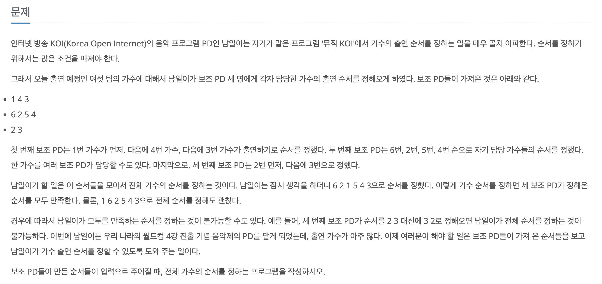

[문제 링크](https://www.acmicpc.net/problem/2623)
# created : 2024-06-17

## 문제



## 떠올린 접근 방식, 과정

주어진 좌표 `가수 연결 정보`의 순서를 검사해서 출력하면 되므로 **그래프의 순서**를 탐색하는 알고리즘인 `위상 정렬`을 사용했다!


## 알고리즘과 판단 사유

`위상정렬`

## 시간복잡도

`O(V+E)`

## 오류 해결 과정

간만에 한번에 맞아서 좋다!

## 개선 방법

없을 것 같다!

## 풀이 코드

``` java
import java.util.*;
import java.io.*;
public class Main {
    public static void main(String[] args) throws IOException{
        BufferedReader br = new BufferedReader(new InputStreamReader(System.in));

        StringTokenizer st= new StringTokenizer(br.readLine());

        int N = Integer.parseInt(st.nextToken());//가수가 몇명인지
        int M = Integer.parseInt(st.nextToken());//PD가 몇명인지

        int[] Indegree = new int[N+1];// 0은 사용하지 않음

        List<int[]>[] cdn = new List[N+1];
        for (int i = 0; i < N+1; i++) {
            cdn[i] = new ArrayList<>();
        }

        for (int i = 0; i < M; i++) {
            st = new StringTokenizer(br.readLine());

            int n = Integer.parseInt(st.nextToken()); //가수 개수

            int[] temp = new int[n];

            for (int j = 0; j < n; j++) {
                temp[j] = Integer.parseInt(st.nextToken());
            }

            for (int j = 0; j < n - 1; j++) {
                int now = temp[j];
                int next = temp[j+1];
                cdn[now].add(new int[]{next}); //인접리스트
                Indegree[next]++;//위상정렬을 위한 배열
            }
        }

        TPsort(Indegree,cdn);

    }
    static void TPsort(int[]Indegree , List<int[]>[]cdn){
        Queue<Integer> q = new ArrayDeque<>();
        Queue<Integer>result =new LinkedList<>();

        for (int i = 1; i < Indegree.length; i++) {
            if(Indegree[i] == 0)q.offer(i);
        }

        while(!q.isEmpty()){
            int now = q.poll();
            result.add(now);
            for (int[] ints : cdn[now]) {
                int v = ints[0];

                Indegree[v]--;

                if(Indegree[v] == 0)q.offer(v);
            }
        }
        if (result.size()!=Indegree.length-1) System.out.println(0);
        else{
            StringBuilder sb = new StringBuilder();
            while(!result.isEmpty()){
                sb.append(result.poll()).append("\n");
            }

            System.out.println(sb);
        }
    }
}
```
