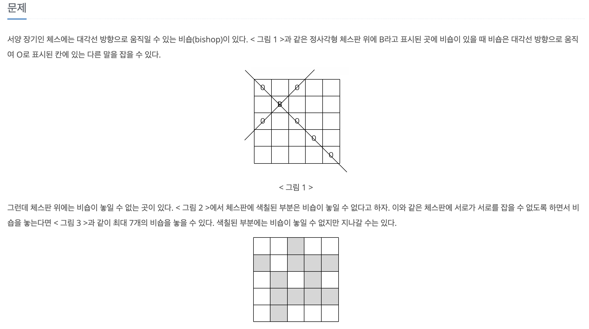

[문제 링크](https://www.acmicpc.net/problem/1799)
# created : 2024-06-19

## 문제



## 떠올린 접근 방식, 과정
처음에는 제한시간이 `10초` + 모든 공간을 다 봐야한다고 생각해서 `DFS`로 접근했다.
또한 비숍은 바로 옆의 칸 `체스판의 흰색과 검은색칸`은 가지 못하므로 2가지 경우로 나누어서
`DFS`를 돌리면 되겠다고 생각했다!

## 알고리즘과 판단 사유

깊이 우선 탐색 `DFS`

## 시간복잡도

O(N^2)

## 오류 해결 과정
2가지 경우로 처음에는 나누는 것을 생각하지 못했었다..

## 개선 방법
없을 것 같다!


## 풀이 코드

``` java
import java.util.*;
import java.io.*;
public class Main {
    static int ans,result;
    public static void main(String[] args) throws IOException{
        BufferedReader br= new BufferedReader(new InputStreamReader(System.in));

        int N = Integer.parseInt(br.readLine());
        boolean[][]visited = new boolean[N][N];
        int[][] arr = new int[N][N];
        int[][]dx = {{-1,-1},{1,1},{-1,1},{1,-1}};//함수 내부에 선언하면 재귀로 계속 생성해서 메모리 초과
        
        for (int i = 0; i < N; i++) {
            StringTokenizer st= new StringTokenizer(br.readLine());
            for (int j = 0; j < N; j++) {
                arr[i][j] = Integer.parseInt(st.nextToken());

            }
        }


        int cnt = 0;
        DFS(0,0,arr,visited,dx);
        cnt+=result;
        result = 0;
        DFS(0,1,arr,visited,dx);
        cnt+=result;

        System.out.println(cnt);

    }
    static void DFS(int y, int x,int[][]arr,boolean[][]visited , int[][]dx){
       
        result = Math.max(ans,result);

        if(x>= arr.length){
            if(x%2==0){
                x=1;
                y++;
            }else{
                x=0;
                y++;
            }

            if(y>=arr.length){
                return;
            }
        }


        if(arr[y][x]==0){//그냥 리턴이 아니라 건너뛰어야함
            DFS(y,x+2,arr,visited,dx);
            return;
        }


        if(check(y,x,arr,visited,dx)){
            visited[y][x]=true;
            ans++;
            DFS(y,x+2,arr,visited,dx);
            ans--;
            visited[y][x]=false;
        }


        DFS(y,x+2,arr,visited,dx);

    }
    static boolean check(int y, int x,int[][]arr,boolean[][]visited,int[][]dx){
       

        for (int i = 0; i < 4; i++) {
            int dely = y + dx[i][0];
            int delx = x + dx[i][1];

            while(dely>=0 && dely<arr.length && delx>=0 && delx<arr[0].length){
                if(visited[dely][delx])return false;
                dely +=dx[i][0];
                delx +=dx[i][1];
            }

        }
        return true;
    }
}
```
