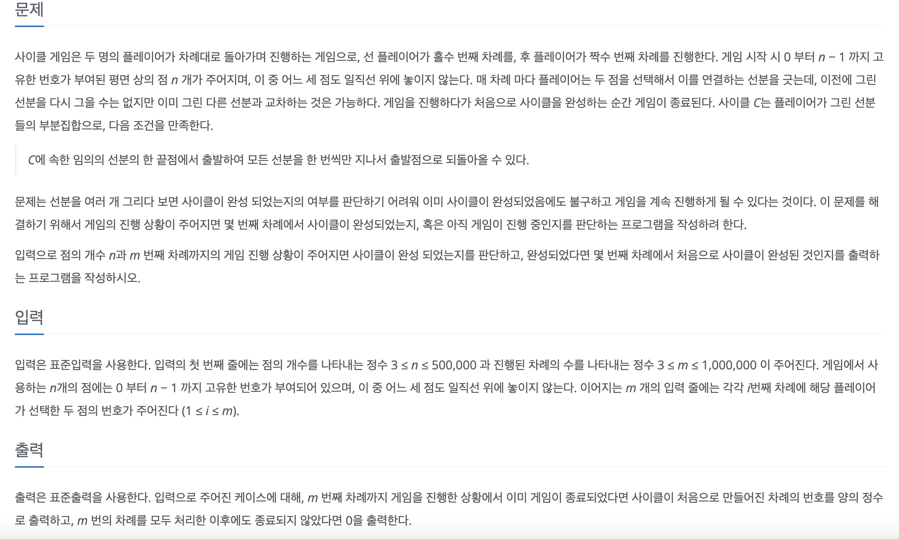

[문제 링크](https://www.acmicpc.net/problem/20040)
# created : 2024-06-19

## 문제



## 떠올린 접근 방식, 과정

사이클 유무를 판단해야하므로 `Union Find`로 그룹화가 되었는지 확인하면 된다! 

## 알고리즘과 판단 사유

유니온 파인드 `Union Find`

## 시간복잡도

O(N+M) `V+E`

## 오류 해결 과정
한번에 풀었다!

## 개선 방법
없을 것 같다!


## 풀이 코드

``` java
import java.util.*;
import java.io.*;
public class Main {
    public static void main(String[] args) throws IOException{
        BufferedReader br= new BufferedReader(new InputStreamReader(System.in));

        StringTokenizer st = new StringTokenizer(br.readLine());

        int N = Integer.parseInt(st.nextToken());
        int M = Integer.parseInt(st.nextToken());

        int[]parent = new int[N];

        for (int i = 0; i < N; i++) {
            parent[i] = i;
        }

        int cnt= 0;
        boolean check = false;
        for (int i = 0; i < M; i++) {
            cnt++;
            st = new StringTokenizer(br.readLine());

            int s = Integer.parseInt(st.nextToken());
            int e = Integer.parseInt(st.nextToken());

            if(union(s,e,parent)){
                check = true;
                break;
            }

        }

        if(check) System.out.println(cnt);
        else System.out.println(0);
    }
    static int find(int a, int[]parent){
        if(a==parent[a])return a;
        else return parent[a] = find(parent[a],parent);
    }

    static boolean union(int a, int b, int[]parent){
        a = find(a,parent);
        b = find(b,parent);

        if(a!=b){
            parent[b] = a;
            return false;
        }
        else return true;
    }
}
```
