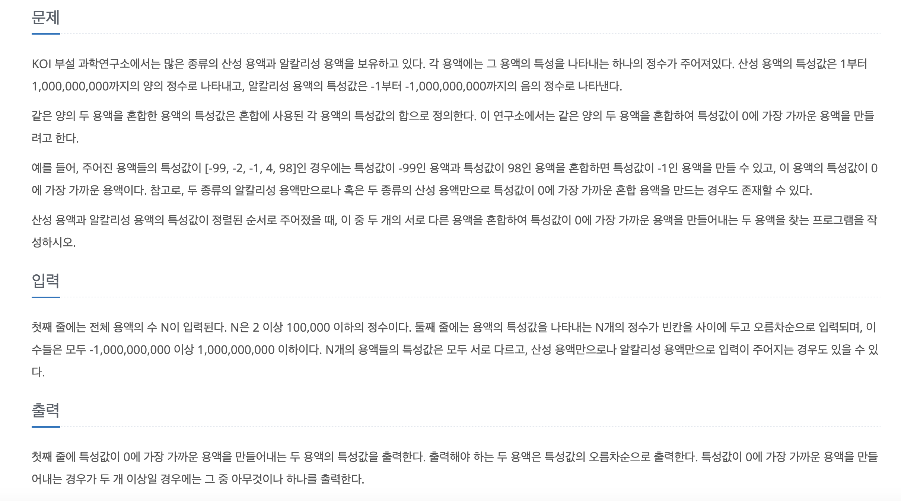

[문제 링크](https://www.acmicpc.net/problem/2467)
# created : 2024-06-20

## 문제




## 떠올린 접근 방식, 과정
이미 정렬이 되어있는 용액의 최소 절댓값을 구하는 문제로, `투 포인터`를 사용하면 되겠다고 생각했다!


## 알고리즘과 판단 사유
`투 포인터`


## 시간복잡도
O(N)


## 오류 해결 과정
처음에 초기값을 MAXVALUE로 안해줘서 틀렸는데 바로 고쳐서 맞았다!

## 개선 방법
없을 것 같다


## 풀이 코드

``` java
import java.util.*;
import java.io.*;

public class Main {
    public static void main(String[] args) throws IOException {
        BufferedReader br= new BufferedReader(new InputStreamReader(System.in));

        int N = Integer.parseInt(br.readLine());

        long  [] arr =new long[N];

        StringTokenizer st =new StringTokenizer(br.readLine());

        for (int i = 0; i < N; i++) {
            arr[i] = Long.parseLong(st.nextToken());
        }

        int s = 0;
        int e =N-1;
        long v = Integer.MAX_VALUE;
        int s_idx = 0;
        int e_idx = 0;
        boolean check = false;
        while(s<e){
            long now = arr[s]+arr[e];


            if(now==0){
                check = true;
                System.out.println(arr[s]+" "+arr[e]);
                break;
            }

            else if (now<0){


                if(Math.abs(v)>Math.abs(now)){
                    s_idx = s;
                    e_idx = e;
                    v = Math.abs(now);
                }
                s++;
            }
            else if(now>0){
                if(Math.abs(v)>Math.abs(now)){
                    s_idx = s;
                    e_idx = e;
                    v = Math.abs(now);
                }
                e--;

            }
        }

        if(!check) System.out.println(arr[s_idx]+" "+arr[e_idx]);

    }
}
```
