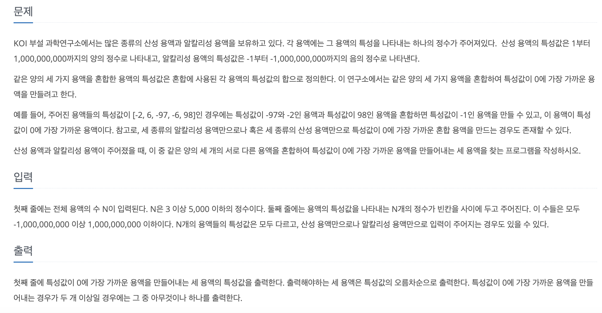

[문제 링크](https://www.acmicpc.net/problem/2473)
# created : 2024-06-22

## 문제



## 떠올린 접근 방식, 과정

어제 풀었던 투 포인터의 응용 문제로,N의 범위를 보니 포인터를 하나 더 늘리기만 하면 되겠다고 생각했다!

## 알고리즘과 판단 사유

`투 포인터`

## 시간복잡도

O(N^2)

## 오류 해결 과정
없다!
## 개선 방법
없을 것 같다!


## 풀이 코드

``` java
import java.util.*;
import java.io.*;

public class Main {
    public static void main(String[] args) throws IOException {
        BufferedReader br= new BufferedReader(new InputStreamReader(System.in));

        int N = Integer.parseInt(br.readLine());
        long[] arr = new long[N];

        StringTokenizer st = new StringTokenizer(br.readLine());
        for (int i = 0; i < N; i++) {
            arr[i] = Long.parseLong(st.nextToken());
        }

        Arrays.sort(arr); // 배열을 정렬

        long[] ans = new long[3];
        long minAbsSum = Long.MAX_VALUE;

        for (int i = 0; i < N - 2; i++) {
            int left = i + 1;
            int right = N - 1;

            while (left < right) {
                long sum = arr[i] + arr[left] + arr[right];

                if (Math.abs(sum) < minAbsSum) {
                    minAbsSum = Math.abs(sum);
                    ans[0] = arr[i];
                    ans[1] = arr[left];
                    ans[2] = arr[right];
                }

                if (sum < 0) {
                    left++;
                } else {
                    right--;
                }
            }
        }

        Arrays.sort(ans);

        for (long an : ans) {
            System.out.print(an + " ");
        }
    }
}
```
