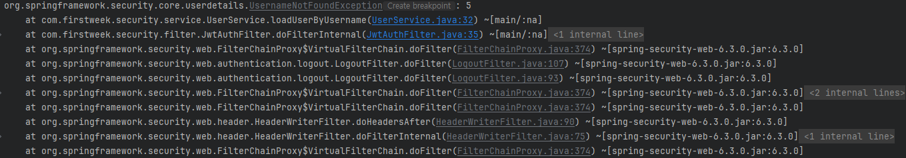

## 문제 1
---

### 문제내용


- Jwt 토큰을 요청 헤더에 포함시키고, 이를 통해 유저네임을 찾을 때, 이름이 아닌 ID로 찾는 문제 발생


### 해결방안 도출
- ID로 찾는 부분을 이름으로 찾도록 변경
``` java
if(jwtUtil.validateToken(token)) {  
    String username = jwtUtil.getUsernameFromToken(token);  
  
    //유저와 토큰이 일치하면 userDetails 생성  
    UserDetails userDetails = userService.loadUserByUsername(username);  
  
    if(userDetails != null) {  
        //userDetails, Password, Role -> 접근권한 인증 Token 생성  
        UsernamePasswordAuthenticationToken authentication = new UsernamePasswordAuthenticationToken(userDetails, null, userDetails.getAuthorities());  
  
        //현재 Request와 Security context에 접근권한 설정  
        SecurityContextHolder.getContext().setAuthentication(authentication);  
    }  
  
}
```

### 결과 

오류 없이 정상 작동완료


### 추가 학습내용
- 코드의 일관성에 대한 중요성을 학습했다!
- 오류 코드의 해석도 중요하다는걸 알게되었다.


<br><br><br>

# 문제 2
---


### 문제내용
- DTO를 적용했을 때, 1주차와 마찬가지로 Comment가 중복해서 출력되는 문제가 발생
### 해결방안 도출
- 1주차 해결방법을 참고했으나, 해결되지 않음
- 다른 방법을 추가적으로 검색해서 적용함
``` java
public BoardResponseDto(Post post) {  
    this.id = post.getId();  
    this.title = post.getTitle();  
    this.content = post.getContent();  
    this.views = post.getViews();  
    this.comment_count = post.getComment_count();  
    this.author_id = post.getAuthor_id();  
    this.likes = post.getLikes();  
    this.dislikes = post.getDislikes();  
    this.created_at = post.getCreated_at();  
    this.comments = post.getComments().stream()  // 이 부분 수정
            .map(comment -> new CommentResponseDto(comment))  
            .collect(Collectors.toList());  
}
``` 
- CommentResponseDto에서 중복되는 post를 삭제하고, BoardRequestDto의 comments를 stream을 사용해서 한번에 불러오도록 설정
### 결과 
- 정상적으로 출력이 되는 것을 확인!


### 추가 학습내용
- stream이 `lazy`한 특징을 가지고 있다는것을 알게되었다
- stream의 병렬처리에 대해서 더 자세히 알아볼 예정이다!


<br><br><br>


<br><br><br>


<br><br><br>
