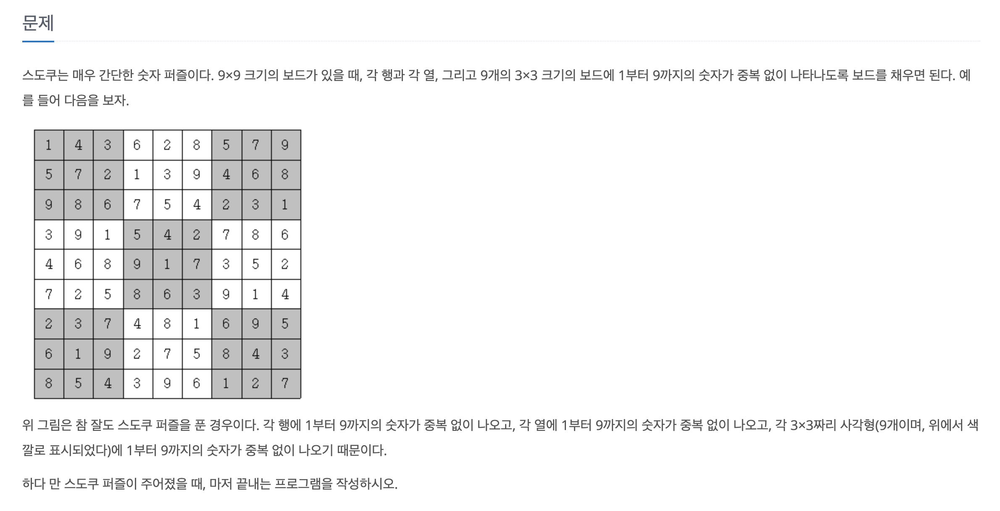

[문제 링크](https://www.acmicpc.net/problem/2239)
# created : 2024-06-23

## 문제



## 떠올린 접근 방식, 과정
처음엔 DFS `재귀` 방식으로 접근했는데 계속 값 초기화 부분에서 오류가 났다
난이도를 보고 쉬운줄 알고 접근했는데, 시간안에 풀지 못했다...
결국 이번 문제는 정답을 참고해서 풀었고, 다음에 다시 한번 풀기로 했다.

## 알고리즘과 판단 사유

`백트래킹`

## 시간복잡도

최악 O(9^N^2)

## 오류 해결 과정
추후 다시 풀어볼 예정이다!

## 개선 방법

없을 것 같다!

## 풀이 코드

``` java
import java.io.*;
import java.util.*;

public class Main {

    public static void main(String[] args) throws IOException {
        BufferedReader br = new BufferedReader(new InputStreamReader(System.in));
        int[][] board = new int[9][9];

        // 스도쿠 보드 입력
        for (int i = 0; i < 9; i++) {
            String line = br.readLine();
            for (int j = 0; j < 9; j++) {
                board[i][j] = line.charAt(j) - '0';
            }
        }

        // 스도쿠 퍼즐 해결
        solveSudoku(board);

        // 결과 출력
        for (int i = 0; i < 9; i++) {
            for (int j = 0; j < 9; j++) {
                System.out.print(board[i][j]);
            }
            System.out.println();
        }
    }

    public static boolean solveSudoku(int[][] board) {
        // 비어 있는 셀을 찾아서 채우기
        for (int i = 0; i < 9; i++) {
            for (int j = 0; j < 9; j++) {
                if (board[i][j] == 0) { // 비어 있는 셀일 경우
                    for (int num = 1; num <= 9; num++) {
                        if (isValid(board, i, j, num)) {
                            board[i][j] = num; // 숫자를 채움
                            if (solveSudoku(board)) {
                                return true; // 재귀적으로 다음 셀 해결
                            } else {
                                board[i][j] = 0; // 백트래킹: 잘못된 경우 초기화
                            }
                        }
                    }
                    return false; // 모든 숫자 시도 후 해결 불가능일 경우
                }
            }
        }
        return true; // 모든 셀이 채워진 경우
    }

    public static boolean isValid(int[][] board, int row, int col, int num) {
        // 같은 행에 중복된 숫자 확인
        for (int j = 0; j < 9; j++) {
            if (board[row][j] == num) {
                return false;
            }
        }

        // 같은 열에 중복된 숫자 확인
        for (int i = 0; i < 9; i++) {
            if (board[i][col] == num) {
                return false;
            }
        }

        // 3x3 박스에 중복된 숫자 확인
        int boxStartRow = (row / 3) * 3;
        int boxStartCol = (col / 3) * 3;
        for (int i = boxStartRow; i < boxStartRow + 3; i++) {
            for (int j = boxStartCol; j < boxStartCol + 3; j++) {
                if (board[i][j] == num) {
                    return false;
                }
            }
        }

        return true; // 모든 조건 만족 시 유효함
    }
}
```
