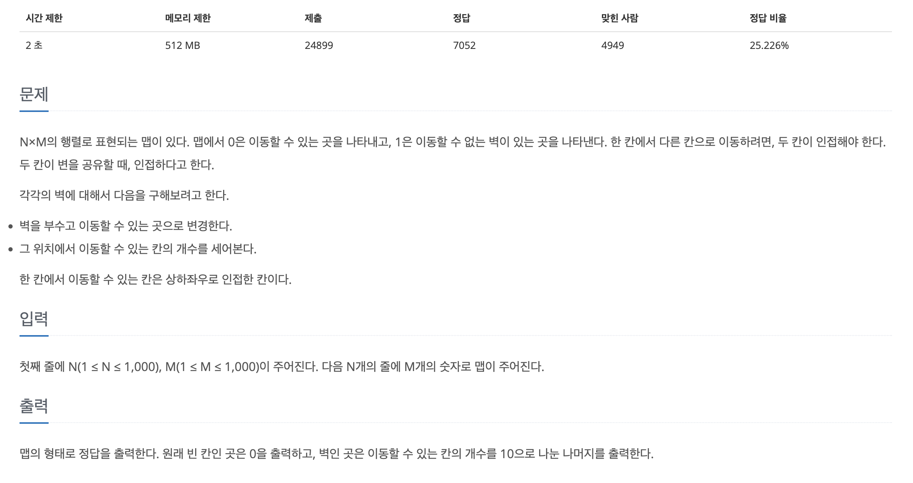

[문제 링크](https://www.acmicpc.net/problem/16946)
# created : 2024-06-28

## 문제




## 떠올린 접근 방식, 과정
문제의 조건을 보면  간단한 `BFS`같이 보이지만, 실제로 구현하면 **시간초과**가 난다.
안에서 문제의 조건을 미리 계산하고 `중복`을 제거하는 자료구조를 사용해야만 **시간초과**를 해결 할 수 있는 문제였다!


## 알고리즘과 판단 사유

`BFS`

## 시간복잡도

`O(N^2)`

## 오류 해결 과정
해결 로직은 생각했지만, 중복 제거를 구현하는데 HashSet을 사용하는 걸 바로 떠올리지 못했다..

## 개선 방법
없을 것 같다!


## 풀이 코드

``` java
import java.io.*;
import java.util.*;

public class Main {
    static int N, M;
    static int[][] arr, result, visited;
    static int[] groupSize;
    static int groupId = 2;  // 그룹 ID는 2부터 시작 (0과 1은 이미 사용 중)

    public static void main(String[] args) throws IOException {
        BufferedReader br = new BufferedReader(new InputStreamReader(System.in));
        StringTokenizer st = new StringTokenizer(br.readLine());

        N = Integer.parseInt(st.nextToken());
        M = Integer.parseInt(st.nextToken());

        arr = new int[N][M];
        result = new int[N][M];
        visited = new int[N][M];

        for (int i = 0; i < N; i++) {
            String s = br.readLine();
            for (int j = 0; j < M; j++) {
                arr[i][j] = s.charAt(j) - '0';
            }
        }

        List<Integer> groupSizes = new ArrayList<>();

        // BFS로 각 그룹의 크기 계산
        for (int i = 0; i < N; i++) {
            for (int j = 0; j < M; j++) {
                if (arr[i][j] == 0 && visited[i][j] == 0) {
                    int size = bfs(i, j, groupId);
                    groupSizes.add(size);
                    groupId++;
                }
            }
        }

        groupSize = new int[groupId];
        for (int i = 0; i < groupSizes.size(); i++) {
            groupSize[i + 2] = groupSizes.get(i);  // 그룹 ID는 2부터 시작
        }

        // 벽 주변의 값 계산
        for (int i = 0; i < N; i++) {
            for (int j = 0; j < M; j++) {
                if (arr[i][j] == 1) {
                    result[i][j] = calculateSum(i, j);
                }
            }
        }

        // 결과 출력
        StringBuilder sb = new StringBuilder();
        for (int i = 0; i < N; i++) {
            for (int j = 0; j < M; j++) {
                sb.append(result[i][j] % 10);
            }
            sb.append("\n");
        }
        System.out.print(sb);
    }

    static int bfs(int y, int x, int id) {
        Queue<int[]> queue = new LinkedList<>();
        queue.add(new int[]{y, x});
        visited[y][x] = id;
        int size = 0;

        int[][] directions = {{0, 1}, {1, 0}, {0, -1}, {-1, 0}};
        while (!queue.isEmpty()) {
            int[] current = queue.poll();
            size++;

            for (int[] dir : directions) {
                int newY = current[0] + dir[0];
                int newX = current[1] + dir[1];

                if (newY >= 0 && newY < N && newX >= 0 && newX < M && arr[newY][newX] == 0 && visited[newY][newX] == 0) {
                    queue.add(new int[]{newY, newX});
                    visited[newY][newX] = id;
                }
            }
        }
        return size;
    }

    static int calculateSum(int y, int x) {
        int[][] directions = {{0, 1}, {1, 0}, {0, -1}, {-1, 0}};
        Set<Integer> uniqueGroups = new HashSet<>();

        for (int[] dir : directions) {
            int newY = y + dir[0];
            int newX = x + dir[1];

            if (newY >= 0 && newY < N && newX >= 0 && newX < M && arr[newY][newX] == 0) {
                uniqueGroups.add(visited[newY][newX]);
            }
        }

        int sum = 1;
        for (int group : uniqueGroups) {
            sum += groupSize[group];
        }
        return sum;
    }
}
```
