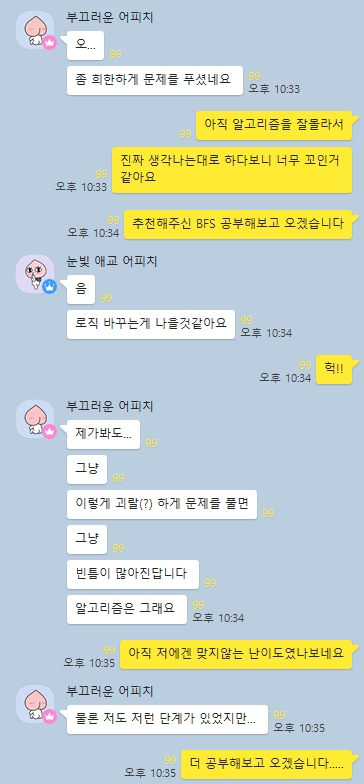
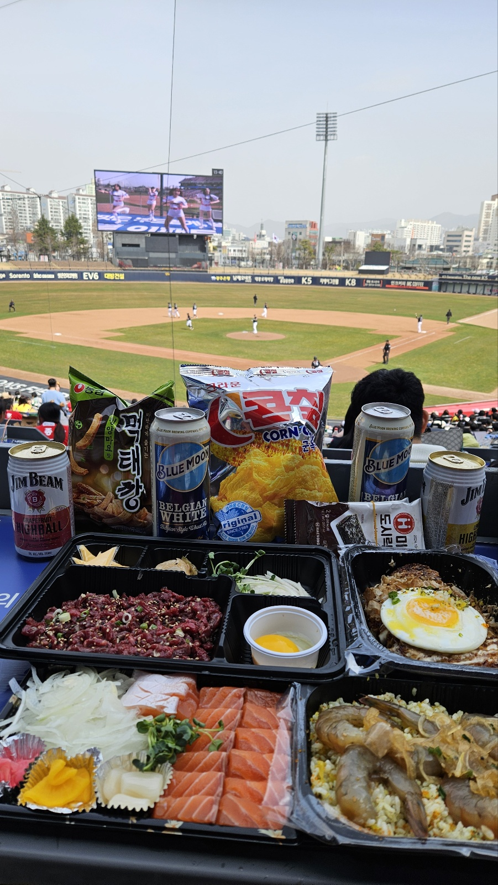
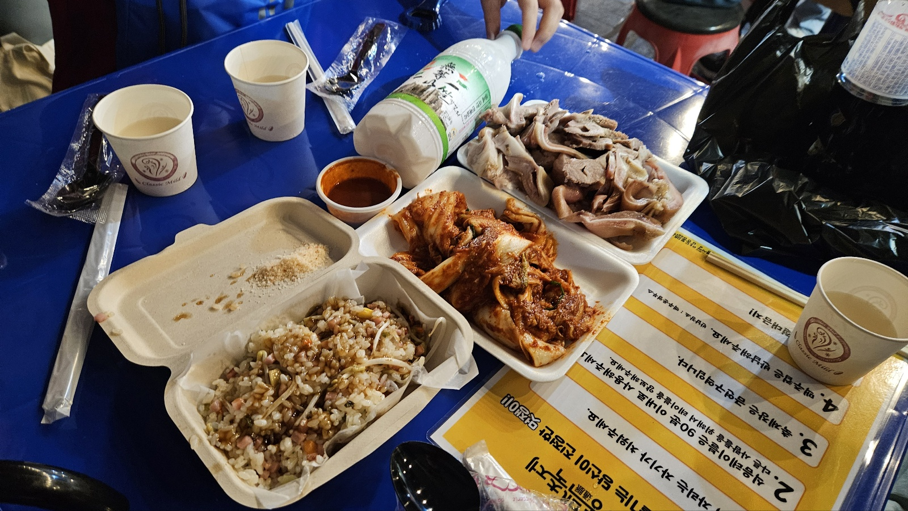
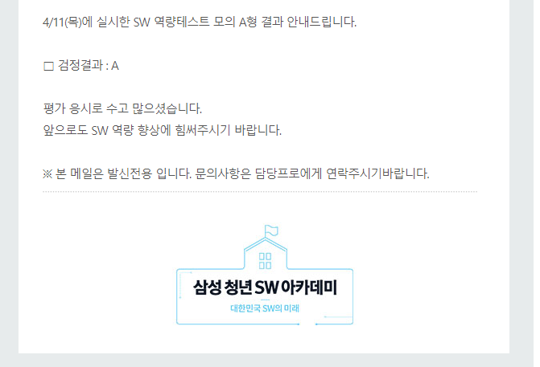
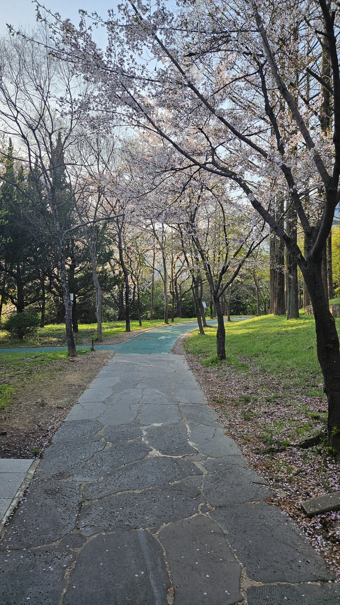
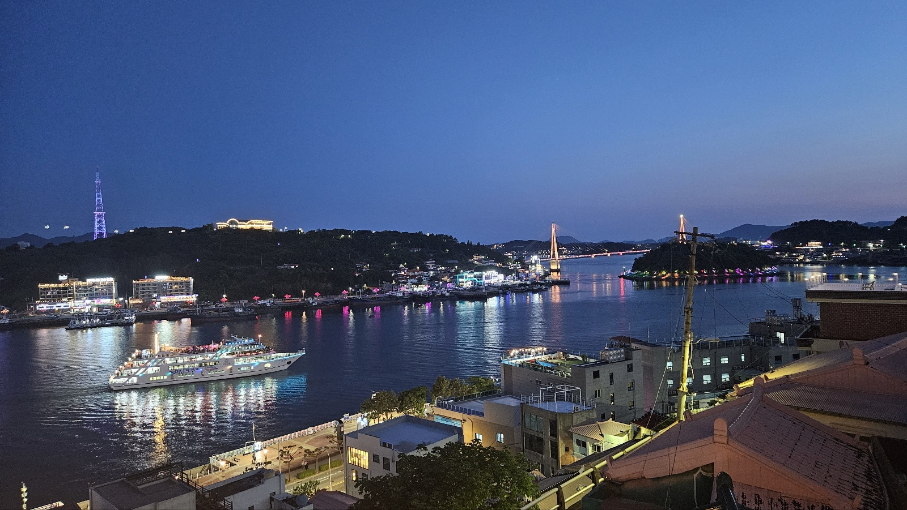
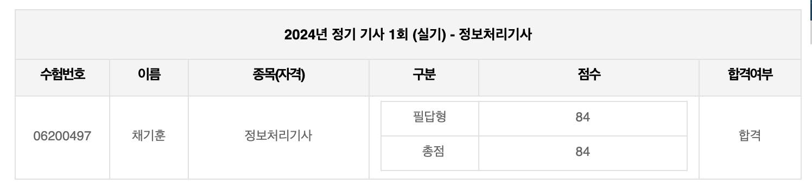
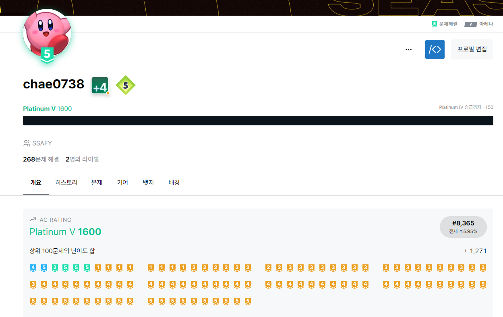

# 1학기 수료

분명 싸피에 입과하기 전에 사전학습을 하고 있던 때가 엊그제 같은데, 벌써 1학기를 수료하게 되었다...
한 학기를 돌아보면서 **느낀점**과 **나의 생각** 등을 정리하기 위해 이 회고록을 작성한다.

# 1학기 기간

2024.01 ~ 2024.06 `6개월`

## 1월

### 알고리즘을 접하게된 계기

내가 싸피에 처음 들어왔을때, 내가 알고있는 지식은 파이썬 for문 if문, 딱 2개였다.
12월 말에 SSAFY 합격발표가 나온 이후, 보통 **사전 학습**을 하라고 자료들을 몇가지 준다.
여기 있는 문제들을 내가 아는 지식으로 풀어보려했는데.. 도저히 답이 안나왔다
그래서 오픈톡방에 질문을 올려보았는데 

다른 선배님들의 추천으로 알고리즘의 존재를 알게되었고, 이때부터 알고리즘을 하나씩 공부하기 시작했다.

### 백엔드 지망
나는 입과 할 때부터 백엔드를 지향하고 있었는데, 마침 우리반에 비전공 파이썬반인데도 불구하고 이미 백엔드 교육을 미리 듣고 오신 고수분이 계셨다!
이 분과 같이 **스터디**를 진행하면서 **자바**와 **알고리즘**의 기초를 쌓고 많이 발전하는 계기가 되었던것 같다.

## 2월

### 스터디의 시작
SSAFY의 파이썬 비전공 커리큘럼을 따라가면서 **Spring**, **Java**, **알고리즘** 3개를 같이 병행하기란 쉽지않았다. 
따라서 **학습 의지**를 잃지 않으면서 꾸준히 공부하기 위해서 수업이 끝난 이후, 각자 집에서 디스코드를 통해 화면을 공유하고 공부하는 **모각공 스터디**를 진행했었다. 
지금 생각하면 이 스터디 덕분에 항상 더 늦게까지 공부할 수 있었고, 동기 부여를 얻었기 때문에 같이 달려준 스터디원들에게 너무 감사하다.

### 본격적인 알고리즘
이때부터 알고리즘을 본격적으로 커리큘럼으로 배우기 시작했다.
우리반 **강사님**께서 초심자를 위해 정말 많이 배려하면서 가르쳐주셨고, 이 덕분에 알고리즘 기본을 배울 수 있었다고 생각한다.

## 3월

### A형 좌절
1~2월간 정말 열심히 달려왔기 때문에, A형 시험은 나에게 노력의 결실을 확인 할 수 있는 테스트였다. 
하지만 결과는 **탈락**... 심지어 코드를 제출하지도 못했다.
내가 아는 유형의 문제라 쉽게 생각하고 설계하지 않고 바로 접근한게 패착이였다.
**변수 초기화**를 하나 잘못해서 생긴 오류를 3시간동안 찾지 못했고, 
이때 정말 심적으로 많이 힘들었던 기억이 난다.
주변 스터디원과 반 친구들이 정말 많이 위로해준 덕분에 **멘탈 회복**을 빨리 할 수 있었던것 같다! `2반 최고`

### 야구 직관

난 어릴때 부터 **야구**를 정말 좋아했다.
SSAFY를 광주로 오게 되면서 야구 직관을 꼭 가고싶었는데 3월에 드디어 가게되었다.
같이 갔던 친구가 준비를 거의 다 해줘서 고마우면서 미안했던 기억이 있다..
## 4월

### 통맥 축제

모각공 스터디원들과 같이 야구+양동 통맥 축제를 갔다.
야구와 축제 모두 너무 재밌었다.

### A형 취득

A형 재시험에서 다행히도 A형을 취득했다!
하지만 첫번째 시험에서 따지 못했다는게 지금 생각해도 너무 아쉽다.
### 카공

4월 말쯤 부터 **모각공**에 사람들도 잘 안들어오고, 
나도 집에서 혼자 공부하다보니 공부 효율이 점점 떨어지게 되었다. 
집에서 공부하려고 다른반에 있는 모각공과 비슷한 스터디에 들어갔는데, 
여기도 점점 갈수록 사람들이 많이 들어오지 않는 비슷한 상황이였다...
그래서 산책을 좋아하는 친구와 같이 **카공**을 자주 다녔다.
## 5월

### 관통 프로젝트
SSAFY 1학기의 끝을 알리는 **관통 프로젝트**이다.
되게 열정있고 잘하는 누나와 한 팀을 하게되었고, 나에겐 제대로 해보는 첫번째 프로젝트였기 때문에 설렘반 걱정반이였던 기억이 난다.
초반에 약간의 의견 마찰도 있었지만 원활하게 잘 풀었고, 우리 둘 다 각자 할 수 있는 최선을 다했다는 생각이 들어서 후회 없는 프로젝트였다!

[프로젝트 보러가기](https://github.com/Hun425/finalpjt)

### 여행

임시반부터 친했던 친구들과 여수 여행을 갔다왔다.
관통 프로젝트가 끝나고 가서 2학기와 미래에 대한 불안감 때문에 어지러웠던 마음이 많이 진정되었고, 앞으로의 **내 방향**에 대해서 편하게 많이 고민해 볼 수 있었던 뜻 깊은 여행이였다
## 6월

### 정처기 합격

4월에 봤던 시험인 정처기를 합격했다!
지엽적인 이론은 포기하고, 프로그래밍 기본에 좀 더 투자했던게 좋은 판단이였던거 같다.

### 백준 플레 달성

6개월간 꾸준히 백준을 풀면서 목표했던 티어인 **플레티넘**을 달성했다!
티어가 절대적인 실력을 말해주진 않지만, **꾸준함**을 증명해 주는것 같아 뿌듯하다.
이제는 드디어 알고리즘 튜토리얼이 끝난느낌...
본격적인 코테 준비를 위해서 **프로그래머스**를 위주로 풀어볼 예정이다!

### 깃허브 정리 / 데일리 회고 작성

[깃허브 보러가기](https://github.com/Hun425)
[데일리 회고 보러가기](https://github.com/Hun425/DailyCheck)
포트폴리오 및 프로젝트를 정리하기위해 **깃허브 프로필**을 정리했다. 
또한 온라인 수업기간인 6월 동안 초심을 잃지 않기 위해서 **데일리 회고**를 매일 작성했다.

### 새로운 사람들
6월 잡페어 기간에 **카공**을 많이 다니면서, 다른 반 사람들과 많이 교류하게 되었다.
덕분에 공부하는데 흥미를 잃지 않고 재밌게 할 수 있었다.

## 1학기를 마치며
한 학기를 돌아보니 정말 많은 일이 있었다는 것이 느껴졌다.
우여곡절이 많았지만.. 지나고 보니 나에게는 전부 뜻 깊은 경험이였다.
또한 6개월간 정말 열심히 공부해서, 나에게는 후회없는 1학기였다.
2일 뒤부터 시작되는 **2학기**도 초심 잃지 않고 열심히 해보자!
