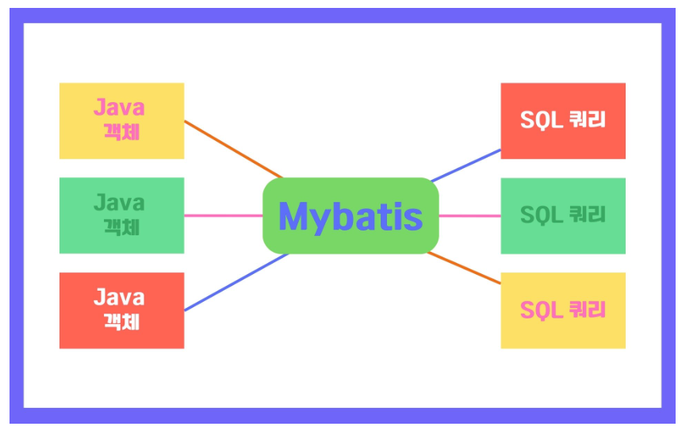
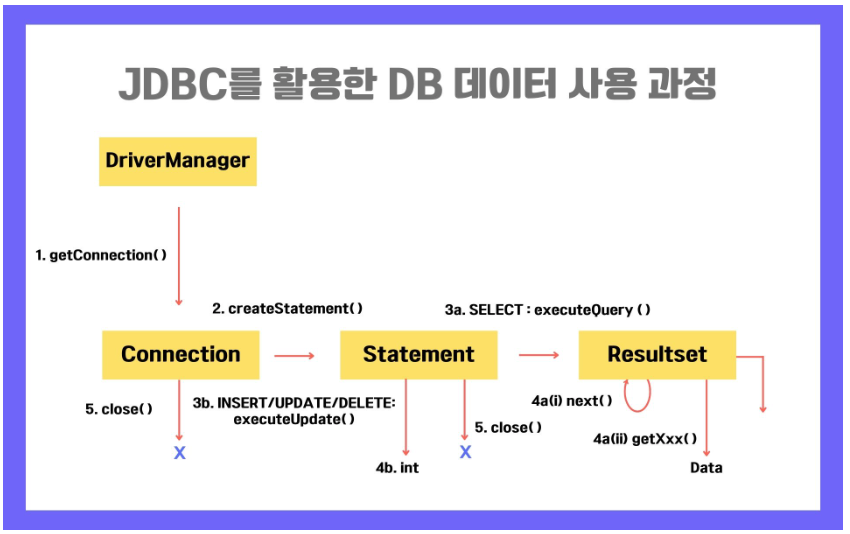
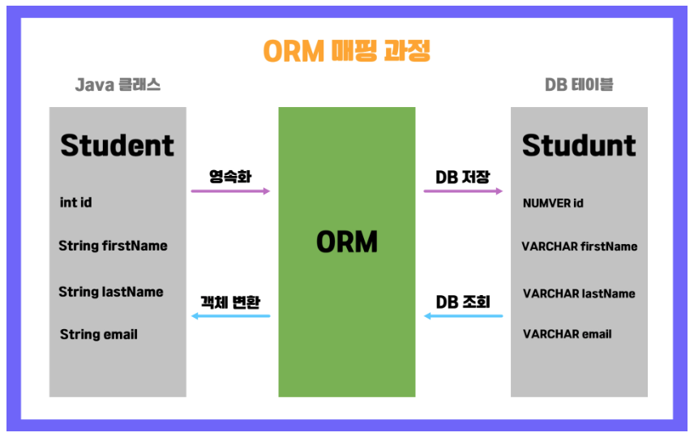
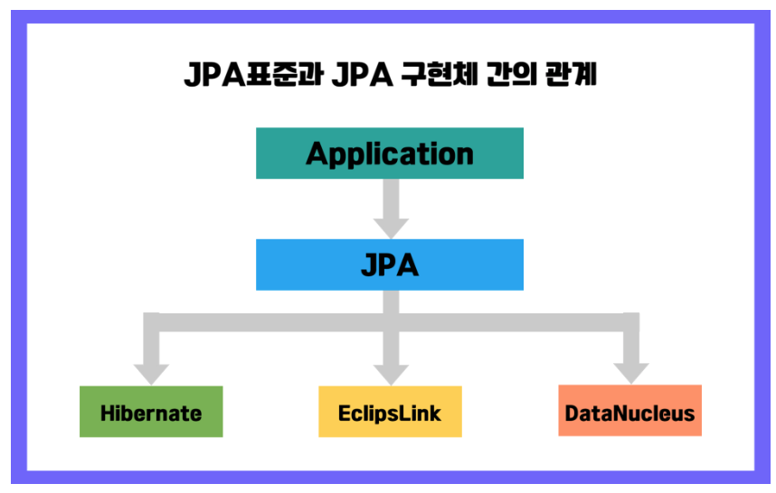
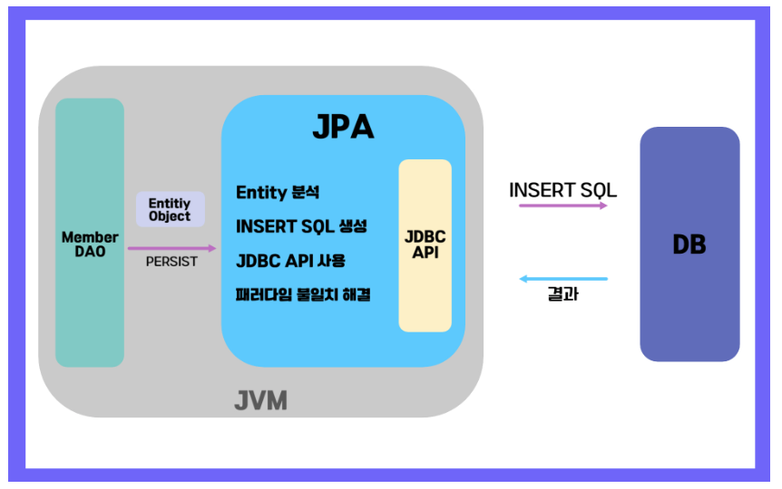
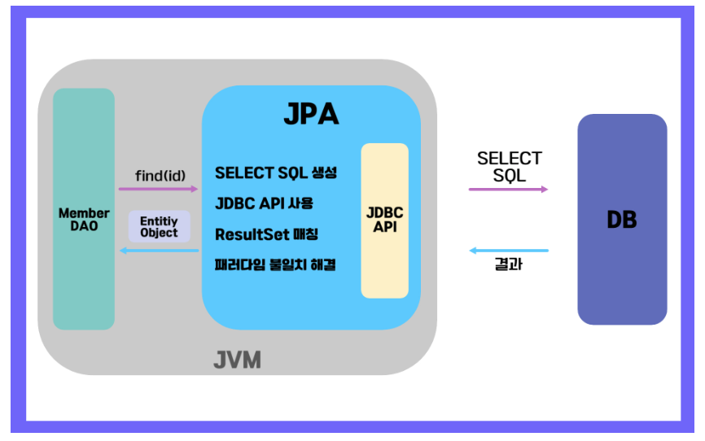

`Mybatis`와 `JPA`는 `Java`기반의 `Spring / SpringBoot`에서 데이터 베이스를 사용하는 대표적인 프레임 워크이다.

`Java`를 기반으로한 `Spring` 기반 데이터베이스를 사용하려면, 이 두 프레임 워크 중 하나를 사용해야 한다.

데이터베이스에 편하게 접근하기 위한 방법으로 크게 두가지가 있는데, 
하나는 `SQL Mapper` 다른 하나는 `ORM(Object Relational Mapping)`이 있다.

결론을 먼저 말하면, `Mybatis == SQL Mapper` / `ORM == JPA` 이다.

두 가지 기술 모두 데이터를 관계형 데이터베이스`RDBMS`에 저장`영속화` 시킨다는 점을 공통점으로 가지지만, 다른 접근 방식을 가지고 있다는 것이 차이점이다.


## Mybatis




`MyBatis`는 JDBC 프로그래밍을 단순화 시키고, `Java` 코드에서 `SQL`문을 분리해 별도의 XML 파일로 저장하며, 이 둘을 연결 시킨다.




### 예시 코드
``` java

@Mapper
public interface BoardMapper{
List<BoardVo> getBoardList();

BoardVo getBoard(Integer seq);
...
}
```

``` html
<select id= "getBoardList" resultType="BoardVo">
	SELECT * FROM BOARD;
</select>

<select id="getBoard" parameterType="int" resultType="boardVO">
	SELECT * FROM BOARD WEHRE SEQ = #{seq}
</select>
```


### 특징
- Boilerpalte 제거 `의미없는 중복 구문`
- `SQL`문 분리
- `Dynamic SQL` 생성 기능 `if, choose, when, otherwise, foreach 등`
	- ``` ex) SELECT * FROM BLOG WHERE state = 'ACTIVE'
	  <if test="title!=null"> AND title like #{title} ```

### 장점
- `SQL` 직접 제어 / 복잡한 쿼리 또는 특정 데이터 베이스에 최적화 가능
- `SQL`을 잘 아는 경우, `JPA`에 비해 학습이 용이하고 쉽게 사용이 가능

### 단점
- CRUD 단순 작업에 반복된 수작업 필요
- 특정 DB에 종속적


## JPA `Java Persisence API`


`JPA`는 `Java` 객체와 관계형 데이터베이스 간의 매핑을 위한 API이다.

### JPA가 생겨난 이유

데이터베이스 == 데이터 중심의 구조
Java == 객체지향적 구조

둘 사이에 데이터를 쉽게 가져오거나 저장하는 방법이 존재하지 않았다.

`Java` 개발자가 객체지향 관점에서 개발하기 용이하도록, `객체`와 `데이터베이스`간의 매핑을 위한 기술을 만들었다.

### ORM 매핑 과정 



### JPA 종류



### 특징





### 장점 
- 표준화된 인터페이스 - `Java`에서 `ORM`을 위한 표준 인터페이스를 제공
- `Java` 표준을 이용하므로 특정 제품`DB`에 종속되지 않음
- 객체 지향적인 접근 지원

### 단점
- 높은 학습 곡선
- 복잡한 SQL 생성의 어려움


## Mybatis & JPA 선택 방법
- 복잡한 쿼리와 SQL 제어가 필요하다 - `MyBatis`
- 간단한 매핑 및 객체 지향적인 접근이 필요하다 - `JPA`

<br>
<br>

#### 참고 : https://www.elancer.co.kr/blog/view?seq=231
