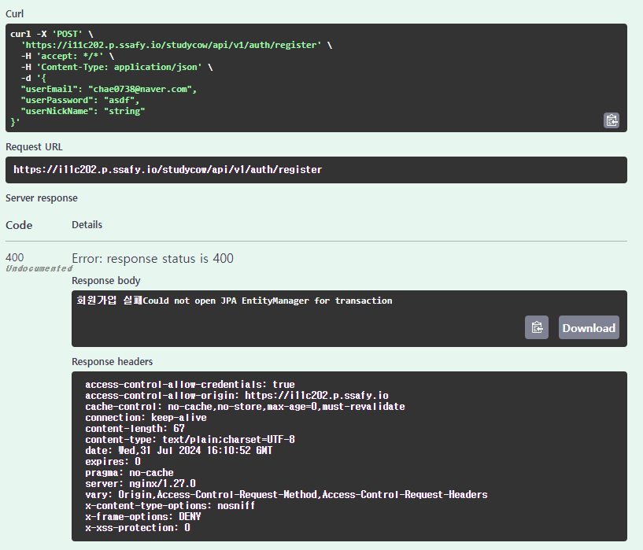

### 문제내용
운영 서버 배포 후 Swagger CORS 오류


### 해결방안 도출

#### 첫 번째 시도
스프링 시큐리티 전역 설정

``` java
@Bean  
public CorsConfigurationSource corsConfigurationSource() {  
    CorsConfiguration configuration = new CorsConfiguration();  
    configuration.setAllowedOrigins(Arrays.asList("http://localhost:5173","http://localhost:8080", "http://localhost:4443",  
            "http://13.125.238.202:8080", "http://13.125.238.202:443","https://i11c202.p.ssafy.io","http://i11c202.p.ssafy.io"));  
    configuration.setAllowedMethods(Arrays.asList("GET", "POST", "PUT", "DELETE","PATCH"));  
    configuration.setAllowedHeaders(Arrays.asList("*"));  
    configuration.setAllowCredentials(true);  
  
    UrlBasedCorsConfigurationSource source = new UrlBasedCorsConfigurationSource();  
    source.registerCorsConfiguration("/**", configuration);  
    return source;  
}
```

> **Tip!**
>setAllowedorigins를 설정 할 때는 하나의 리스트로 담아주어야한다

하지만 실패..
<br>

#### 두 번째 시도
``` java
@OpenAPIDefinition(  
       servers = {  
             @Server(url = "https://i11c202.p.ssafy.io/studycow",description = "운영 서버")  
       })
```
Swagger 서버에 운영서버 주소를 명시를 해주었다.
개발서버와 배포서버의 주소가 다르기 때문에 나는 오류였다.
**두 번째 방법**으로 CORS 오류 해결 완료!

<br>

### 결과 


이제 운영서버에 DB 연결하러 가자..

### 추가 학습 예정

- Swagger 에러코드 명시


<br><br><br>
## 문제 2
---


### 문제내용
STOMP apic 연결 오류


### 해결방안 도출
1. 서버에 오는 요청 로그 확인 `로그 존재 x`
2. 내장서버 websocket 페이지로 확인 `연결 성공`
3.  시큐리티 cors 추가 설정 후 요청 로그 확인 `cors 전역설정 오류 발생`
4. **시큐리티 cors 세션 및 쿠키 설정 비활성화** 
### 결과 
`"Stomp connected."


### 추가 학습내용

Apic을 사용한 테스트에서는 
``` java
@Override  
public void registerStompEndpoints(StompEndpointRegistry registry) {  
    registry.addEndpoint("/ws-stomp")  
            .setAllowedOriginPatterns("http://localhost:8080","http://localhost:5173","https://i11c202.p.ssafy.io")  
            .withSockJS();   // 비활성화가 필요하다
}
```

js 기반의 테스트가 아니기때문에 `.withSockJS()`를 비활성화 해야한다
<br>

## 문제 3
---


### 문제내용
글로벌 예외처리 적용시, 스프링 시큐리티에서 Global 예외처리가 작동하지 않는 문제
```
 cache-control: no-cache,no-store,max-age=0,must-revalidate connection: keep-alive  content-length: 0  date: Tue,06 Aug 2024 08:45:29 GMT  expires: 0  keep-alive: timeout=60  pragma: no-cache  vary: Origin,Access-Control-Request-Method,Access-Control-Request-Headers  x-content-type-options: nosniff  x-frame-options: DENY x-xss-protection: 0
```

### 해결방안 도출
1. 서비스 로직 log 확인
2. 다른 서비스 로직 예외처리 테스트
3. Security 및 예외처리 흐름 확인
4. `Spring Security AuthenticationEntryPoint` **구현체 생성 후 추가**로 해결!

### 결과 

```json
{
  "timestamp": "2024-08-07T13:52:08.0660066",
  "errorCode": "BAD_REQUEST",
  "errorMessage": "존재하지 않는 아이디입니다.",
  "validationErrors": null
}
```
에러 결과값 반환 성공 !

### 추가 학습내용

데이터가 거쳐가는 흐름은 

1. Spring Security 필터
2. 서블릿 필터
3. DispatcherServlet
4. 컨트롤러
5. 글로벌 예외 처리기 (`@ControllerAdvice` / `@RestControllerAdvice`)

의 순서로, **Spring Security**에서 예외처리가 먼저 걸러질 경우
**글로벌 예외 처리기**까지 도달하지 못한다.
따라서 **Spring Security**의 부가적인 설정을 통해 글로벌 예외 처리기와 연결해주어야 한다!

<br><br><br>
