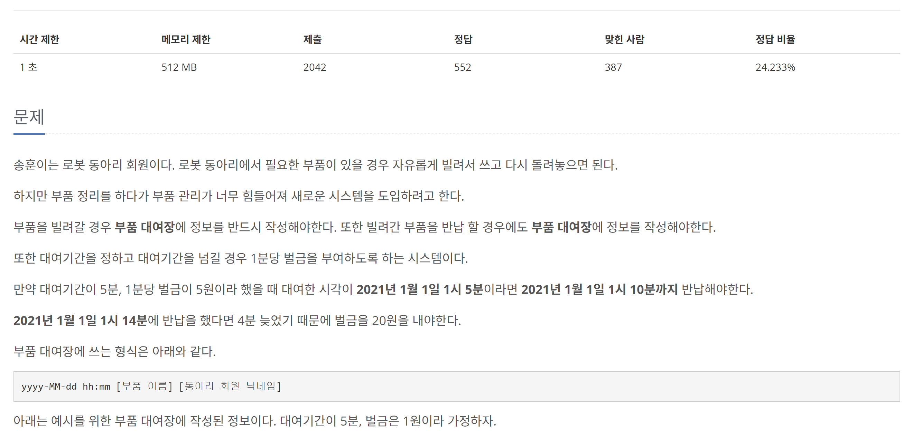
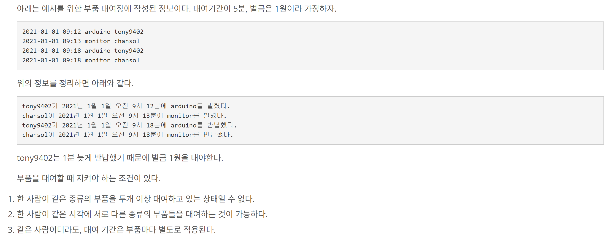

[문제 링크](https://www.acmicpc.net/problem/21942)
# created : 2024-08-21

## 문제




## 떠올린 접근 방식, 과정
파싱 문제로 접근했다.


## 알고리즘과 판단 사유
파싱 `parsing`


## 시간복잡도
O(N)


## 오류 해결 과정
처음에는 일자를 모두 String 으로 받아 **일일히 파싱**하려고 시도했다.
그랬더니 고려해야되는 부분도 너무 많았고,
**월별 일자**가 다른것을 고려하지 못해서  틀렸다
그래서 Java 8 의 **Time 메서드 계산**을 이용해 풀이했다

## 개선 방법
없을 것 같다!

프로젝트가 있더라도 알고리즘을 열심히 풀자!

## 풀이 코드

``` java
import java.io.*;
import java.time.*;
import java.time.format.*;
import java.util.*;

public class Main {
    static long standardMinutes;
    static int feePerMinute;
    static DateTimeFormatter formatter = DateTimeFormatter.ofPattern("yyyy-MM-dd HH:mm");

    public static void main(String[] args) throws IOException {
        BufferedReader br = new BufferedReader(new InputStreamReader(System.in));
        String[] input = br.readLine().split(" ");

        int N = Integer.parseInt(input[0]);
        String[] durationParts = input[1].split("/");
        standardMinutes = Duration.ofDays(Integer.parseInt(durationParts[0]))
                .plusHours(Integer.parseInt(durationParts[1].split(":")[0]))
                .plusMinutes(Integer.parseInt(durationParts[1].split(":")[1]))
                .toMinutes();
        feePerMinute = Integer.parseInt(input[2]);

        Map<String, LocalDateTime> rentalLog = new HashMap<>();
        Map<String, Long> feeLog = new TreeMap<>();

        for (int i = 0; i < N; i++) {
            String[] parts = br.readLine().split(" ");
            String dateTime = parts[0] + " " + parts[1];
            String item = parts[2];
            String member = parts[3];
            String key = member + " " + item;

            LocalDateTime currentTime = LocalDateTime.parse(dateTime, formatter);

            if (rentalLog.containsKey(key)) {
                LocalDateTime rentalTime = rentalLog.remove(key);
                long minutes = Duration.between(rentalTime, currentTime).toMinutes();
                if (minutes > standardMinutes) {
                    long fee = (minutes - standardMinutes) * feePerMinute;
                    feeLog.put(member, feeLog.getOrDefault(member, 0L) + fee);
                }
            } else {
                rentalLog.put(key, currentTime);
            }
        }

        if (feeLog.isEmpty()) {
            System.out.println(-1);
        } else {
            for (Map.Entry<String, Long> entry : feeLog.entrySet()) {
                System.out.println(entry.getKey() + " " + entry.getValue());
            }
        }
    }
}
```
