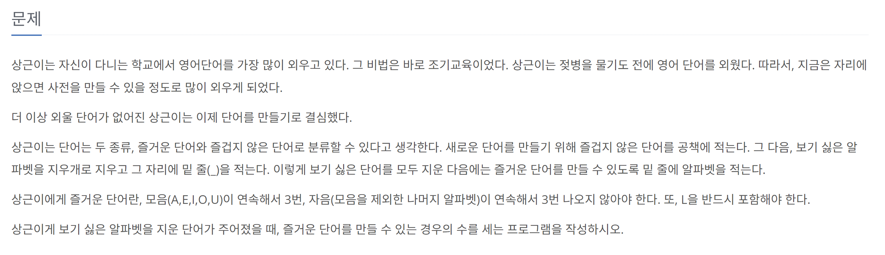

[문제 링크](https://www.acmicpc.net/problem/2922)
# created : 2024-08-22

## 문제



## 떠올린 접근 방식, 과정
빈칸의 범위가 10개라는점과 모든 경우의 수를 세야된다는 점을 가지고 **백트래킹(DFS)** 로 접근했다


## 알고리즘과 판단 사유
`DFS`


## 시간복잡도
O(3^10)


## 오류 해결 과정
중간 계산 범위를 확인하지 못하고 `int`형을 사용해 오류가 났다..
`long`으로 계산 후 해결했다!
## 개선 방법
DP로 가능 할 수도 있을 것 같은데
아직은 잘 모르겠다


## 풀이 코드

``` java
package baekjoon;  
import java.io.*;  
  
public class __2922 {  
    static long answer = 0;  
    static char[] word;  
    static char[] temp = new char[101];  
    public static void main(String[] args) throws IOException {  
        BufferedReader br = new BufferedReader(new InputStreamReader(System.in));  
        word = br.readLine().toCharArray();  
  
        if(checkBlank(word)) {  
            dfs(0, 0, 0, false, temp);  
        }else{  
            if(checkFunnyWord(0,word,0,0))answer++;  
        }  
  
        System.out.println(answer);  
    }  
    static boolean checkFunnyWord(int level,char[] arr,int C, int V){  
        if(C==3 || V==3)return false;  
  
        if(level==arr.length){  
            return true;  
        }  
  
        for (int i = level; i < arr.length; i++) {  
            if(word[i]=='A'||word[i]=='E'||word[i]=='I'||word[i]=='O'||word[i]=='U') {  
                checkFunnyWord(level + 1, arr,0,V+1);  
            }else{  
                checkFunnyWord(level+1,arr,C+1,0);  
            }  
        }  
  
        return true;  
    }  
  
    static boolean checkBlank(char[]word){  
        for (char c : word) {  
            if(c=='_')return true;  
        }  
        return false;  
    }  
  
    static void dfs(int index, int consonantCount, int vowelCount, boolean hasL,char[] arr) {  
        if (consonantCount == 3 || vowelCount == 3) return;  
  
        if (index == word.length) {  
            if (hasL){  
                long cnt = 1;  
                for (char c : arr) {  
                    if(c=='C') cnt*=20;  
                    if(c=='V') cnt*=5;  
                }  
                answer+=cnt;  
            }  
            return;  
        }  
  
        if (word[index] == '_') {  
            // L을 넣는 경우  
            arr[index]='L';  
            dfs(index + 1, consonantCount + 1, 0, true,arr);  
            arr[index]=' ';  
            // 자음(L 제외)을 넣는 경우 (20개)  
            arr[index]='C';  
            dfs(index + 1, consonantCount + 1, 0, hasL,arr);  
            arr[index]=' ';  
            // 모음을 넣는 경우 (5개)  
            arr[index]='V';  
            dfs(index + 1, 0, vowelCount + 1, hasL,arr);  
            arr[index]=' ';  
        } else {  
            if (isVowel(word[index])) {  
                dfs(index + 1, 0, vowelCount + 1, hasL,arr);  
            } else {  
                if (word[index] == 'L') hasL = true;  
                dfs(index + 1, consonantCount + 1, 0, hasL,arr);  
            }  
        }  
    }  
  
    static boolean isVowel(char c) {  
        return c == 'A' || c == 'E' || c == 'I' || c == 'O' || c == 'U';  
    }  
}
```
