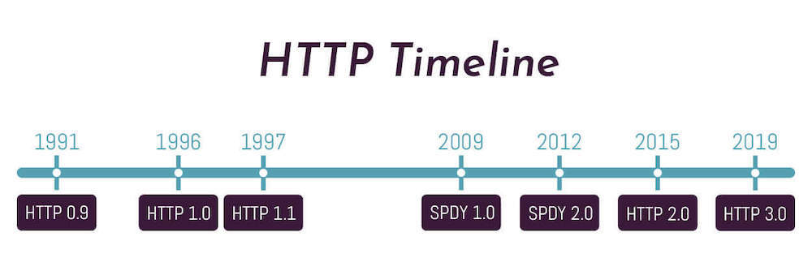
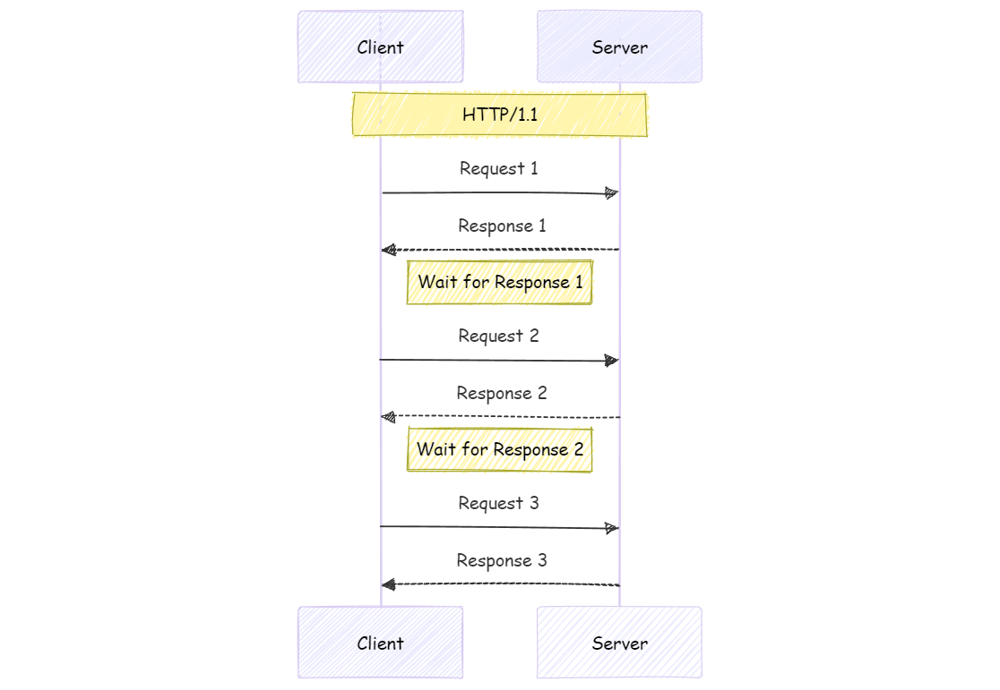
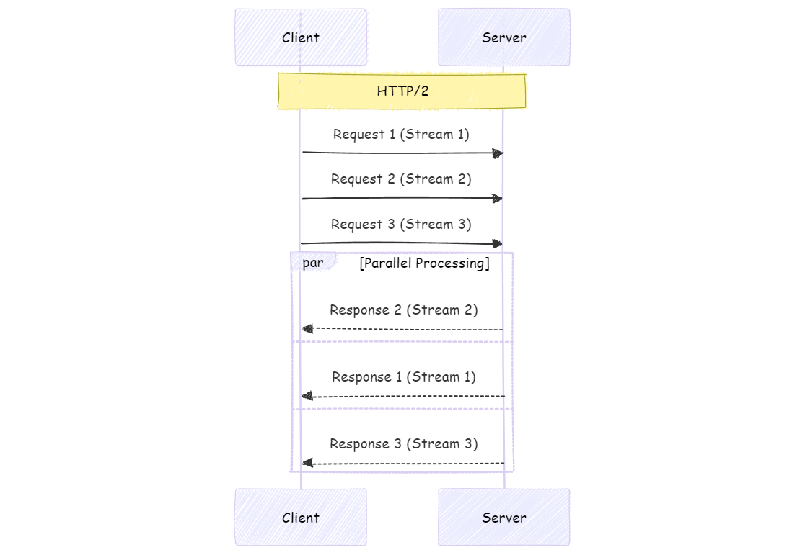
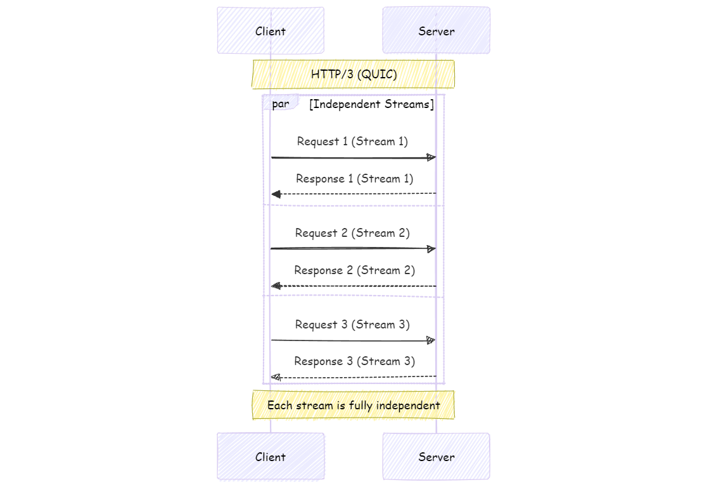

**HTTP**는 시대가 지남에 따라 많은 발전이 이루어졌다.
초기엔 어떤 문제가 있었고, 그러한 문제들을 어떻게 해결했는지 의문이 들어 조사해보았다!

# HTTP 통신의 전체적인 흐름

HTTP 통신은 다음과 같은 단계로 이루어진다.

1. URL 입력과 파싱
   - 브라우저에 URL을 입력
   - 브라우저가 URL을 파싱하여 **프로토콜**, **도메인**, **경로**를 추출

2. DNS 조회
   - 도메인에 대한 **IP 주소**를 찾음
   - **로컬 캐시**, **운영체제 캐시**, **ISP의 DNS 서버** 순으로 조회

3. TCP 연결 설정
   - 서버와 **TCP 3-way handshake**를 수행
   - **SYN**, **SYN-ACK**, **ACK** 순서로 진행

4. TLS 협상 (HTTPS의 경우)
   - **암호화 알고리즘**을 협상
   - 서버가 **인증서**를 전송하고 클라이언트가 확인
   - **세션 키**를 생성

5. HTTP 요청 전송
   - 브라우저가 **HTTP 요청 메시지**를 생성
   - 생성된 요청을 서버로 전송

6. 서버의 요청 처리
   - 웹 서버가 요청을 수신하고 파싱
   - 필요시 **애플리케이션 서버**로 요청을 전달
   - **비즈니스 로직** 처리 및 **데이터베이스** 조회를 수행

7. HTTP 응답 생성 및 전송
   - 서버가 **HTTP 응답 메시지**를 생성
   - 생성된 응답을 클라이언트로 전송

8. 브라우저의 응답 처리
   - 브라우저가 응답을 수신하고 파싱
   - **상태 코드**를 확인하고 적절히 처리
   - 응답 **헤더**를 처리

9. 리소스 로딩 및 렌더링
   - HTML을 파싱하여 **DOM 트리**를 구축
   - CSS를 처리하여 **CSSOM**을 생성
   - DOM과 CSSOM을 결합하여 **렌더 트리**를 생성
   - **레이아웃**을 계산하고 **페인팅**을 수행

10. JavaScript 실행
    - HTML 파싱 중 **script 태그**를 만나면 JavaScript를 실행
    - **DOM 조작**, **이벤트 핸들러** 등록 등을 수행

11. AJAX 요청 (필요한 경우)
    - JavaScript에서 추가적인 **HTTP 요청**을 생성
    - 데이터를 가져오고 처리

12. 연결 종료 또는 유지
    - **keep-alive 헤더**에 따라 연결을 유지하거나 종료
    - 연결 종료 시 **TCP 4-way handshake**를 수행

이 흐름은 HTTP/1.1 기준이며, **HTTP/2**나 **HTTP/3**에서는 일부 단계가 최적화되거나 병렬로 처리된다

# HTTP/2 통신의 전체적인 흐름

HTTP/2는 성능 개선을 위해 다음과 같은 특징을 가진다.

1. 멀티플렉싱
   - 단일 TCP 연결에서 여러 요청과 응답 **동시 처리**
   - **HOL(Head of Line) 블로킹** 문제 해결

2. 서버 푸시
   - 클라이언트 요청 없이 서버가 리소스 **미리 전송**
   - 페이지 로딩 시간 단축

3. 헤더 압축
   - **HPACK 알고리즘**을 사용하여 헤더 압축
   - 네트워크 오버헤드 감소

4. 스트림 우선순위 지정
   - 리소스에 **우선순위 부여**
   - 중요한 리소스 우선 처리

### HTTP/2의 통신 흐름

1. TCP 연결 설정
   - 기존 HTTP/1.1과 동일하게 TCP 연결 설정

2. TLS 협상 (HTTPS의 경우)
   - **ALPN**(Application-Layer Protocol Negotiation)을 통해 HTTP/2 사용 협상

3. HTTP/2 세션 설정
   - 클라이언트와 서버가 HTTP/2 세션 초기화
   - **SETTINGS 프레임**을 교환하여 세션 매개변수 설정

4. 스트림 생성 및 요청 전송
   - 클라이언트가 새로운 스트림 생성
   - **HEADERS 프레임**과 **DATA 프레임**을 사용하여 요청 전송

5. 서버 처리 및 응답
   - 서버가 요청 처리 및 응답 생성
   - 응답도 HEADERS 프레임과 DATA 프레임으로 전송

6. 멀티플렉싱 처리
   - 여러 요청과 응답 동시 처리
   - 각 스트림에 **ID 부여**하여 구분

7. 서버 푸시 (선택적)
   - 서버가 클라이언트에게 추가 리소스 푸시
   - **PUSH_PROMISE 프레임** 사용

8. 연결 유지 및 종료
   - 장기간 연결 유지하여 재사용
   - **GOAWAY 프레임**을 사용하여 연결 정상 종료

하지만 **이러한 개선**에도 **TCP 자체의 HOL** 문제가 남아있었고, 이를 보완하기위한 **HTTP/3**가 나오게된다.

# HTTP/3 통신의 전체적인 흐름

HTTP/3는 **QUIC 프로토콜**을 기반으로 하며 다음과 같은 특징을 가진다.

1. UDP 기반 통신
   - **TCP 대신 UDP** 사용
   - 연결 설정 시간 단축

2. 내장된 TLS 1.3
   - 암호화와 인증 기본 제공
   - 연결 설정 단계 감소

3. 독립적인 스트림 처리
   - 각 스트림 **독립적 처리**
   - TCP HOL 블로킹 문제 완전 해결

4. 연결 마이그레이션
   - 클라이언트 IP 변경 시에도 연결 유지
   - 모바일 환경에서 안정적 연결 제공

### HTTP/3의 통신 흐름

1. QUIC 연결 설정
   - UDP를 통해 QUIC 연결 설정
   - **TLS 1.3 handshake** 동시 수행

2. HTTP/3 세션 초기화
   - QUIC 스트림을 통해 HTTP/3 세션 초기화
   - SETTINGS 프레임 교환

3. 요청 전송
   - 새로운 QUIC 스트림 생성
   - HEADERS 프레임과 DATA 프레임으로 요청 전송

4. 서버 처리 및 응답
   - 서버가 요청 처리 및 응답 생성
   - 별도의 QUIC 스트림으로 응답 전송

5. 0-RTT 재연결 (선택적)
   - 이전 연결 정보를 사용하여 **즉시 데이터 전송**
   - 연결 설정 시간 추가 단축

6. 독립적 스트림 처리
   - 각 요청과 응답 독립적 처리
   - 한 스트림의 손실이 다른 스트림에 **영향 없음**

7. 연결 마이그레이션
   - 클라이언트 IP 변경 시 **연결 ID**를 사용하여 세션 유지

8. 연결 종료
   - QUIC 연결 종료 절차 수행
   - 정상적인 종료와 오류 상황 구분하여 처리

HTTP/3는 QUIC의 특성을 활용하여 **더 빠르고 안정적인** 웹 통신을 제공한다.
또한 TCP의 고질적 문제인 HOL을 **QUIC**의 UDP 사용을 통해서 해결했다!
