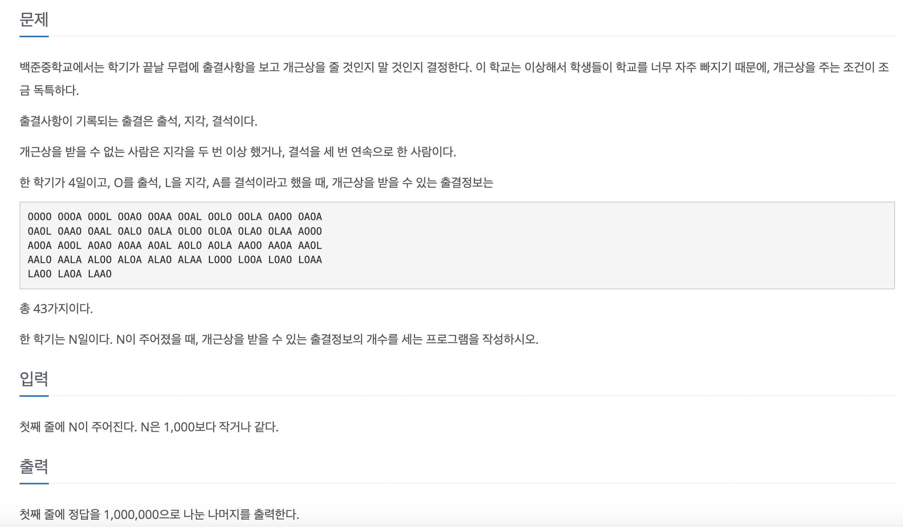

# created : 2024-09-15

## 문제


[문제 링크](https://www.acmicpc.net/problem/1563)

## 떠올린 접근 방식, 과정
처음에는 DFS를 떠올렸지만 문제 범위와 정답의 단위를 보고 DP임을 알았고, 직전 날짜를 기준으로 규칙을 찾았다


## 알고리즘과 판단 사유
DP `동적 프로그래밍`


## 시간복잡도
O(N)

## 오류 해결 과정
규칙을 찾는데 오래걸렸다

## 개선 방법
이미 메모리도 초기화 되어서 없을 것 같다

## 풀이 코드

``` java
import java.io.*;
import java.util.*;

public class Main {
    static final int MOD = 1000000;
    static int N;
    static long[][][] dp;

    public static void main(String[] args) throws IOException {
        BufferedReader br = new BufferedReader(new InputStreamReader(System.in));
        N = Integer.parseInt(br.readLine());

        dp = new long[N+1][2][3];

        // 초기 상태 설정
        dp[1][0][0] = 1; // 출석
        dp[1][1][0] = 1; // 지각
        dp[1][0][1] = 1; // 결석

        for (int i = 2; i <= N; i++) {
            // 출석
            dp[i][0][0] = (dp[i-1][0][0] + dp[i-1][0][1] + dp[i-1][0][2]) % MOD;
            dp[i][1][0] = (dp[i-1][1][0] + dp[i-1][1][1] + dp[i-1][1][2]) % MOD;

            // 지각
            dp[i][1][0] = (dp[i][1][0] + dp[i-1][0][0] + dp[i-1][0][1] + dp[i-1][0][2]) % MOD;

            // 결석
            dp[i][0][1] = dp[i-1][0][0] % MOD;
            dp[i][1][1] = dp[i-1][1][0] % MOD;
            dp[i][0][2] = dp[i-1][0][1] % MOD;
            dp[i][1][2] = dp[i-1][1][1] % MOD;
        }

        long result = 0;
        for (int i = 0; i < 2; i++) {
            for (int j = 0; j < 3; j++) {
                result = (result + dp[N][i][j]) % MOD;
            }
        }

        System.out.println(result);
    }
}
```
