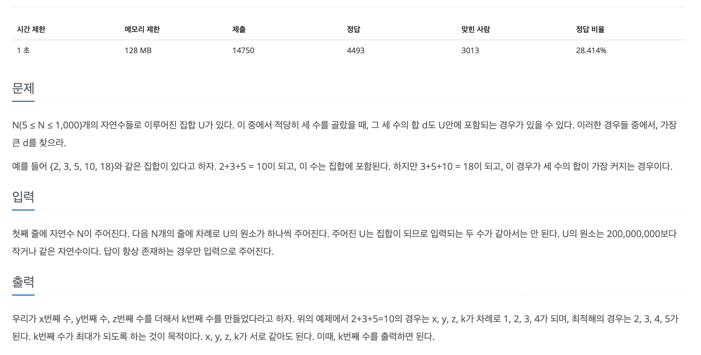

[문제 링크](https://www.acmicpc.net/problem/2295)
# created : 2024-09-15

## 문제



## 떠올린 접근 방식, 과정
처음에는 이분 탐색으로 접근해보려 했지만, **O(N^2 * logN)**으로 시간 복잡도가 좋지 않을 것 같아서 **HashSet**을 사용한 최적화 방법을 생각했다


## 알고리즘과 판단 사유
HashSet `자료구조`


## 시간복잡도
O(N^2)


## 오류 해결 과정
모든 원소의 선택이 중복된다는 것을 읽지 않았다가 50%에서 틀렸다
문제 다시 읽고 고쳐서 맞았다

## 개선 방법
없을 것 같다


## 풀이 코드

``` java
import java.util.*;
import java.io.*;

public class Main {

    public static void main(String[] args) throws IOException{
        BufferedReader br = new BufferedReader(new InputStreamReader(System.in));

        int N = Integer.parseInt(br.readLine());

        long[] arr = new long[N];
        //X = a + b + c
        //X - c = a + b
        Set<Long> twoSum = new HashSet<>();

        for (int i = 0; i < N; i++) {
            arr[i] = Long.parseLong(br.readLine());
        }

        Arrays.sort(arr);

        for (int i = 0; i < N; i++) {
            for (int j = i; j <N ; j++) {
                twoSum.add(arr[i] + arr[j]);
            }
        }

        long result = 0;

        //최댓값을 찾아야 하니깐 뒤에서부터
        for (int i = N-1; i >=0 ; i--) {
            for (int j = i; j >=0 ; j--) {
                if(twoSum.contains(arr[i] - arr[j])){
                    result = arr[i];
                    i=-1;
                    break;
                }
            }
        }
        System.out.println(result);
    }
}
```
