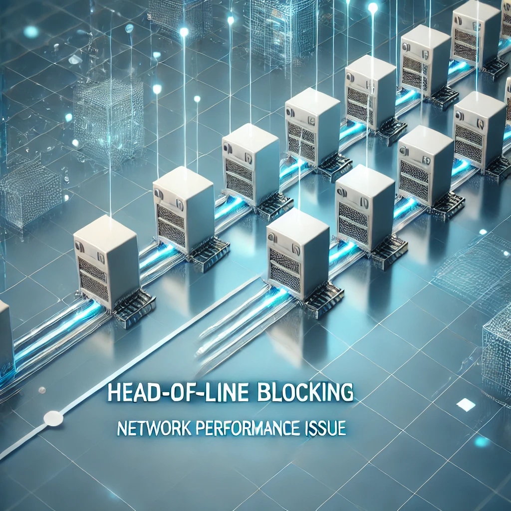

HTTP의 역사를 알아보면서 **HOL**이라는 문제가 많이 나왔다.
따라서 **HOL**에 대해서 조사해보기로 했다!

## 1. 헤드 오브 라인 블로킹 정의
네트워크 큐에서 **첫 번째 패킷**(헤드)이 지연되면서 그 뒤의 패킷들도 함께 **지연**되는 현상이다. 주로 FIFO(First In First Out) 큐잉 시스템에서 발생한다.

## 2. 발생 원인
- 네트워크 혼잡
- 처리 시간이 **긴 대용량 패킷**
- 패킷 손실로 인한 **재전송**
- 수신자의 **처리 능력** 부족

## 3. 영향
HOL 블로킹이 발생하면 전체 **네트워크 성능이 저하**된다. **지연 시간이 증가**하고, 처리량(throughput)이 감소해 사용자 경험이 나빠진다.

## 4. HOL 블로킹이 흔히 발생하는 프로토콜
- HTTP/1.1: 단일 TCP 연결에서 요청을 순차적으로 처리하기 때문에 HOL 블로킹이 자주 발생한다.
- TCP: 패킷 순서를 보장하는 과정에서 HOL 블로킹이 발생할 수 있다.

## 5. HOL 블로킹 해결 방법

### a. 다중화(Multiplexing)
여러 스트림을 **동시에 전송**하는 방식이다. HTTP/2에서 사용되는 기술로 HOL 블로킹을 완화한다.

### b. 연결 병렬화
**여러 개의 연결**을 동시에 사용하는 방법이다. HTTP/1.1에서는 도메인 샤딩(domain sharding) 기법으로 연결 병렬화를 구현할 수 있다.

### c. 우선순위 큐잉
중요도에 따라 **패킷 처리 순서**를 조정하는 방식이다. 중요한 패킷을 먼저 처리해 HOL 블로킹의 영향을 줄인다.

### d. 패킷 분할
큰 패킷을 **작은 단위로 나누어** 전송하는 방법이다. 이렇게 하면 각 패킷의 처리 시간이 줄어들어 HOL 블로킹을 방지할 수 있다.

## 6. 관련 개념

### a. 버퍼 블로팅(Buffer Bloating)
과도하게 큰 버퍼로 인해 지연 시간이 증가하는 현상이다. HOL 블로킹을 악화시킬 수 있다.

### b. TCP 혼잡 제어
네트워크 혼잡을 감지하고 데이터 전송 속도를 조절하는 방식이다. HOL 블로킹과 상호작용하여 성능에 영향을 준다.

### c. QoS(Quality of Service)
네트워크 트래픽의 **우선순위**를 관리하는 기술이다. HOL 블로킹 완화에 도움이 된다.

### d. CDN(Content Delivery Network)
콘텐츠를 **지리적**으로 분산하여 제공하는 네트워크이다. 서버 부하를 줄이고 HOL 블로킹 가능성을 감소시킨다.

### e. 로드 밸런싱
트래픽을 **여러 서버로 분산**하는 기술이다. 단일 지점에서의 HOL 블로킹 위험을 줄인다.

## 7. 최신 프로토콜에서의 HOL 블로킹 해결

- HTTP/2: **스트림 다중화**로 HOL 블로킹을 완화한다.
- QUIC: **UDP** 기반 프로토콜로 TCP의 HOL 블로킹 문제를 해결한다.
- HTTP/3: **QUIC**을 기반으로 성능을 더욱 개선해 HOL 블로킹 문제를 최소화한다

## 8. 모니터링과 분석
네트워크 분석 도구를 사용해 HOL 블로킹을 탐지할 수 있다. 성능 메트릭스를 모니터링하여 문제를 조기에 발견하고 해결해야 한다.
