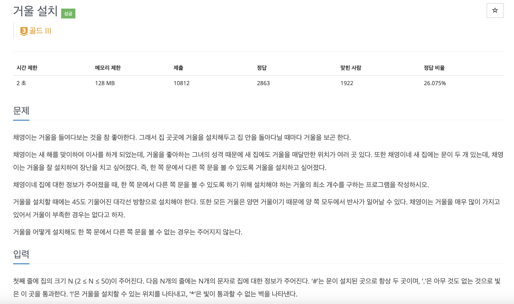

[문제 링크](https://www.acmicpc.net/problem/2151)
# created : 2024-09-29

## 문제



## 떠올린 접근 방식, 과정
거울을 거쳐가는 최단경로를 구해야하고, 범위가 50밖에 되지 않으므로 조건에 맞는 다익스트라를 구현하면 되겠다고 생각했다


## 알고리즘과 판단 사유
다익스트라 `Dijkstra`

## 시간복잡도
O(N^2)


## 오류 해결 과정
문제를 잘못읽어 출발점에서도 좌우를 고려 안해서 틀렸다
수정해서 맞았다

## 개선 방법
없을 것 같다!


## 풀이 코드

``` java
import java.io.*;
import java.util.*;

class Point {
    int x, y, dir, mirrors;
    Point(int x, int y, int dir, int mirrors) {
        this.x = x;
        this.y = y;
        this.dir = dir;
        this.mirrors = mirrors;
    }
}

public class Main {
    static int N;
    static char[][] house;
    static int[] dx = {-1, 0, 1, 0};  // 상, 우, 하, 좌
    static int[] dy = {0, 1, 0, -1};
    static Point start, end;

    public static void main(String[] args) throws IOException {
        BufferedReader br = new BufferedReader(new InputStreamReader(System.in));
        N = Integer.parseInt(br.readLine());
        house = new char[N][N];

        boolean foundStart = false;
        for (int i = 0; i < N; i++) {
            String line = br.readLine();
            for (int j = 0; j < N; j++) {
                house[i][j] = line.charAt(j);
                if (house[i][j] == '#') {
                    if (!foundStart) {
                        start = new Point(i, j, -1, 0);
                        foundStart = true;
                    } else {
                        end = new Point(i, j, -1, 0);
                    }
                }
            }
        }

        System.out.println(bfs());
    }

    static int bfs() {
        PriorityQueue<Point> pq = new PriorityQueue<>((a, b) -> a.mirrors - b.mirrors);
        boolean[][][] visited = new boolean[N][N][4];

        for (int i = 0; i < 4; i++) {
            pq.offer(new Point(start.x, start.y, i, 0));
        }

        while (!pq.isEmpty()) {
            Point current = pq.poll();

            if (current.x == end.x && current.y == end.y) {
                return current.mirrors;
            }

            if (visited[current.x][current.y][current.dir]) continue;
            visited[current.x][current.y][current.dir] = true;

            int nx = current.x + dx[current.dir];
            int ny = current.y + dy[current.dir];

            if (nx >= 0 && nx < N && ny >= 0 && ny < N && house[nx][ny] != '*') {
                // 직진
                pq.offer(new Point(nx, ny, current.dir, current.mirrors));

                // 거울 설치 가능한 위치에서 방향 전환
                if (house[nx][ny] == '!' || house[nx][ny] == '#') {
                    int leftDir = (current.dir + 3) % 4;
                    int rightDir = (current.dir + 1) % 4;

                    pq.offer(new Point(nx, ny, leftDir, current.mirrors + 1));
                    pq.offer(new Point(nx, ny, rightDir, current.mirrors + 1));
                }
            }
        }

        return -1;
    }
}
```
