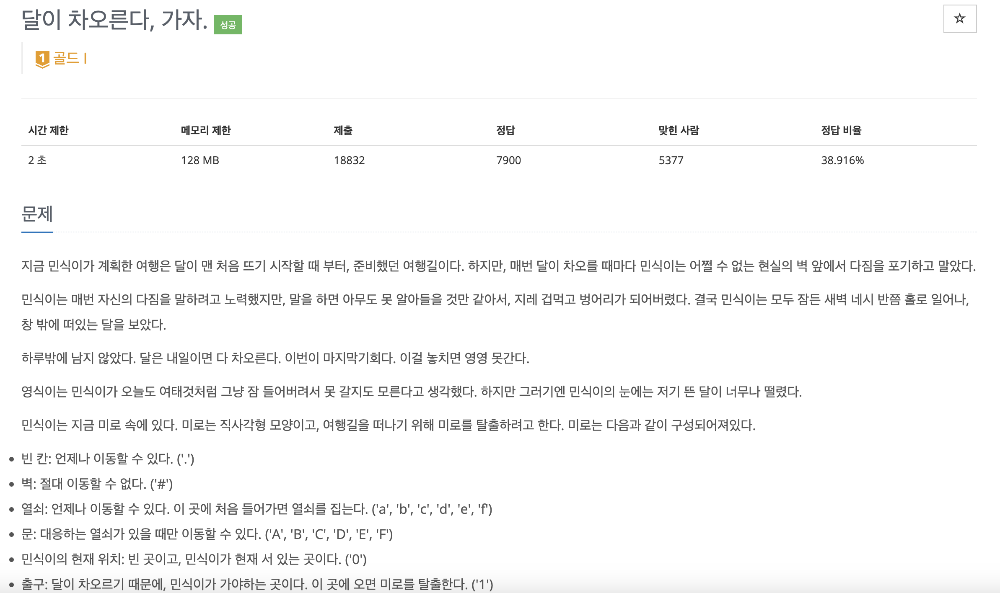

# created : 2024-09-30

## 문제


[문제 링크](https://www.acmicpc.net/problem/1194)

## 떠올린 접근 방식, 과정
기본적으로 최단경로이므로 BFS에 메모리 제한이 128로 작으므로 비트마스킹을 통한 상태관리가 필요하다고 생각했다


## 알고리즘과 판단 사유
BFS `너비우선탐색` + 비트마스킹

## 시간복잡도
O(N * M)


## 오류 해결 과정
없다

## 개선 방법
없을 것 같다 


## 풀이 코드

``` java
import java.util.*;

public class Main {
    static int N, M;
    static char[][] maze;
    static int[] dx = {-1, 1, 0, 0};
    static int[] dy = {0, 0, -1, 1};

    static class State {
        int x, y, keys, dist;

        State(int x, int y, int keys, int dist) {
            this.x = x;
            this.y = y;
            this.keys = keys;
            this.dist = dist;
        }
    }

    public static void main(String[] args) {
        Scanner sc = new Scanner(System.in);
        N = sc.nextInt();
        M = sc.nextInt();
        maze = new char[N][M];

        int startX = 0, startY = 0;
        for (int i = 0; i < N; i++) {
            String line = sc.next();
            for (int j = 0; j < M; j++) {
                maze[i][j] = line.charAt(j);
                if (maze[i][j] == '0') {
                    startX = i;
                    startY = j;
                }
            }
        }

        System.out.println(bfs(startX, startY));
    }

    static int bfs(int startX, int startY) {
        Queue<State> queue = new LinkedList<>();
        boolean[][][] visited = new boolean[N][M][64]; // 64 = 2^6, 6개의 열쇠 상태

        queue.offer(new State(startX, startY, 0, 0));
        visited[startX][startY][0] = true;

        while (!queue.isEmpty()) {
            State current = queue.poll();

            if (maze[current.x][current.y] == '1') {
                return current.dist;
            }

            for (int i = 0; i < 4; i++) {
                int nx = current.x + dx[i];
                int ny = current.y + dy[i];

                if (nx < 0 || nx >= N || ny < 0 || ny >= M) continue;

                char nextCell = maze[nx][ny];
                if (nextCell == '#') continue;

                int newKeys = current.keys;

                if (nextCell >= 'a' && nextCell <= 'f') {
                    newKeys |= (1 << (nextCell - 'a'));
                }

                if (nextCell >= 'A' && nextCell <= 'F') {
                    if ((newKeys & (1 << (nextCell - 'A'))) == 0) continue;
                }

                if (!visited[nx][ny][newKeys]) {
                    visited[nx][ny][newKeys] = true;
                    queue.offer(new State(nx, ny, newKeys, current.dist + 1));
                }
            }
        }

        return -1;
    }
}
```
