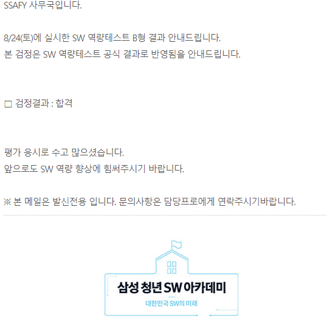
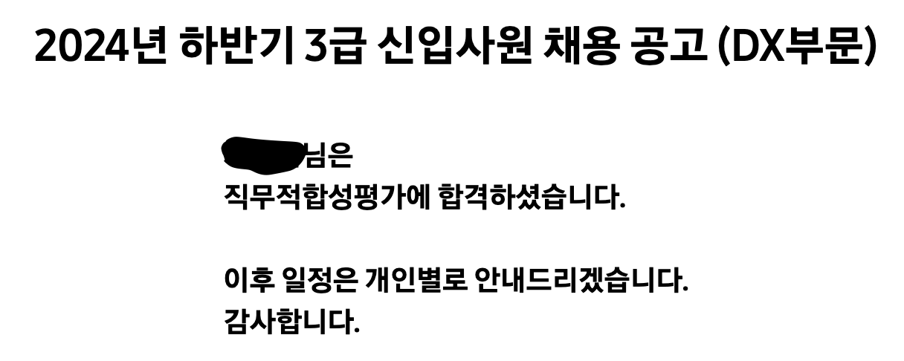

이번 8월 24일에 실시한 B형에 합격하게 되었다!
1학기에 작성한 버킷리스트 중 하나를 이룬 기념으로 후기를 작성할까 한다.

## 준비 과정

이번 B형을 위한 준비는 많이 하지 못했다.
2학기 자체가 프로젝트에 집중되어있고, 심지어 8월 막바지 부터는 공채기간의 시작이기 때문이다.
그래서 B형 시험을 신청할 때, 2번을 신청했다.
8월의 시험은 유형 맛보기로 보고 9월의 시험에 제대로 준비해보자는 마인드로 갔지만 1학기에 알고리즘을 꾸준히 풀었던 것과, 6월 방학기간에 열심히 달려서 백준 플레를 찍었던 것도 합격에 한 몫을 한 것 같다!

## 문제 유형

문제 유형을 자세히 말하진 못하지만, 보통 B형 시험은 자료구조와 그것을 사용해 어떤식으로 최적화를 구현할지가 주요 문제이다.
이번 시험 또한 마찬가지였는데, 특히 내부 구현의 시간 복잡도 최적화가 제일 중요했던 포인트였다. 오히려 구현 잘하는 사람한테 유리했던것 같다.

## 후기

B형 덕분에 전공 제한이 있었던 삼성 본사에 지원할 수 있게 되었고, 11월에 최종 면접을 보게 되었다! 첫 면접인 만큼 더 열심히 준비해야겠다..
