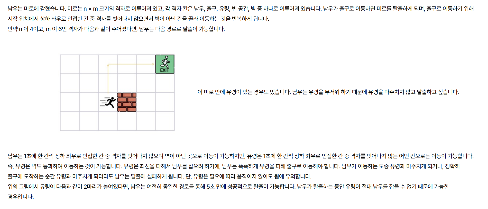

[문제 링크](https://softeer.ai/practice/7726)
# created : 2024-11-01

## 문제



## 떠올린 접근 방식, 과정
기본적인 최단경로를 구하기 위해 BFS를 사용하고, 내부 로직 최적화를 위해 우선순위 큐를 사용했다


## 알고리즘과 판단 사유
BFS + 우선순위 큐 


## 시간복잡도
O(N^M)


## 오류 해결 과정
중간에 초기화를 잘못해주어 게속 틀렸었다..

## 개선 방법
출구와 가장 가까운 유령만 BFS 돌려도 가능 할 것 같다.


## 풀이 코드

``` java
import java.util.*;
import java.io.*;

public class Main {
    static String [][] map ;
    static int startY,startX, endY,endX,N,M,countH,countG;
    static boolean check;
    public static void main(String[] args) throws IOException{
        BufferedReader br = new BufferedReader(new InputStreamReader(System.in));
        StringTokenizer st = new StringTokenizer(br.readLine());

        countG = Integer.MAX_VALUE;

        N = Integer.parseInt(st.nextToken());
        M = Integer.parseInt(st.nextToken());

       map = new String[N][M];

        List<int[]> ghostCdn = new ArrayList<>();

        boolean[][] visited = new boolean[N][M];

        int[][] humanMap = new int[N][M];
        int[][] ghostMap = new int[N][M];

        for (int i = 0; i < N; i++) {
            for (int j = 0; j < M; j++) {
                humanMap[i][j] = Integer.MAX_VALUE;
                ghostMap[i][j] = Integer.MAX_VALUE;
            }
        }

        for (int i = 0; i < N; i++) {
            String temp = br.readLine();
            for (int j = 0; j < M; j++) {
                map[i][j] = String.valueOf(temp.charAt(j));
                if(map[i][j].equals("N")){
                    startY = i;
                    startX = j;
                    humanMap[i][j] = 0;
                }
                if(map[i][j].equals("D")){
                    endY = i;
                    endX = j;
                }
                if(map[i][j].equals("G")){
                    ghostCdn.add(new int[]{i,j});
                    ghostMap[i][j] = 0;
                }
            }
        }


        check = false;

        HumanBFS(humanMap,visited);
        GhostBFS(ghostMap,ghostCdn);


        if(!check) System.out.println("No");
        else{
            if(countH-countG<0) System.out.println("Yes");
            else System.out.println("No");
        }
    }

    static void HumanBFS(int[][] countMap, boolean[][]visited){

        int[][]dx = {{-1, 0}, {1, 0}, {0, -1}, {0, 1}};

        PriorityQueue<int[]> pq = new PriorityQueue<>((a, b) -> a[2] - b[2]);

        pq.add(new int[]{startY, startX, 0});

        while(!pq.isEmpty()){
            int[] cur = pq.poll();

            if(cur[0]==endY && cur[1]==endX){
                countH =cur[2];
                check = true;
                return;
            }

            for (int i = 0; i < 4; i++) {
                int y = cur[0] + dx[i][0];
                int x = cur[1] + dx[i][1];
                if(!isValid(y,x,N,M))continue;
                if(map[y][x].equals("#"))continue;
                if(countMap[y][x]>cur[2]){
                    countMap[y][x] = cur[2];
                    visited[y][x] = true;
                    pq.add(new int[]{y,x,cur[2]+1});
                }

            }
        }


    }


    static void GhostBFS(int[][] countMap,List<int[]>ghostCdn){

        int[][]dx = {{-1, 0}, {1, 0}, {0, -1}, {0, 1}};

        PriorityQueue<int[]> pq = new PriorityQueue<>((a, b) -> a[2] - b[2]);

        for (int i = 0; i < ghostCdn.size(); i++) {
            pq.add(new int[]{ghostCdn.get(i)[0], ghostCdn.get(i)[1],0});
        }
        while(!pq.isEmpty()){
            int[] cur = pq.poll();

            if(cur[0]==endY && cur[1]==endX){
                countG = Math.min(countG,cur[2]);
            }

            for (int i = 0; i < 4; i++) {
                int y = cur[0] + dx[i][0];
                int x = cur[1] + dx[i][1];
                if(!isValid(y,x,N,M))continue;


                if(countMap[y][x]>cur[2]){
                    countMap[y][x] = cur[2];
                    pq.add(new int[]{y,x,cur[2]+1});
                }

            }
        }


    }
    static boolean isValid(int y , int x,int N, int M){
        if(y<0 || y>=N || x<0 || x>=M) return false;
        else return true;
    }
}
```
