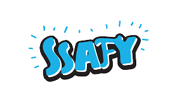

길다고 말하면 길고, 짧다면 짧은 1년이라는 교육 기간이 끝났다.
비전공자로 전공자와 경쟁해야되는 것을 알고 있기에 나름 열심히 살려고 노력했고, 
여러 우여곡절을 겪으면서 결국은 취업했다!
물론 원하던 계열(대기업 혹은 B2C)는 아니지만, 하반기에 겪은 삼성 최종 탈락과 현재 시장 상황들을 고려했을때, 중고 신입의 메리트와 집에서 혼자하는 취준보다는 현업에 뛰어드는게 내가 더 성장할 수 있을것이라고 생각했다.
다음주부터는 신입사원 연수가 진행되기 때문에 시간이 남는 지금, 회고록을 작성해보자 한다.

## 7월 ~ 8월

- 프로젝트 우수상
- 삼성 역량 평가 Pro(B형)등급 취득

> 잡페어가 끝나고 2학기에 처음 진행했던 프로젝트였다.
SSAFY에 입과할 당시부터 백엔드를 지망했고, 1학기에 커리큘럼과 독학을 병행하며 준비했지만.. SSAFY의 팀 배정 구조상 비전공이 백엔드를 맡기에는 매우 힘들었다.
따라서 내가 팀장이되어서 팀원들을 구하러 다녔고, 다행히도 내가 원하는 역할 배분대로 팀을 구할 수 있었다.
팀원들을 정말 좋은 사람들을 만나 프로젝트를 진행하며 정말 많이 성장할 수 있었고, 그 결과로 우수상까지 받을 수 있었다.
8월에 진행된 Pro등급 시험에서도 1학기부터 노력해왔던 것이 결실을 맺은거 같아 정말 기뻤다.

## 9월 ~ 10월

- 하반기 공채 지원 
- 두번째 프로젝트 완료

> 첫번째 프로젝트 팀원들과 마음도 잘 맞았고, 서로가 정말 친했기 때문에 4명의 팀원과 같은 팀으로 내가 팀장을 맡아 진행했다. 이 때 AI를 담당했었고, 처음 담당하는 분야라 매우 힘들었지만 그만큼 많은 성장을 할 수 있어서 뜻 깊은 경험이였다.
그리고 하반기 공채에 프로젝트를 진행하며 많이 지원했지만, 서류 결과가 15개중 삼성전자와 SK C&C 빼고는 전부다 떨어졌다..
심적으로 힘들었지만, 제일 원했던 곳의 최종 면접이 붙었기 때문에 세번째 프로젝트는 취업 준비 팀으로 들어갔다.

## 11월 ~ 12월

- 최종 면접 탈락 
- 세번째 프로젝트 완료
- 그리고 취업

> 취업 준비팀에 들어가 프로젝트는 기본적인 기능들만 구현하고 나머지는 면접 대비에 집중했다. 첫 면접이 제일 원하던 기업이라서 더 떨렸고, 준비하기도 힘들었다.
다행히도 SSAFY 내의 면접 스터디와 컨설턴트님이 있어서 도움을 많이 받았다. 
이전까지는 계속 블로그도 꾸준히 작성했지만, 면접에 올인한만큼 많이 작성하지 못했던거 같다.
결국 삼성 최종에서 떨어졌지만, 다행히도 미리 서류를 써둔 기업 두 곳에서 연락이 왔고
코테와 면접을 진행해서 한 곳에 합격했다.

## 후기 

SSAFY에서 진행한 1년간 커리큘럼과 독학을 병행하며 매우 타이트했지만, 그만큼 얻어가는게 많았다.
특히 삼성 역량 평가 Pro(B형)은 취준생이 얻을 수 있는 최고의 메리트 중 하나라는 생각이 든다. 최종 면접까지 보내주는 프리패스권과 비슷하기 때문이다.(삼성 계열사 한정)
결국은 최종 탈락이지만 이번 면접을 통해 정말 많은 것을 느꼈다.
나름 기본기에 충실하다고 생각했지만 생각보다 많았던 허점들 그리고 현재의 개발자 시장 상황 등....

이제야 개발자로의 튜토리얼이 끝난 느낌이 든다.
현업에 가서도 나태해지지말고 매일 성장하기 위해 항상 노력하는 사람이 되야겠다고 다시 한번 다짐한다.
