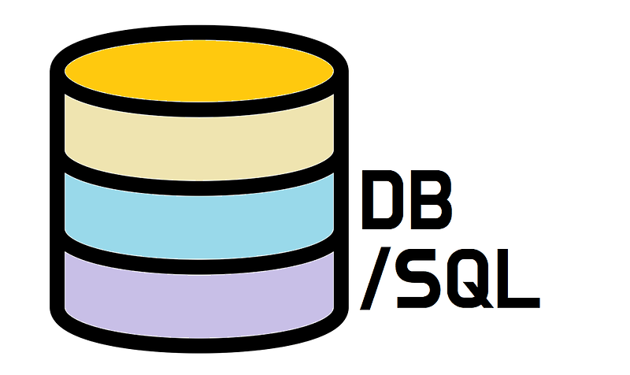

이번주 신입사원 연수에 **데이터베이스 분석/설계**에 관한 내용이 나왔다.
내가 이전까지 보통 설계 할 때, 단일테이블에 PK`기본키`가 2개가 될 경우에는 거의 모든 경우에 테이블을 두개로 분리했다. 
하지만 현업에서 쓰는 **공통코드**의 설계는 대분류와 소분류를 같이 PK로 잡고 설계하는 방식이였다.
이를 보고 각 설계 방식의 상황별 장단점이 궁금해져 공부해서 정리한다.


먼저 크게 **두 가지** 방식으로 나누었다.
## 1. 복합 PK 사용
``` sql
CREATE TABLE COMMON_CODE (
    MAIN_CODE VARCHAR(10),
    SUB_CODE VARCHAR(10),
    CODE_NAME VARCHAR(100),
    DESCRIPTION TEXT,
    PRIMARY KEY (MAIN_CODE, SUB_CODE)
);
```

## 2. 테이블 분리
``` sql
CREATE TABLE MAIN_CODE (
    MAIN_CODE VARCHAR(10) PRIMARY KEY,
    MAIN_NAME VARCHAR(100),
    DESCRIPTION TEXT
);

CREATE TABLE SUB_CODE (
    MAIN_CODE VARCHAR(10),
    SUB_CODE VARCHAR(10),
    CODE_NAME VARCHAR(100),
    DESCRIPTION TEXT,
    PRIMARY KEY (SUB_CODE),
    FOREIGN KEY (MAIN_CODE) REFERENCES MAIN_CODE(MAIN_CODE)
);
```


### 복합 PK의 장점
1. 단일 테이블 조회로 인한 **조인 비용 감소**
2. 인덱스 관리 **단순화**
3. 트랜잭션 범위가 작아 **동시성 처리에 유리**

### 테이블 분리의 장점
1. 대분류 코드만 필요한 경우(?) **조회 성능 상승** 
2. **캐시 전략** 수립 용이 (개별 캐싱)
3. 데이터 정합성이 **DB레벨**에서 보장됨

### 복합 PK의 단점
1. 복합 인덱스로 인한 **인덱스 크기증가** (메모리 부담, 비용 상승)
2. 부분 인덱스 활용 제한
3. 대용량 데이터에서 **인덱스 재구성**시 더 시간이 오래걸림
4. 코드 체계 변경시, 모든 데이터를 **한번에 마이그레이션** 해야함
5. 새로운 분류체계 추가가 어려움(**구조 변경**)

### 테이블 분리의 단점
1. 조인으로 인한 **추가 I/O**
2. **트랜잭션 범위 증가**로 인한 동시성 저하 우려
3. 백업/복구 시 **테이블간 순서 및 관계** 고려 필요

간략하게 정리하면 이렇게 된다.
물론 개인이 하는 프로젝트 수준에서는 어떤 방법을 선택하든 별 성능차이가 없으므로 가독성이 더 좋은 방법을 선택하는 것이 최선이다.
하지만 이제는 실제 다수의 사용자들이 이용하는 서비스를 설계해야 되기 때문에 조건을 조금 더 걸어보겠다.


## DB 환경이 다를 경우

### MySql의 경우
- 하나의 **클러스터드 인덱스** 특성을 활용한 복합 PK가 더 효과적
- 두 개의 클러스터드 인덱스 조회보다 **하나의 연속된 클러스터드 조회**가 더 빠름
- 복합 PK가 **캐시 효율성**이 더 높음

### Oracle의 경우
- **파티셔닝** 기능으로 인한 테이블 분리가 효과적
- 대분류별로 **독립적인 파티션 관리**가 가능
- Oracle의 **시퀀스**를 효율적으로 활용 가능
- Oracle의 **옵티마이저**가 더 효율적으로 계획 수립

### NoSQL의 경우
- 복합 PK가 더 자연스러움
- **조인 연산**이 비교적 비효율적임

## 동시 접속자가 많을 때

### 복합 PK
- 락의 범위가 작음(동시성 처리 유리)
- 트랜잭션 처리 단순

### 테이블 분리
- FK제약으로 추가 락 발생
- 테이블 단위 백업 및 복구가 용이

실제 운영 환경에서는 이러한 **차이점**을 모두 인지 후 상황에 맞게 선택하는게 중요할 것 같다.
어쩌면 현재 용량 가격은 많이 낮아진 추세라고 하니 성능과 코드 가독성에만 맞춰서 선택하는 것도 방법일 것 같다!
