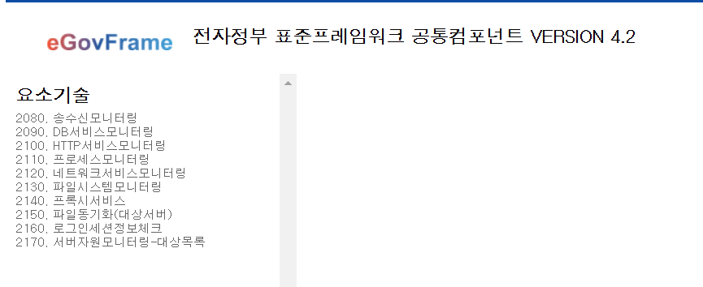
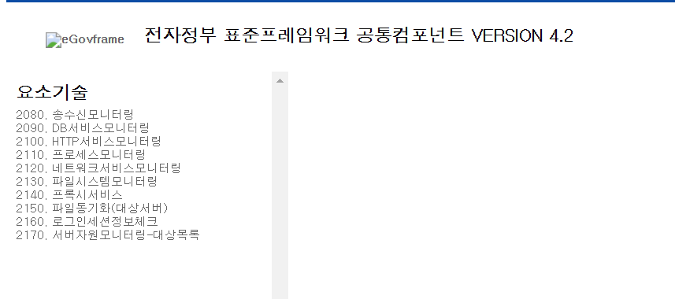

## 회사에서 어떤 IDE를 쓸까

요즘은 선택할 수 있는 여러 `IDE`가 있다.
JAVA 진영에서 대표적으로 많이 쓰이는 두 가지는 `Intellij`와 `Eclipse`라고 할 수있다.

>
레거시 시스템 - `Eclipse` 
비교적 최근 시스템 - `intellij`

왜냐하면 레거시 프로그램의 대표격인 `egov` 자체가 `eclipse` 전용으로 동작하기 때문인것 같다. 
그래서 그런지 우리 회사에서 대부분의 프로젝트에 `eclipse`를 많이 쓴다. `무료여서 그런가`

>**하지만!!! **
나는 `Intellij`의 가독성 좋은 UI를 포기할 수 없었기 때문에... `단축키 익숙한거는 덤`
차장님께 `intellij`의 설정은 내가 알아서 한다는 전제조건하에 **허락을 받게되었다!**

## 근데 무슨 문제가..?🤔
신이나서 현재 커스텀이 진행중인 egov 세팅을 두개로 나누었다.
하나는 `Eclipse` 하나는 `intellij`로 열어서 세팅을 검색해가며 톰캣 서버까지 전부 동일하게 맞췄다.
그리고 `Tiles` 대신 `Thymeleaf`를 적용하며 화면을 띄워보기로 했다.

먼저 `Eclipse`를 실행했다



역시 문제 없이 잘됐다.
그래서 `intellij`도 실행했는데




❓❓❓

>분명 모든 환경세팅을 똑같이 했고
돌리는 IDE만 다른데 왜 이미지가 안뜨지?????

그래서 환경설정을 다 일일히 체크했지만.. 다른게 없었다.


## 문제 해결을 위한 고민 시작

### 1단계: 요청 흐름 추적
내부 흐름을 타고가다가 IDE에 관련된 분기가 있는지 확인하기 위해 디버거를 사용해서 HTTP 요청이 어떻게 처리되는지 추적해보았다. 
이 과정에서 서블릿 컨테이너의 핵심 클래스인 `StandardWrapperValve`의 처리 흐름을 자세히 살펴볼 수 있었다.


```java
// org.apache.catalina.core.StandardWrapperValve
protected void invoke(Request request, Response response) {
    // 1. 정확한 서블릿 매핑 검사
    Wrapper wrapper = getWrapper();
    if (wrapper == null) {
        return; // 매핑된 서블릿이 없음
    }

    // 2. 확장자 기반 매핑 검사
    String extension = getExtension(request);
    if (extension != null) {
        // 확장자에 따른 처리
    }

    // 3. 경로 기반 매핑 검사
    String pathInfo = request.getPathInfo();
    // 경로 기반 처리 로직

    // 4. 기본 서블릿으로 위임
    if (!handled) {
        defaultServlet.service(request, response);
    }
}
```

IDE 관련 설정은 따로 보이지않았다..

### 2단계: DefaultServlet 동작 분석
Tomcat의 DefaultServlet이 정적 리소스를 처리하는 방식에 문제가 있는지 확인해보았다.

```java
// org.apache.catalina.servlets.DefaultServlet
public void doGet(HttpServletRequest request, 
                 HttpServletResponse response) 
    throws IOException, ServletException {
    
    // 1. 리소스 경로 검증
    String path = getRelativePath(request);
    if (!validateResource(path)) {
        response.sendError(HttpServletResponse.SC_NOT_FOUND);
        return;
    }

    // 2. 캐시 처리
    long lastModified = resource.getLastModified();
    if (checkIfModifiedSince(request, response, lastModified)) {
        return;
    }

    // 3. MIME 타입 결정
    String mimeType = getServletContext().getMimeType(path);
    if (mimeType == null) {
        mimeType = "application/octet-stream";
    }

    // 4. 파일 전송
    response.setContentType(mimeType);
    copy(resource.getInputStream(), response.getOutputStream());
}
```
### 1,2 단계의 결론
1. web.xml 파일 설정을 읽어서 매핑 테이블 생성
2. 매핑 테이블을 기준으로 `StandardWrapperValve` 가 `DefaultServlet`으로 전송
3. doGet 실행


### 난 설정해 준적이 없는데???

난 web.xml에 추가 설정을 해준적이 없었다.
그럼 `intellij`가 정상이고 `Ecplise`가 안나오는게 정상이였다. `소름`😱
근데 `Ecplise`는 왜 정적 리소스가 나올까??


### Eclipse WTP의 비밀 발견
Eclipse의 작동 방식을 이해하기 위해 워크스페이스의 `.metadata` 폴더를 조사했다. 여기서 WTP가 자동으로 생성하는 설정 파일을 발견했다.

```xml
<!-- Eclipse WTP가 자동 생성하는 설정 -->
<servlet-mapping>
    <servlet-name>default</servlet-name>
    <url-pattern>*.png</url-pattern>
    <url-pattern>*.gif</url-pattern>
    <url-pattern>*.jpg</url-pattern>
    <url-pattern>*.css</url-pattern>
    <url-pattern>*.js</url-pattern>
</servlet-mapping>
```


## 명시적 설정으로 해결

문제의 해결은 Eclipse가 암묵적으로 제공하던 설정을 명시적으로 추가하는 것이였다.

```xml
<!-- web.xml에 추가한 설정 -->
<servlet-mapping>
    <servlet-name>default</servlet-name>
    <url-pattern>*.png</url-pattern>
    <url-pattern>*.gif</url-pattern>
    <url-pattern>*.jpg</url-pattern>
    <url-pattern>*.css</url-pattern>
    <url-pattern>*.js</url-pattern>
</servlet-mapping>
```

## 요약 정리

### 서블릿 컨테이너의 요청 처리 순서
1. 정확한 서블릿 매핑 확인
2. 확장자 매핑 확인
3. 경로 매핑 확인
4. 기본 서블릿 위임

### 정적 리소스 처리 메커니즘
- DefaultServlet의 리소스 검증
- 캐시 처리 최적화
- MIME 타입 결정
- 효율적인 파일 스트림 전송

### IDE 자동화의 영향
- 개발 환경의 투명성
- 설정의 명시성
- 디버깅 용이성


## 결론

IDE 전환이라는 단순한 작업이 서블릿 컨테이너의 동작 원리까지 파헤치게 될지는 몰랐다.
그리고 의외로 `Eclipse`도 개발자를 위해 자동화 시켜놓은게 있어서 조금 놀랐다.
그래도 난 `intellij` 쓸거야~~~~~~
