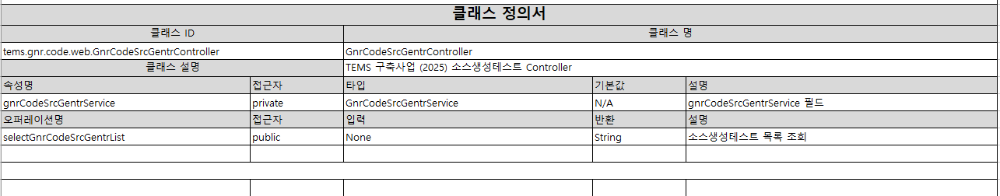
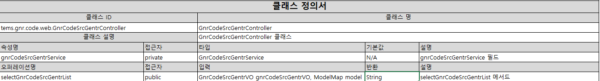

## 개발 배경

자바 프로젝트의 클래스 구조를 엑셀로 정리하는 작업은 매우 단순한 노가다 작업이다. `하지만 해야된다..` 다행히 예전 팀장님이 쓰시던 `옆 회사분이 만들어주셨다는` 자동화 툴이 있었고, 이거를 사용해보기로 했다. 처음에는 정규식으로 쉽게 처리할 수 있지 않을까?라고 생각했지만.... 점점 들어가다 보니 생각보다 복잡한 문제들이 하나둘씩 튀어나오기 시작했다. 

프로젝트 요구사항은 간단했다. 자바 파일들을 읽어서 각 클래스의 정보(이름, 패키지, 필드, 메서드 등)를 추출하고 이걸 엑셀 문서로 만드는 것이었다. 자바 코드는 형식이 정해져 있으니까 정규식으로 패턴 매칭하면 될 것 같았다.


## 1단계: 직접 경로만 처리하는 초기 버전

초기에 팀에서 제공된 코드는 사용자가 지정한 폴더에 있는 Java 파일만 처리하는 단순한 구조였다.

```python
def process_java_folder(folder_path):
    """Java 폴더 내 모든 파일을 처리하는 함수"""
    try:
        # 폴더 내 모든 Java 파일 목록을 가져옴
        java_files = [os.path.join(folder_path, f) for f in os.listdir(folder_path) if f.endswith('.java')]
        
        if not java_files:
            print("지정된 폴더에 Java 파일이 없습니다.")
            return
        
        all_classes_info = []
        
        # 각 Java 파일에서 클래스 정보를 추출
        for java_file in java_files:
            with open(java_file, 'r', encoding='utf-8') as file:
                java_code = file.read()
            
            # 클래스 정보를 추출하고 리스트에 저장
            class_info = extract_class_info(java_code)
            all_classes_info.append(class_info)
        
        # 하나의 엑셀 파일로 저장
        output_file = os.path.join(folder_path, 'class_definitions.xlsx')
        create_excel(all_classes_info, output_file)
        print(f"엑셀 파일 '{output_file}'이 생성되었습니다.")
    except Exception as e:
        print(f"오류가 발생했습니다: {e}")
```

이 코드는 단순히 `os.listdir()`을 사용해서 지정된 폴더 내의 Java 파일만 찾아 처리했다. 정규식으로 클래스 정보를 추출하는 부분도 기본적인 패턴만 찾도록 되어있었다.

```python
def extract_class_info(java_code):
    """Java 코드에서 클래스 정보를 추출하는 함수"""
    class_info = {}
    
    # 클래스 이름과 패키지 추출
    class_match = re.search(r'(?:public\s+)?class\s+(\w+)', java_code)
    package_match = re.search(r'package\s+([\w.]+);', java_code)
    
    if class_match and package_match:
        class_info['class_name'] = class_match.group(1)
        class_info['class_id'] = f"{package_match.group(1)}.{class_info['class_name']}"
    else:
        class_info['class_name'] = 'Unknown'
        class_info['class_id'] = 'Unknown'
    
    # 클래스 설명 추출
    description_match = re.search(r'/\*\*([\s\S]*?)\*/\s*(?:@\w+\s*(?:\([^)]*\))?\s*)*(?:public\s+)?class', java_code)
    if description_match:
        class_info['description'] = clean_comment(description_match.group(1))
    else:
        class_info['description'] = 'No description available'
    
    # 나머지 정보(필드, 메서드) 추출...
    
    return class_info
```

이 첫 버전은 간단한 프로젝트에는 잘 동작했지만, 곧 두 가지 큰 제한점이 드러났다:

1. **하위 폴더 무시**: 실제 자바 프로젝트는 보통 여러 하위 폴더로 구성되어 있는데, 이 버전은 지정된 폴더의 파일만 처리했다.
2. **기본적인 패턴만 인식**: 복잡한 자바 코드(주석 처리된 코드, 중첩된 클래스, 제네릭 타입 등)는 제대로 처리하지 못했다.

이걸로는 자동화라고 부르기엔 민망하니 추가적으로 커스텀해보기로 했다.

## 2단계: 재귀적으로 하위 폴더 탐색하기

첫 번째 개선점은 하위 폴더의 Java 파일까지 모두 처리하도록 하는 것이었다. 이를 위해 `os.walk()`를 사용하여 재귀적으로 폴더를 탐색하도록 수정했다.

```python
def process_java_folder(folder_path):
    """Java 폴더와 모든 하위 폴더 내 Java 파일을 처리하는 함수"""
    try:
        java_files = []
        
        # 폴더와 모든 하위 폴더를 재귀적으로 탐색
        for root, dirs, files in os.walk(folder_path):
            for file in files:
                if file.endswith('.java'):
                    java_files.append(os.path.join(root, file))
        
        if not java_files:
            print("지정된 폴더와 하위 폴더에 Java 파일이 없습니다.")
            return
        
        all_java_info = []
        
        for java_file in java_files:
            try:
                with open(java_file, 'r', encoding='utf-8') as file:
                    java_code = file.read()
                
                java_info = extract_java_info(java_code)
                all_java_info.append(java_info)
                print(f"처리 완료: {java_file}")
            except Exception as e:
                print(f"파일 처리 중 오류 발생: {java_file}, 오류: {e}")
        
        output_file = os.path.join(folder_path, 'java_definitions.xlsx')
        create_excel(all_java_info, output_file)
        print(f"엑셀 파일 '{output_file}'이 생성되었습니다.")
        print(f"총 {len(all_java_info)}개의 Java 클래스/인터페이스가 처리되었습니다.")
    except Exception as e:
        print(f"오류가 발생했습니다: {e}")
```

이제 특정 폴더 내의 모든 하위 폴더까지 탐색해서 Java 파일을 찾을 수 있게 되었다. 프로젝트 전체를 한 번에 문서화할 수 있어서 훨씬 편리해졌다. 또한 진행 상황을 보여주는 출력 메시지도 추가해서 사용자가 처리 중인 파일을 확인할 수 있게 했다.

그런데 여전히 정규식 기반 파싱에서 발생하는 문제들은 남아있었다. 더 복잡한 자바 코드를 처리하면서 정규식의 한계점들이 뚜렷하게 드러나기 시작했다.

## 정규식의 한계를 뼈저리게 느끼다

### 1. 주석 처리된 코드를 인식해버리는 문제

가장 심각한 문제 중 하나는 주석 처리된 코드도 인식해버린다는 거였다. 이런 코드가 있었는데

```java
///**
// * 이 메서드는 사용하지 않아서 주석 처리했음
// */
//@AuthorityCheck(authorities = {"Admin"})
//@RequestMapping(value="/tems/code/selectGnrCodeSrcGentrDetail.do")
//public String selectGnrCodeSrcGentrDetail(@ModelAttribute("gnrCodeSrcGentrVO") GnrCodeSrcGentrVO gnrCodeSrcGentrVO, ModelMap model) throws Exception {
//    // 구현부...
//}
```

내 정규식 파서는 이걸 실제 메서드로 인식해서 추출해버렸다. . 사실 정규식으로 주석을 완벽하게 처리하는 건 생각보다 까다로운 문제라는 걸 알게 됐다.

### 2. 어노테이션과 씨름하기

또 다른 악몽은 자바의 어노테이션 처리였다. 특히 매개변수가 있는 어노테이션은 정규식의 최대 적이었다.

```java
@AuthorityCheck(authorities = {"Admin"})
@RequestMapping(value="/tems/code/selectGnrCodeSrcGentrList.do")
public String selectGnrCodeSrcGentrList(@ModelAttribute("gnrCodeSrcGentrVO") GnrCodeSrcGentrVO gnrCodeSrcGentrVO, ModelMap model) throws Exception {
    // 메서드 구현
}
```


여기서 `@ModelAttribute("gnrCodeSrcGentrVO")`가 들어간 매개변수를 제대로 처리하는게 너무 어려웠다. 처음에는 매개변수를 'None'으로 반환하거나 같은 매개변수를 여러 번 중복해서 추출하는 문제가 발생했다. 정규식을 계속 수정했지만 한계가 있었다.

### 3. 제네릭 때문에 머리 아프다

자바의 제네릭이 또 하나의 복병이었다.

```java
public List<Map<String, Object>> getComplexData(Set<Integer> ids, Function<String, Boolean> validator) {
    // 메서드 구현
}
```

이런 코드는 정규식 파싱의 악몽이다. 꺾쇠 괄호 내부에 있는 쉼표가 매개변수 구분자인지 제네릭 타입의 일부인지 구분하는 게 정규식으로는 너무 복잡했다.

정규식 패턴을 계속 수정하면서 점점 더 복잡하게 만들었지만, 모든 케이스를 완벽하게 처리하기는 불가능했다. 정규식으로 할 수 있는 한계에 도달한 것 같았다. `이쯤 되니 내가 짠 코드도 이해하기 힘들어졌다...`

## 3단계: JavaParser로 전환

몇 번의 삽질 끝에 정규식은 자바 같은 복잡한 언어를 파싱하기에 적합하지 않다는 결론에 도달했다. 그래서 `javalang`이라는 라이브러리를 도입하기로 했다.

`javalang`은 자바 코드를 구문 트리(AST)로 변환해주는 파싱 라이브러리다. 코드의 구조를 이해하기 때문에 정규식으로 풀려고 했던 많은 문제들이 저절로 해결됐다.

```python
def extract_java_info(java_code):
    """자바 코드에서 클래스 또는 인터페이스 정보를 추출하는 함수"""
    try:
        # 자바 코드를 구문 트리로 파싱
        tree = javalang.parse.parse(java_code)
        
        # 트리에서 클래스나 인터페이스 노드 찾기
        for path, node in tree.filter(javalang.tree.ClassDeclaration):
            return extract_class_info(java_code, node, tree.package)
        
        for path, node in tree.filter(javalang.tree.InterfaceDeclaration):
            return extract_interface_info(java_code, node, tree.package)
        
        return {'class_name': 'Unknown', 'class_id': 'Unknown', 'description': 'No description', 'attributes': [], 'operations': []}
    
    except Exception as e:
        print(f"파싱 오류: {e}")
        # 파싱 오류 시 기본 정보 반환
        return {'class_name': 'Parsing Error', 'class_id': 'Parsing Error', 'description': f'파싱 중 오류 발생: {e}', 'attributes': [], 'operations': []}
```

이전에는 정규식으로 몇 십 줄을 작성했던 기능들이 JavaParser로는 훨씬 직관적이고 간결하게 구현됐다.

### JavaParser의 장점들

#### 1. 코드 구조를 정확히 이해한다

JavaParser의 가장 큰 장점은 코드 구조를 정확히 이해한다는 점이다. 주석 처리된 코드는 자동으로 무시하고, 중첩된 코드 블록도 정확히 처리한다.

```python
def extract_methods(java_code, node, is_interface=False):
    """클래스/인터페이스에서 메서드 정보를 추출하는 함수"""
    operations = []
    
    for method in node.methods:
        # 메서드가 주석처리 되어있는지 확인
        if is_commented_out(java_code, method.position):
            continue
        
        # 반환 타입 추출
        return_type = "void"
        if method.return_type:
            return_type = method.return_type.name
            # 제네릭 타입 처리
            if hasattr(method.return_type, 'arguments') and method.return_type.arguments:
                return_type += '<' + ', '.join([arg.type.name if hasattr(arg, 'type') else str(arg) for arg in method.return_type.arguments]) + '>'
        
        # 메서드 정보 추가
        operations.append({
            'name': method.name,
            'access': 'public',  # 기본값
            'input': extract_parameters(method.parameters),
            'return': return_type,
            'description': extract_javadoc(java_code, method.position) or f'{method.name} 메서드'
        })
    
    return operations
```

#### 2. 메서드와 매개변수 추출이 정확해졌다

메서드 매개변수 추출이 몰라보게 개선됐다. 더 이상 복잡한 어노테이션에 속앓이를 할 필요가 없었다:

```python
def extract_parameters(parameters):
    """메서드 매개변수를 추출하는 함수"""
    params = []
    if parameters:
        for param in parameters:
            param_type = param.type.name if hasattr(param.type, 'name') else str(param.type)
            # 제네릭 타입 처리
            if hasattr(param.type, 'arguments') and param.type.arguments:
                param_type += '<' + ', '.join([arg.type.name if hasattr(arg, 'type') else str(arg) for arg in param.type.arguments]) + '>'
            params.append(f"{param_type} {param.name}")
    
    return ', '.join(params) if params else "None"
```

이제 `List<String>`, `Map<String, Integer>` 같은 복잡한 제네릭 타입도 문제없이 처리된다. 어노테이션도 자동으로 제외하고 실제 타입과 변수명만 추출한다.

#### 3. 코드가 더 유지보수하기 쉬워졌다

정규식은 계속 패치하다 보면 무지막지하게 복잡해진다. 반면 JavaParser를 사용한 코드는 자바의 구조를 그대로 따르기 때문에 이해하기 쉽고 유지보수도 간편해졌다.

## 정규식 vs JavaParser 직접 비교

아까 말했던 복잡한 메서드를 두 방식으로 처리한 결과를 비교해보자:

```java
/**
* 소스생성테스트 목록 조회
* @param GnrCodeSrcGentrVO
* @return "selectGnrCodeSrcGentrList page"
*/
@AuthorityCheck(authorities = {"Admin"})
@RequestMapping(value="/tems/code/selectGnrCodeSrcGentrList.do")
public String selectGnrCodeSrcGentrList(@ModelAttribute("gnrCodeSrcGentrVO") GnrCodeSrcGentrVO gnrCodeSrcGentrVO, ModelMap model) throws Exception {
    // 메서드 구현...
}
```

### 정규식 방식의 결과

- **메서드명**: selectGnrCodeSrcGentrList
- **접근자**: public
- **입력**: None (매개변수 추출 실패!)
- **반환**: String
- **설명**: 소스생성테스트 목록 조회


### JavaParser 방식의 결과

- **메서드명**: selectGnrCodeSrcGentrList
- **접근자**: public
- **입력**: GnrCodeSrcGentrVO gnrCodeSrcGentrVO, ModelMap model (제대로 추출!)
- **반환**: String
- **설명**: 소스생성테스트 목록 조회



정규식 방식에서는 매개변수 추출이 완전히 실패했지만, JavaParser는 정확하게 처리했다. 

## 배운 점들

이 프로젝트를 통해 몇 가지 중요한 교훈을 얻었다:

1. **진화적 개발의 중요성**: 처음부터 완벽한 코드를 작성하기는 어렵다. 단계별로 기능을 개선해 나가는 접근법이 실용적이다.
    
2. **적절한 도구 선택의 중요성**: 처음에는 정규식이 간단해 보였지만, 복잡한 언어 파싱에는 전문 파서가 훨씬 효율적이다. 시간을 아끼려면 처음부터 적합한 도구를 선택하자.
    
3. **정규식의 한계**: 정규식은 많은 문제를 해결할 수 있지만, 모든 것의 해답은 아니다. 특히 중첩 구조나 문맥 의존적인 파싱에는 한계가 있다.
    
4. **기존 라이브러리 활용하기**: 내가 겪는 문제는 다른 사람들도 이미 겪었을 가능성이 높다. 바퀴를 재발명하기보다 검증된 라이브러리를 활용하자.
    
5. **유지보수성 고려하기**: 당장 동작하는 코드보다 장기적으로 유지보수하기 쉬운 코드가 중요하다. 코드 복잡도가 너무 높아지면 다른 접근법을 고려해보자.
    

결국 이 프로젝트는 세 단계의 과정을 거치면서 훨씬 더 견고하고 유지보수하기 쉬운 도구가 됐다. 처음부터 JavaParser를 사용했다면 좋았겠지만, 이 과정에서 배운 교훈들도 소중하다고 생각한다.
다음에 비슷한 프로젝트를 시작할 때는 망설임 없이 파싱 라이브러리를 선택할 것같다...
