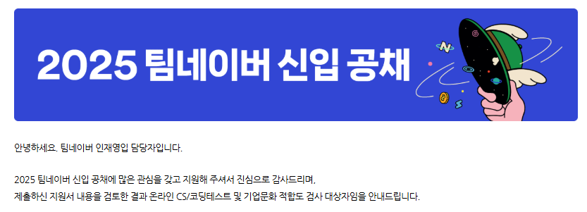
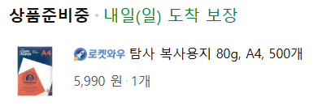

## 최근 알고리즘 근황

매주 주말에하는 프로젝트로 가기전, 코딩테스트를 봤다.
네이버가 흔히 말하는 `네카라쿠배`에서는 코테가 쉬운편이긴 하지만, 이번엔 **CS 객관식 문제**가 20개가 추가되어서 어떻게 공부해야 될 지 감이 안잡혔다..
그래도 B형을 따고나서 안일하던 내 알고리즘 실력에 상반기 공채들이 열의를 불태우게 해주는 원동력이 되어서 요즘엔 쉴 틈이 없는거같다.

## 문제 유형

### 코딩테스트
문제를 자세히 말할수는 없지만, 내가 푼 방식을 말해보자면

1. 구현 (슬라이딩 윈도우)
2. 우선순위큐 + HashMap + 구현
3. 완전탐색으로 하면 60점 (지인을 통해 들음)

이렇게 된다.

체감 난이도는 실버 상위 ~ 골드 하위 정도지만, 알고리즘 복귀한지 얼마 안돼서 2번 구현쪽에서 시간을 너무 많이 쓴게 아쉬웠다.. 
그리고 공지를 제대로 안읽고 공책 종이를 준비했다가 `A4만 가능합니다`라는 소식을 듣고 
뇌코딩으로만 풀게 된것도 한 몫을 한 것 같다.....

(절대 화나서 A4 주문한거 아님)

### CS문제
cs 문제는 유형을 말하는거 조차 문제가 될 수 있을것 같아 생략하겠다.
다만 놀랐던건 내가 블로그에 정리하던 CS 내용들 중에서 몇개 부분이 그대로 나와서 조금 놀랐다.
신입 채용이라 그런지 공통 기본기를 많이 보는 느낌을 받았다.

## 꿀팁
이번 기회로 얻게된 교훈들을 정리하면

1. 코테 볼 때는 A4 준비하자.`ㅠㅠ`
2. 조건별 점수제로 못맞출거 같으면 일정 점수만 먹고 빠지는게 현명하다.
3. 1년 경력넘으면 신입 지원못함(시한부??)

이런 코테 볼 때마다 동기부여가 많이 되어서 좋은 경험인 것 같다!
