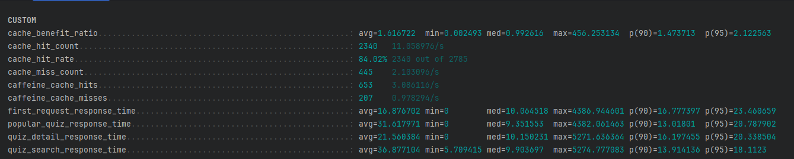

## 최근 근황

최근 황금연휴가 시작되고 난 이후, 갑자기 심한 번아웃이 찾아왔다. SSAFY 다닐 때도 번아웃이 온 적이 있었지만, 이 때는 동기들과 같이 카공하면서 잘 넘길 수 있었다. 하지만 지금은 같이 카공 갈 동기들도 없고, 연휴도 회사에서 2일 전에 강제로 휴가 쓰라고 지침이 내려와서 생긴 거라 더욱 대처할 방법을 찾기 힘들었다.

그래서 무기력하게 침대에 누워서 나의 핸드폰과 함께 우울증을 간접 체험하던 도중 이 짤을 다시 보게 되었다.


그래서 생각하지 말고 그냥 개발이나 하기로 했고, 그 결과 오류 하나를 잡을 수 있었다!!!!
`덕분에 번아웃도 조금은 탈출..`
이번엔 그 해결과정을 공유하고자 이 글을 쓴다.

## 문제 상황: k6에서 보이지 않는 'X-Cache-Status' 헤더

먼저 나는 프로젝트 성능 개선의 일환으로 API 응답 캐싱을 적용하기로 했다. 각 API에 알맞는 캐시 `만료 시간, 크기 기반 제거 등` 설정을 하기 위해선 먼저 성능을 수치화해야겠다고 생각했고, 그 효과를 측정하기 위해 k6 부하 테스트 도구를 사용하기로 했다. 이것에 대한 구현 방안으로 캐시 히트율을 정확히 파악하려면 서버가 응답 헤더에 캐시 상태(HIT/MISS/BYPASS/SKIP)를 알려주는 커스텀 헤더, 예를 들어 `X-Cache-Status`를 추가해주면 좋겠다고 생각했다.

Spring Boot 환경에서 Caffeine 캐시를 사용하기로 하고, 캐시 히트/미스 여부를 추적하기 위해 `CacheResolver`와 `CacheOperationListeners`를 커스텀하여 캐시 상태를 `ThreadLocal` 변수에 저장하는 로직까지는 구현했다.

``` java
// CacheStatusInterceptor.java (초기 시도 - afterCompletion)
import org.springframework.stereotype.Component;
import org.springframework.web.servlet.HandlerInterceptor;
import jakarta.servlet.http.HttpServletRequest;
import jakarta.servlet.http.HttpServletResponse;
import lombok.extern.slf4j.Slf4j;

@Slf4j
@Component
public class CacheStatusInterceptor implements HandlerInterceptor {

    // 요청 스레드별 캐시 상태 저장을 위한 ThreadLocal
    private static final ThreadLocal<Boolean> cacheHitThreadLocal = new ThreadLocal<>();

    // --- preHandle, postHandle 등 다른 메서드 생략 ---

    /**
     * 요청 처리가 완료된 후 (뷰 렌더링 후) 호출
     * 초기 시도: 여기서 헤더를 설정
     */
    @Override
    public void afterCompletion(HttpServletRequest request, HttpServletResponse response, Object handler, Exception ex) throws Exception {
        try {
            // 현재 스레드의 캐시 상태(Hit/Miss) 가져오기
            Boolean isHit = cacheHitThreadLocal.get();
            // 캐시 상태 문자열 결정 (예: "HIT", "MISS")
            String cacheStatus = determineCacheStatus(request, isHit);

            // 문제 지점: 여기서 헤더를 설정해도 이미 응답이 커밋되었을 수 있음
            response.setHeader("X-Cache-Status", cacheStatus);
            log.debug("최종 캐시 상태 헤더 설정 시도 (afterCompletion): {}={}", "X-Cache-Status", cacheStatus);

        } finally {
            // ThreadLocal 값 정리 (메모리 누수 방지)
            cacheHitThreadLocal.remove();
        }
    }

    // 예시: 캐시 상태 문자열 결정 로직 (실제 구현 필요)
    private String determineCacheStatus(HttpServletRequest request, Boolean isHit) {
        // 요청 경로, isHit 값 등을 기반으로 HIT/MISS/BYPASS/SKIP 결정
        if (isHit == null) {
            // 캐시 대상이 아니거나, 캐시 상태를 알 수 없는 경우
            return "SKIP"; // 또는 "BYPASS" 등 상황에 맞게
        }
        return isHit ? "HIT" : "MISS";
    }

    // 서비스 로직 등 다른 곳에서 캐시 상태를 설정하기 위한 static 메서드
    public static void setCacheHit(boolean hit) {
        cacheHitThreadLocal.set(hit);
    }

    // ResponseBodyAdvice 등 다른 컴포넌트에서 캐시 상태를 읽기 위한 static 메서드
    public static Boolean getCurrentCacheHitStatus() {
        return cacheHitThreadLocal.get();
    }

    // --- 기타 필요한 메서드 (isCacheablePath 등) 생략 ---
}
```

문제는 이 `ThreadLocal` 값을 읽어 실제 응답 헤더에 `X-Cache-Status`를 추가하는 부분이었다. 처음에는 당연히 `HandlerInterceptor`의 `afterCompletion` 메서드가 가장 적절하다고 생각했다. 요청 처리가 모두 완료된 후 호출되니, 최종 캐시 상태를 헤더에 담아 보내면 될 것이라고 예상했다.

Spring MVC 설정 (`WebMvcConfigurer`)에 이 인터셉터를 등록하고 k6 테스트를 실행했다. 하지만 k6 로그에는 `X-Cache-Status` 헤더가 전혀 보이지 않았다. 서버 로그에는 분명히 `afterCompletion`에서 헤더를 설정했다는 로그가 찍히는데도 말이다.

## 여기서 잠깐

### 왜 K6?

Jmeter와 Locust 보다 훨씬 적은 리소스로 많은 요청을 테스트 할 수 있기 때문에 선택하기로 했다.

### 왜 Caffeine Cache?

보통 로컬 캐시의 기본은 `ehcache`를 많이 생각하지만, 캐시 관련해서 공부하다 보니 Caffeine Cache가 Local Cache의 King이라고 할 정도의 성능 `제거 알고리즘`을 보여준다고 해서 도입해보게 되었다.

## 삽질의 시작, 필터? 시큐리티? 순서?

처음에는 내가 뭔가 간단한 실수를 했으리라 생각했다.

1. **Spring Security 설정 확인:** 혹시 Spring Security가 커스텀 헤더를 막고 있는 건 아닐까? `SecurityConfig`를 열어 CORS 설정의 `setExposedHeaders()`에 `X-Cache-Status`를 명시적으로 추가했다. 그래도 헤더는 보이지 않았다. 혹시 Security 필터 체인이 헤더를 기본값으로 덮어쓰나 싶어 `.headers().cacheControl().disable()`도 추가해봤지만, 여전히 실패.
    
2. **인터셉터/필터 순서 확인:** 다른 인터셉터나 필터가 내가 설정한 헤더를 지우는 건 아닐까? 인터셉터 등록 순서(`@Order`)를 조정해봤지만 소용없었다.
    
3. **`CacheStatusInterceptor` 구현 재검토:** `ThreadLocal` 관리는 제대로 되는지, `setCacheHit`는 제대로 호출되는지 로그를 찍어가며 확인했다. 인터셉터 자체의 로직에는 문제가 없어 보였다.
    

## 두 번째 시도: `postHandle`이라면 괜찮을까?

내가 아는 지식선에서 계속 트라이 했지만.. 답이 보이지가 않았다.

그래서 http의 요청 흐름을 더 자세히 공부하고 다시 도전해보기로 했다.


[![](https://mermaid.ink/img/pako:eNqdV21P21YU_iu3_pR0JoE0gWBNVbd2WzftTSvSpIkvJrlA1MTObKdbV1UCYaoUgpqWt0CTNnSMgpRpBtIu26j6X_ox91rbT9i59nXe7KAxPiTx9Xl9znPOPdwTUmoaC5Kg4-8LWEnhGxl5TpNz0wqCv7ysGZlUJi8rBrqezWD4knVkLzZJ7YzWmnSrZa-0UOj2eNgvP6XmUrIjT80qaW2Qg7eI_nVoL5dAk5hFFOISZP04QP3jTNbAmu742zRt00KhWzhV0DLG3SEaNzJ6XjZS81i7hbU7Wez49h369W7KSjqLtU8V8JfCeUPVnKBrLXBKlx_CZwAYqmJoahbUHFlIa6VF9vbJ8wYKXeu-jKJr32Dd6B4EhA0CeVXR8Ydq-u4H6TuZFGYm_acBgRtG_gus6_IcBg93sGa44QSdTyuuvlvFkatX33PRl9DNqamvEd3doCe_otAnH02hqJzPRCORCI_VlWMavCSSJ03rJlltuFL8HRPzQS7xCpKXi8h-avbp-YSZBX9FJJTXsHscCiO70qKvq66BL1UDIy0zN28gdRYFaXrRnlTIQYM5R2SvSiEWWqzYWw_fn9GiV0O0UpTQ1LyG5fTnakrOItostluWvbPBYfBbHoFQRwKSNbQCjs7KWR0jYlXsnco5mXaZwUBqkXVGoVAfn8jRBn1QIuvV_ry7mmCn1wz5w6QHRbJapCv7gZn-WaarVUT3LHu3JPbnvLRoL8Erc5_WN3u6rMfXkJw5uO0Tq316xtNGLqg3pr5CbatGT5rhi5Zc1Y3_W_NeBOnqPmSPAAhgn-igQH63EKmXyNoGkDJKa4_J6itEThdY2MAQR-bdbv3v1iNEtxtABJhhyN7eBwVEX2-0rQWwWiWPTAk5sp6FE9NeO3Pewoz7rYWodUiOmhDOPrFWSbnOKoHosyKtlS5dlFftU5M-WIM0TMhmOJRB1akv0nrR3qwGjwxq1u2lGi_XZ3Lqtq4q59XKP5skpBfyeVUz9E6lwBx43T1CpLQAvIJxSl8uIHtnE35x43LWQINCQKE3dJdP3GERBAUwg2dVzTn5Fu6IQcb4WRNk4131kJeblXCg3K-qECurOq2XLzFRp_BBgLr155RqkQbQYN0Co4yBQC6xlzEuM9BlOL8MxDCBN6h9bNFaBXSb9NkvpHwYcRu3t1Pb1hNw8YZuNTthOk0b7qbrT3AkmB0h4CSokjJMGB4vqZTJCth8WoaDzmHPMMNK-rxmDgBFQj_01QXc9kHEm49Yj3gXcdDCPS2vgqlACovIu80c_E7PIB-6XWZNO9iZDpbwTdZrXne6uqDpvPvn-e4h16I10ytQiM9GZ_FpRT3Q69CSew4pnj0OI6bq2LA3gzo9IPBhve6iEfV4s2OSn0vDAfeS7040Vx9K6uXfe-dqOGUgbW4mFEskRBSLjTof4YFOccB2LYt8bZBQP2vdZmCYw2B1ScqBAf_QyIi8LgLUl3pMd7YJz6K7fnSCZHD2Yy1yhoucKeEBBnKLDMjuguJP2ltQmFwnG-jpF8v93r1FqYuBD3Hxv6wZTsmcdSdEzeP26asojFe6A0RvNNvNhYvehfIsPFxXc3mQyajKhS_EvguvNzq31QNGUlcmwvviycBMtDcr7GbchnKbRUgLkZUDRvdhGxXMmIPGhdep88nPlDq9z6F_sQwKgijMaZm0ILF1TBRyWMvJ7FG4x0xNC8Y8zuFpQYKfaTwrF7LGtDCt3Ac12K2_U9Wcp6mphbl576GQT8uG9z9SRwK4yIpTUAxBGks6FgTpnvCjICUmI_FEbCyZHJ-Mx5OTEzFRuCtII8mJSDI-PhaPTYxemZxIxGP3ReEnx-dYZCw-mRhPTCSTidHRsSuxxP1_AQpMH4k?type=png)](https://mermaid.live/edit#pako:eNqdV21P21YU_iu3_pR0JoE0gWBNVbd2WzftTSvSpIkvJrlA1MTObKdbV1UCYaoUgpqWt0CTNnSMgpRpBtIu26j6X_ox91rbT9i59nXe7KAxPiTx9Xl9znPOPdwTUmoaC5Kg4-8LWEnhGxl5TpNz0wqCv7ysGZlUJi8rBrqezWD4knVkLzZJ7YzWmnSrZa-0UOj2eNgvP6XmUrIjT80qaW2Qg7eI_nVoL5dAk5hFFOISZP04QP3jTNbAmu742zRt00KhWzhV0DLG3SEaNzJ6XjZS81i7hbU7Wez49h369W7KSjqLtU8V8JfCeUPVnKBrLXBKlx_CZwAYqmJoahbUHFlIa6VF9vbJ8wYKXeu-jKJr32Dd6B4EhA0CeVXR8Ydq-u4H6TuZFGYm_acBgRtG_gus6_IcBg93sGa44QSdTyuuvlvFkatX33PRl9DNqamvEd3doCe_otAnH02hqJzPRCORCI_VlWMavCSSJ03rJlltuFL8HRPzQS7xCpKXi8h-avbp-YSZBX9FJJTXsHscCiO70qKvq66BL1UDIy0zN28gdRYFaXrRnlTIQYM5R2SvSiEWWqzYWw_fn9GiV0O0UpTQ1LyG5fTnakrOItostluWvbPBYfBbHoFQRwKSNbQCjs7KWR0jYlXsnco5mXaZwUBqkXVGoVAfn8jRBn1QIuvV_ry7mmCn1wz5w6QHRbJapCv7gZn-WaarVUT3LHu3JPbnvLRoL8Erc5_WN3u6rMfXkJw5uO0Tq316xtNGLqg3pr5CbatGT5rhi5Zc1Y3_W_NeBOnqPmSPAAhgn-igQH63EKmXyNoGkDJKa4_J6itEThdY2MAQR-bdbv3v1iNEtxtABJhhyN7eBwVEX2-0rQWwWiWPTAk5sp6FE9NeO3Pewoz7rYWodUiOmhDOPrFWSbnOKoHosyKtlS5dlFftU5M-WIM0TMhmOJRB1akv0nrR3qwGjwxq1u2lGi_XZ3Lqtq4q59XKP5skpBfyeVUz9E6lwBx43T1CpLQAvIJxSl8uIHtnE35x43LWQINCQKE3dJdP3GERBAUwg2dVzTn5Fu6IQcb4WRNk4131kJeblXCg3K-qECurOq2XLzFRp_BBgLr155RqkQbQYN0Co4yBQC6xlzEuM9BlOL8MxDCBN6h9bNFaBXSb9NkvpHwYcRu3t1Pb1hNw8YZuNTthOk0b7qbrT3AkmB0h4CSokjJMGB4vqZTJCth8WoaDzmHPMMNK-rxmDgBFQj_01QXc9kHEm49Yj3gXcdDCPS2vgqlACovIu80c_E7PIB-6XWZNO9iZDpbwTdZrXne6uqDpvPvn-e4h16I10ytQiM9GZ_FpRT3Q69CSew4pnj0OI6bq2LA3gzo9IPBhve6iEfV4s2OSn0vDAfeS7040Vx9K6uXfe-dqOGUgbW4mFEskRBSLjTof4YFOccB2LYt8bZBQP2vdZmCYw2B1ScqBAf_QyIi8LgLUl3pMd7YJz6K7fnSCZHD2Yy1yhoucKeEBBnKLDMjuguJP2ltQmFwnG-jpF8v93r1FqYuBD3Hxv6wZTsmcdSdEzeP26asojFe6A0RvNNvNhYvehfIsPFxXc3mQyajKhS_EvguvNzq31QNGUlcmwvviycBMtDcr7GbchnKbRUgLkZUDRvdhGxXMmIPGhdep88nPlDq9z6F_sQwKgijMaZm0ILF1TBRyWMvJ7FG4x0xNC8Y8zuFpQYKfaTwrF7LGtDCt3Ac12K2_U9Wcp6mphbl576GQT8uG9z9SRwK4yIpTUAxBGks6FgTpnvCjICUmI_FEbCyZHJ-Mx5OTEzFRuCtII8mJSDI-PhaPTYxemZxIxGP3ReEnx-dYZCw-mRhPTCSTidHRsSuxxP1_AQpMH4k)

(위 이미지를 클릭하면 Mermaid Live Editor에서 다이어그램을 확대해서 볼 수 있다.)

공부 한 이후에 다시 보니, 혹시 `afterCompletion` 메서드 시점은 너무 늦은 건 아닐까 하는 생각이 들었다. `afterCompletion`은 뷰 렌더링까지 끝난 후에 호출되니, 이미 응답이 클라이언트로 전송되기 시작한 후일 수도 있겠다고 짐작했다.

그래서 헤더 설정 로직을 `postHandle` 메서드로 옮겨봤다. `postHandle`은 컨트롤러 실행 직후, 뷰 렌더링(또는 `@ResponseBody` 처리) 전에 호출되니, 이때는 헤더 설정이 가능할 것이라고 기대했다.

``` java
// CacheStatusInterceptor.java (두 번째 시도 - postHandle)
import org.springframework.stereotype.Component;
import org.springframework.web.servlet.HandlerInterceptor;
import org.springframework.web.servlet.ModelAndView;
import jakarta.servlet.http.HttpServletRequest;
import jakarta.servlet.http.HttpServletResponse;
import lombok.extern.slf4j.Slf4j;

@Slf4j
@Component
public class CacheStatusInterceptor implements HandlerInterceptor {

    private static final ThreadLocal<Boolean> cacheHitThreadLocal = new ThreadLocal<>();

    // --- preHandle 등 다른 메서드 생략 ---

    /**
     * 컨트롤러 실행 직후, 뷰 렌더링 또는 @ResponseBody 처리 전에 호출
     * 두 번째 시도: 여기서 헤더를 설정
     */
    @Override
    public void postHandle(HttpServletRequest request, HttpServletResponse response, Object handler, ModelAndView modelAndView) throws Exception {
        // 응답이 커밋(전송 시작)되었는지 확인
        if (response.isCommitted()) {
            log.warn("응답이 이미 커밋되어 헤더를 설정할 수 없습니다: {}", request.getRequestURI());
            return; // 커밋되었으면 헤더 설정 불가
        }

        try {
            Boolean isHit = cacheHitThreadLocal.get();
            String cacheStatus = determineCacheStatus(request, isHit);

            // 문제 지점: 여기서도 응답 본문 크기 등에 따라 커밋될 수 있음
            response.setHeader("X-Cache-Status", cacheStatus);
            log.debug("캐시 상태 헤더 설정 시도 (postHandle): {}={}", "X-Cache-Status", cacheStatus);

        } catch (Exception e) {
            log.error("postHandle에서 헤더 설정 중 오류 발생", e);
        }
        // ThreadLocal 정리는 afterCompletion에서 수행 (아래 코드 참고)
    }

    /**
     * 요청 처리 완료 후 호출. (성공/예외 무관)
     * postHandle에서 헤더 설정을 시도하므로, 여기서는 ThreadLocal 정리만 수행
     */
    @Override
    public void afterCompletion(HttpServletRequest request, HttpServletResponse response, Object handler, Exception ex) throws Exception {
        cleanUpThreadLocals(); // ThreadLocal 정리 메서드 호출
    }

    // ThreadLocal 정리 메서드
    private void cleanUpThreadLocals() {
        cacheHitThreadLocal.remove();
        log.trace("ThreadLocal cleanup executed."); // 필요시 로깅
    }

    // --- determineCacheStatus, setCacheHit, getCurrentCacheHitStatus 등 생략 ---
}
```

다시 k6 테스트를 실행했다. 이번에는 서버 로그에 충격적인 경고 메시지가 나타났다.

```
WARN [...] c.q.c.c.i.CacheStatusInterceptor : 응답이 이미 커밋되어 캐시 상태 헤더를 설정할 수 없습니다: /api/quizzes/8
```
postHandle 시점조차도 이미 늦었다는 의미였다. 컨트롤러가 반환한 데이터를 `HttpMessageConverter`(JSON 변환 등)가 처리하여 응답 버퍼에 쓰는 과정에서 버퍼가 가득 차거나 다른 이유로 인해 이미 응답이 **커밋**되어 버린 것이다.

## 깨달음: 응답 커밋(Response Commit) 시점의 중요성

여기서 '응답 커밋'이라는 개념에 대해 깊이 파고들게 되었다.

* **응답 커밋이란?** 서블릿 컨테이너(Tomcat 등)가 HTTP 응답의 상태 라인과 헤더 정보를 실제로 클라이언트에게 보내기 시작하는 시점이다.
* **커밋 후에는 헤더 변경 불가:** 일단 커밋되면 상태 코드와 헤더는 더 이상 변경할 수 없다. HTTP 프로토콜 구조상 헤더는 본문보다 먼저 전송되어야 하기 때문이다.
* **커밋 발생 시점:**
    * 응답 버퍼가 가득 찼을 때 (가장 흔함)
    * `response.flushBuffer()`를 명시적으로 호출했을 때
    * 서블릿 처리가 완전히 완료되었을 때 (버퍼가 차지 않았다면)

`@ResponseBody`를 사용하는 내 API의 경우, 컨트롤러 메서드가 결과를 반환하면 Spring의 `HttpMessageConverter`가 이를 JSON 문자열로 변환하여 응답 버퍼에 쓴다. 이 과정에서 데이터 양이 많으면 버퍼가 가득 차서 `postHandle`이 실행되기도 전에 응답이 커밋될 수 있었던 것이다.

`afterCompletion`은 당연히 너무 늦고, `postHandle`조차도 응답 커밋 이후일 수 있다는 사실을 깨달았다. 그렇다면 헤더를 추가하기에 가장 확실하고 안전한 시점은 언제일까?

## 최종 해결책: `ResponseBodyAdvice`의 등장

해답은 `ResponseBodyAdvice` 인터페이스에 있었다.

* **`ResponseBodyAdvice`란?** 컨트롤러가 반환한 객체를 `HttpMessageConverter`가 응답 본문으로 변환하기 *직전*에 호출되는 컴포넌트다.
* **`beforeBodyWrite` 메서드:** 이 메서드는 `HttpMessageConverter`가 변환된 데이터를 응답 버퍼에 쓰기 *바로 전에* 실행된다. 즉, 응답 버퍼가 채워지기 전, **응답이 커밋되기 전**에 헤더를 조작할 수 있는 이상적인 시점이다.

나는 `CacheStatusResponseBodyAdvice` 클래스를 만들고 `@ControllerAdvice` 어노테이션을 붙여 이 로직을 구현했다.

```java
// CacheStatusResponseBodyAdvice.java (최종 해결책)
import org.springframework.core.MethodParameter;
import org.springframework.http.MediaType;
import org.springframework.http.converter.HttpMessageConverter;
import org.springframework.http.server.ServerHttpRequest;
import org.springframework.http.server.ServerHttpResponse;
import org.springframework.http.server.ServletServerHttpResponse;
import org.springframework.web.bind.annotation.ControllerAdvice;
import org.springframework.web.servlet.mvc.method.annotation.ResponseBodyAdvice;
import lombok.extern.slf4j.Slf4j;

@Slf4j
@ControllerAdvice // 모든 @Controller 에 적용되는 AOP 컴포넌트
public class CacheStatusResponseBodyAdvice implements ResponseBodyAdvice<Object> {

    /**
     * 어떤 응답에 이 Advice를 적용할지 결정
     * 여기서는 모든 응답에 적용하도록 true를 반환
     * 특정 어노테이션이나 컨트롤러 타입에만 적용하도록 조건을 추가
     */
    @Override
    public boolean supports(MethodParameter returnType, Class<? extends HttpMessageConverter<?>> converterType) {
        return true; // 모든 응답 본문 쓰기 전에 실행
    }

    /**
     * HttpMessageConverter가 응답 본문을 쓰기 직전에 호출
     * 여기가 헤더를 추가하기 가장 안전한 시점
     */
    @Override
    public Object beforeBodyWrite(Object body, // 컨트롤러가 반환한 원본 응답 본문
                                MethodParameter returnType,
                                MediaType selectedContentType,
                                Class<? extends HttpMessageConverter<?>> selectedConverterType,
                                ServerHttpRequest request, // HttpServletRequest 래퍼
                                ServerHttpResponse response) { // HttpServletResponse 래퍼

        // ServerHttpResponse를 ServletServerHttpResponse로 캐스팅하여 Servlet API 접근
        if (response instanceof ServletServerHttpResponse servletResponse) {
            // 만약을 위해 여기서도 커밋 여부 확인 (거의 발생하지 않음)
            if (servletResponse.getServletResponse().isCommitted()) {
                log.warn("ResponseBodyAdvice: 응답이 이미 커밋됨: {}", request.getURI());
                return body; // 이미 커밋되었으면 아무것도 하지 않음
            }

            try {
                // CacheStatusInterceptor의 static 메서드를 이용해 ThreadLocal 값 가져오기
                Boolean isHit = CacheStatusInterceptor.getCurrentCacheHitStatus();
                // 실제 determineCacheStatus 구현 필요 (Interceptor와 동일 로직 사용 가능)
                String cacheStatus = determineCacheStatus(request.getURI().getPath(), isHit);

                // ✨ 헤더 추가! ✨
                response.getHeaders().add("X-Cache-Status", cacheStatus);
                log.debug("ResponseBodyAdvice: 캐시 상태 헤더 설정 완료: {}={}", "X-Cache-Status", cacheStatus);

            } catch (Exception e) {
                log.error("ResponseBodyAdvice에서 헤더 설정 중 오류 발생", e);
            }
        } else {
             log.warn("Unexpected ServerHttpResponse type: {}", response.getClass().getName());
        }

        // 원본 응답 본문(body)을 그대로 반환 (본문 수정이 필요하면 여기서 수정 후 반환)
        return body;
    }

    // 예시: 캐시 상태 문자열 결정 로직 (Interceptor의 것과 동일하게 사용 가능)
    private String determineCacheStatus(String path, Boolean isHit) {
        // 경로, isHit 값 등을 기반으로 HIT/MISS/BYPASS/SKIP 결정
        // CacheStatusInterceptor의 static 메서드를 호출하거나 동일 로직 구현
        if (isHit == null) {
             return "SKIP";
        }
        return isHit ? "HIT" : "MISS";
    }
}
````

그리고 기존 `CacheStatusInterceptor`에서는 헤더 설정 로직을 완전히 제거하고, `ThreadLocal` 값 설정(`setCacheHit`) 및 정리(`afterCompletion`), 그리고 `ResponseBodyAdvice`에서 호출할 `getCurrentCacheHitStatus` static 메서드 제공 역할만 하도록 수정했다.

``` java
// CacheStatusInterceptor.java (수정 후 - 헤더 설정 로직 제거)
import org.springframework.stereotype.Component;
import org.springframework.web.servlet.HandlerInterceptor;
import jakarta.servlet.http.HttpServletRequest;
import jakarta.servlet.http.HttpServletResponse;
import lombok.extern.slf4j.Slf4j;

@Slf4j
@Component
public class CacheStatusInterceptor implements HandlerInterceptor {

    private static final ThreadLocal<Boolean> cacheHitThreadLocal = new ThreadLocal<>();
    // ... (PATH_CACHE_MAPPING 등 필요한 다른 변수)

    /**
     * 요청 처리 전에 호출됩니다. ThreadLocal 값을 초기화
     */
    @Override
    public boolean preHandle(HttpServletRequest request, HttpServletResponse response, Object handler) throws Exception {
        cacheHitThreadLocal.remove(); // 이전 요청 값 제거 (안전을 위해)
        // 필요시 여기서 요청 경로 기반으로 캐시 대상 여부 판단 등 초기 작업 수행
        return true; // 계속 진행
    }

    /**
     * 컨트롤러 실행 후 호출
     * 헤더 설정은 ResponseBodyAdvice에서 하므로 여기서는 특별한 로직 없음.
     * 필요시 로깅 등 추가 가능.
     */
    @Override
    public void postHandle(HttpServletRequest request, HttpServletResponse response, Object handler, org.springframework.web.servlet.ModelAndView modelAndView) throws Exception {
        // No operation needed here for header setting
    }

    /**
     * 요청 처리 완료 후 호출 (성공/예외 무관)
     * ThreadLocal 값을 정리.
     */
    @Override
    public void afterCompletion(HttpServletRequest request, HttpServletResponse response, Object handler, Exception ex) throws Exception {
        cacheHitThreadLocal.remove(); // ThreadLocal 정리
        log.trace("CacheStatusInterceptor: ThreadLocal cleaned up.");
    }

    // 서비스 로직 등 다른 곳에서 캐시 상태를 설정하기 위한 static 메서드
    public static void setCacheHit(boolean hit) {
        cacheHitThreadLocal.set(hit);
        log.trace("Cache status set in ThreadLocal: {}", hit);
    }

    // ResponseBodyAdvice 등 다른 컴포넌트에서 캐시 상태를 읽기 위한 static 메서드
    public static Boolean getCurrentCacheHitStatus() {
        return cacheHitThreadLocal.get();
    }

    // --- 기타 필요한 메서드 (isCacheablePath, shouldSkipCache 등) 생략 ---
}
```

드디어 k6 테스트를 다시 실행했을 때, 응답 헤더에 `X-Cache-Status: HIT` 또는 `X-Cache-Status: MISS`가 선명하게 나타나는 것을 확인할 수 있었다!




## 교훈

이번 경험을 통해 몇 가지 중요한 교훈을 얻었다.

1. **HTTP 응답 커밋 시점을 항상 염두에 두어야 한다.** 특히 응답 헤더를 동적으로 조작해야 할 때는 더욱 그렇다. 로그만 믿고 '설정했겠지'라고 생각하면 안 된다.
    
2. `HandlerInterceptor`의 `postHandle`, `afterCompletion`은 헤더를 추가하기에 안전한 시점이 아닐 수 있다. 특히 `@ResponseBody`를 사용하고 응답 본문 크기가 클 가능성이 있다면 더욱 그렇다.
    
3. **`ResponseBodyAdvice`는 응답이 커밋되기 전에 헤더나 본문을 수정해야 할 때 매우 유용한 도구이다.**
    
4. 문제가 발생했을 때 로그를 자세히 보고, 기본 동작 원리(여기서는 HTTP 응답 흐름과 서블릿 컨테이너의 커밋 메커니즘)를 다시 한번 공부하는 것이 중요하다.
    

단순히 커스텀 헤더 하나 추가하는 작업이라고 생각했는데, 예상치 못한 난관에 부딪히고 깊은 내용까지 파고들게 된 경험이었다. 이 삽질(?)을 하면서 Spring MVC와 HTTP 응답 처리 과정에 대해 더 깊이 이해할 수 있게 되었다. 역시 기본기가 제일 중요하다는 걸 다시 한번 명심하고 초심으로 돌아가야겠다..


## 참고자료
### HTTP Response Commit
- [What exactly does "Response already committed" mean? (Stack Overflow)](https://stackoverflow.com/questions/14392361/what-exactly-does-response-already-committed-mean-how-to-handle-exceptions-th)
- [HttpServletResponse (Oracle 공식 문서)](https://docs.oracle.com/javaee/7/api/javax/servlet/http/HttpServletResponse.html)

### ResponseBodyAdvice & Header
- [스프링 API 공통 응답 포맷 반환 기능 (ResponseBodyAdvice)](https://whalesbob.tistory.com/18)
- [Spring Security 공식 문서: Security HTTP Response Headers](https://docs.spring.io/spring-security/site/docs/4.1.x/reference/html/headers.html)

### Caffeine Cache
- [Optimizing Cache Performance with Caffeine in Spring Boot](https://javanexus.com/blog/optimizing-cache-performance-caffeine-spring-boot)
- [니들이 Caffeine 맛을 알아?](https://medium.com/naverfinancial/%EB%8B%88%EB%93%A4%EC%9D%B4-caffeine-%EB%A7%9B%EC%9D%84-%EC%95%8C%EC%95%84-f02f868a6192)
