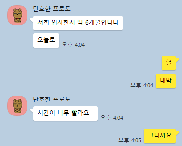

## 들어가며

오늘도 어김없이 평화롭게 회사에서 개발을 하던 도중 동기에게 카톡이 왔다.  

벌써 입사한지 6개월이 되었다는 말을 듣고 순간 멍해졌다.
길다면 길고 짧다면 짧은 시간이지만, 나에게는 너무 짧은 시간이였던 것 같다.
올해 6개월은 취준생 시절보다 더 알차게 보내려고 노력했고, 
그에 따라 기회도 몇번 주어졌었지만 아직은 준비가 부족했던건지 그 기회를 잡지 못했다.
마지막 남은 상반기 2번의 기회와 앞으로 다가올 하반기를 위해서 오늘은 6개월간의 회고와 내 생각을 개발 문답을 통해서 정리해보고자 한다. 

## 1. **나의 정체성(Self-Identity)**

1. 나는 왜 ‘개발자’가 되고 싶은가?

> 코드를 통해 무언가를 만들고, 사용자들이 그걸 사용하면서 주는 피드백들을 통해 프로그램을 완성하고 그에 따른 성취감을 느낀다.
> 그리고 단순히.. 내가 만든게 잘 돌아가는걸 보면 재밌따.

2. 개발자로서 나를 한 문장으로 정의한다면 무엇인가?

>열정 넘치는 개발자

3. 내게 ‘좋은 개발자’란 어떤 모습인가?

>소통을 잘하는 개발자
>이전에는 가독성이 좋고 최적화 로직을 잘 설계하는,
>기술적으로 배울점이 많은 개발자가 최고라고 생각했지만...
>회사에 있어보니 단순히 뭐를 잘하고 뭐를 해봤고 이런거 보다는 
>남들의 의견을 수용하고 그에 따라 피드백과 회의를 이끌어 갈 수 있는 개발자가 정말 좋은 개발자 같다. 

4. 내가 지금껏 가장 자부심을 느꼈던 개발 경험은?

>평소에 하지 않았던 분야를 맡아서 진행했을때 여러 어려움을 겪으면서 계속 성장하고, 결국에는 해당 기능이 잘 작동하는걸 보았을 때 제일 많은 성취감을 느꼈다.

5. 내가 회피하거나 불편해하는 개발 업무는 무엇인가?

>비효율적인 업무.
>추후 바뀌어서 다시 작업할게 눈에 뻔히 보여도 해야되는 어쩔 수 없는 상황이 싫다.

6. 나에게 “코딩”이란 어떤 의미(취미, 직업, 예술 등)인가?

>취미이자 직업
>단순히 일로만 느끼는게 아니라 보람과 성취를 느끼면서 취미의 영역까지 넓힌 것 같다.

## 2. **가치관 & 동기부여(Core Values & Motivation)**

1. 개발자로서 절대 양보할 수 없는 나만의 가치(예: 코드 퀄리티, 협업 문화 등)는?

> 코드 퀄리티(가독성)과 책임감있는 협업 문화를 중요시한다.

2. 내가 일하면서 가장 큰 동기부여를 느끼는 순간은 언제인가?

> 체계가 진짜 ... 말하지 못할 정도여서 내 미래가 보이지 않을 때 

3. 가장 큰 좌절을 겪었을 때 무엇이 나를 계속 붙잡아 주었는가?

> 내 노력은 배신하지 않을 것이라는 믿음

4. 나를 움직이게 하는 ‘내적 동기’와 ‘외적 동기’는 각각 무엇인가?

> 내적 동기는 개발에 대한 재미, 소프트웨어를 만들고 사용자들이 이용하는걸 보면서 느끼는 성취감.
> 외적 동기는 많은 돈을 벌고 싶다와 내가 개발하는 분야에 대해서는 기술적으로 정점을 찍어보고 싶다.

5. 동기부여가 떨어졌을 때 나를 다시 일으키는 방법은?

> 그냥 회사가면 자동으로 동기부여된다.

## 3. **단기·중장기 목표설정(Goal Setting)**

1. **1개월 내 달성하고 싶은 기술 목표**는?

> 알고리즘 실력 복구와 꾸준한 CS 공부, 부가적으로는 MSA 완전히 구현해보기

2. **6개월 내 이루고 싶은 커리어 목표**는?

> 같이 성장할 수 있는회사로 이직 

3. **3년 후** 내가 수행하고 있을 프로젝트 또는 포지션은?

> 한 프로젝트의 팀장 또는 팀원
내가 맡은 부분에 대해서는 누구에게나 쉽게 설명 가능한 개발자

4. 목표 달성에 필요한 핵심 지표(KPI)는 무엇인가?

> 서류 합격률 및 면접까지 가는 비율

5. 목표가 현실과 괴리날 때 어떻게 조정할 것인가?

> 목표를 설정했으면 현실을 목표에 맞춘다

## 4. **기술 & 역량 분석(Skills & Gaps)**

1. 현재 내가 가장 자신 있는 기술 스택과 이유는?

> JAVA / 꾸준히 공부하고 있기 때문에

2. 보완해야 할 약점 기술은 무엇이며, 그 수준은 어느 정도인가?

> CS / 모르지는 않는데 매번 봐도 계속 두루뭉실하게만 기억이 나서 설명을 잘 못한다.
최근에는 노트에 직접 글로 쓰며 정리해보니 기억에도 더 잘남는 것 같아 이 방식으로 공부중이다.

3. 시장(채용 공고)에서 요구하는 핵심 기술과 내 역량 차이는?

> 경력직 or 최신 오픈소스 기술 경험 / 회사에서 쌓을수 없어 따로 기반을 마련해야한다.

4. 격차를 메우기 위해 어떤 학습 리소스·프로젝트를 활용할 것인가?

> 개인 프로젝트 + 사이드 프로젝트를 지금처럼 꾸준히하고, 공부를 놓치 않는다.
성장에 대한 의지가 있는 지인들과 함께 공부한다.

5. 학습 페이스를 유지하기 위한 루틴 또는 체계는?

>지금은 회사만 가도 동기부여가 되지만.. 
언젠가 이 동기부여가 약해지게 되면 이걸 극복하기 위해 지금 회고 및 정리를 쓰는 것 같다.
>꾸준한 리마인드가 필수

## 5. **경력 전략 & 시장 이해(Career Strategy)**

1. 내가 원하는 회사(스타트업·대기업·공공기관 등)의 공통된 특징은?

> 이걸 잘 몰라서 요즘 힘든것 같다..
> 내 생각으론 회사에 맞는 기술과 하나의 문제를 해결하더라도 여기서 얻은 깊은 경험을 보는것 같다.

2. 조직 문화·개발 프로세스·기술 스택 중 무엇을 우선순위에 둘 것인가?

> 이 팀에 오기전까지는 기술 스택 > 개발 프로세스 > 조직문화 라고 생각을 했는데.. 
> 조직문화의 중요성을 뼈저리게 느끼고 나서는 무조건 최우선이 되어야 할 것 같다.
> 기술스택이 아예 다르지만 않으면 관련 공부도 되고, 정안되면 개인 시간에 독학이라는 선택지가 있지만............. 조직 문화는 바꿀 수 없다. 특히 신입이라면 더더욱

3. 이상적인 팀 내에서의 내 역할(Role)은 무엇인가?

> 신입으로서의 내 역할은 주어진 일에 책임감을 가지고 기간내에 완수하는것
> 그리고 사수에게 많이 배워 빠르게 성장하는것 (지금은 AI가 사수 역할을 대신 한다..)

4. 네트워킹·멘토링을 위해 어떤 활동(커뮤니티·스터디·컨퍼런스 등)을 할 것인가?

> 지금은 사이드 프로젝트와 면접스터디를 통해 진행중이다. 확실히 같은 목표를 향해 달려가는 지인들과 얘기하다보면 자연스럽게 동기부여도 되고, 위로도 되서 너무 좋다.

5. 실패한 이직 경험에서 얻은 교훈은 무엇이며, 어떻게 적용할 것인가?

> 생각보다 대기업은 실력보다 인성 or 이직 사유(특히 얼마 안됐으면 더더욱)를 매우 꼼꼼히 본다는 느낌을 받았다... 
공통적으로는 매번 생각하지만 기본기가 정말 중요한 것 같다. 

## 6. **지속 가능한 성장 & 균형(Sustainable Growth & Well-being)**

1. 일과 삶의 균형을 유지하기 위해 지켜야 할 원칙은?

> 정말 방향만 맞고 성장할 수 있다면, 워라벨은 1도 신경쓰지않는다.
> 워라벨을 포기하는건 젊을때 누릴 수 있는 특권이라고 생각한다.

2. 번아웃 조짐이 보일 때 사전에 감지할 지표는?

> 코딩에 쏟는 시간이 줄어든다거나, 갑자기 다른 것에 대한 욕구가 증가하는 것

3. 꾸준히 동기부여를 유지하기 위해 도입할 습관·루틴은?

> 이력서를 꾸준히 업데이트하고 내가 원하는 회사에 들어가기 전까지 지원-피드백-공부 및 수정 을 반복하는 것 
취준생때 했던 서류난사가 아닌, 정말 가고 싶은 회사들만 골라 성의있게 지원하는 방식으로 바꿨다.
`난사하면 들어오고 후회함 ㅜ`

4. 피드백(코드 리뷰·1:1·스터디)을 어떻게 받을 것인가?

> 정말 회사오면 코드 리뷰나 스터디로 많이 성장 하는 것을 기대했지만.. ㅜㅜ 
스터디는 동기들과 점심시간에 cs관련 토론하면서 간단하게 진행중이고, 
코드 리뷰는 받을 수 있는 사람이 없어서 AI에게 받고있지만, 
추후에는 선배/시니어 개발자 분께 받아보고 싶다.

## 후기
사실상 정리하다보니 6개월간의 기록보다는 개발자에 대한 정체성을 찾기위한 문답이 주가 된 것 같다. 
앞만 보고 달려가다보니 정리할 시간이 부족했는데, 이번 기회로 개발에 대한 나의 생각에 대해서 정리하는 계기가 된 것 같아 너무 좋았다.
특히 6개월 뒤에 같은 문답을 해보면 내용이 어떻게 바뀔지 궁금해졌다.
이젠 정리도 됐으니 앞으로는 더 열심히 달려가보자!
