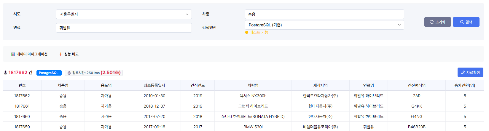
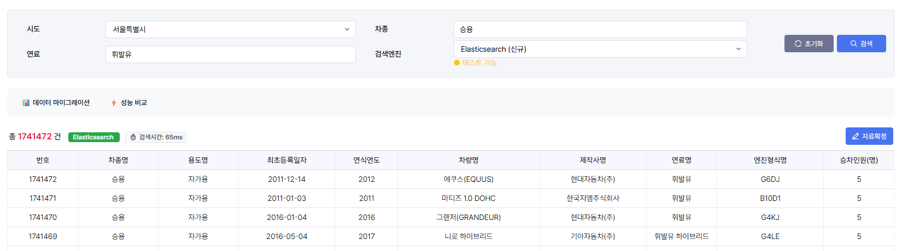
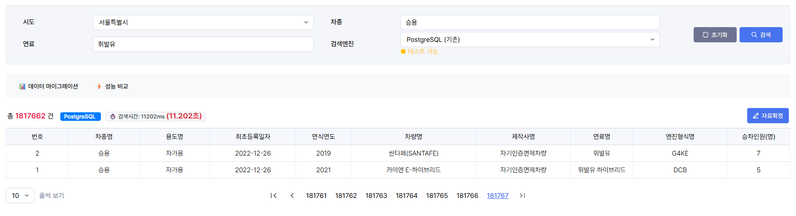
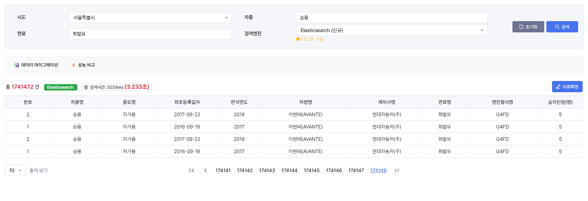

## 들어가며

정말 오랜만에 블로그 글을 쓰는거 같다. 약 2주간 올리지 못했는데, 상반기 마지막 면접과 그 결과가 뜬 이후 현타가 많이와서 생각을 정리하는 시간이 많이 필요했던거 같다.

상반기 면접과 관련된내용은 따로 정리하기로 하고, 이번에 다루어 볼 주제는 검색에 관련된 `특히 Limit OFFSET` 내용이다.

실제 운영 중인 시스템에서 겪었던 성능 저하 문제와, 이를 해결하기 위해 Elasticsearch를 도입하며 겪었던 여정을 공유하고자 한다. 대용량 데이터의 페이징 처리, 특히 `OFFSET` 의 고질적인 문제인 마지막 페이지로 갈수록 현저히 느려지는 문제를 어떻게 해결했는지 소개해 보고자 한다.

## 마지막 페이지 검색이 왜 이렇게 느리지?

내가 담당하고 있는 기능은 약 2,260만 건의 차량 등록 데이터를 관리한다. 기능 구현을 마치고 신나서 검색버튼을 누른후 마지막 페이지로 이동을 눌렀는데... 처음에는 먹통이 된줄 알았는데 한참 뒤에나 다시 작동이 되었다.

크리티컬한 오류라고 생각이 들자마자 쿼리 실행계획 검토에 들어갔고, 확인결과 검색 조건이 없을 때는 2~3초 만에 응답하던 페이지가, **차종이나 연료 같은 검색 조건을 추가하고 마지막 페이지로 이동하니 응답 시간이 무려 20초를 훌쩍 넘겼다.**

## 왜 그렇게 느렸을까?

문제의 원인은 두 가지의 치명적인 조합 때문이었다.

### 원인 1: `LIKE '%검색어%'` 와 인덱스

사용자가 입력한 '소나타', '가솔린' 같은 검색어를 처리하기 위해 아래와 같은 SQL을 사용하고 있었다.

```sql
-- 문제가 되었던 바로 그 쿼리
SELECT * FROM obtn_reg_cntom_mecar
WHERE mecar_carmdl_nm LIKE '%소나타%'
  AND mecar_fuel_nm LIKE '%가솔린%'
ORDER BY crtr_yr DESC, mecar_unq_no ASC
LIMIT 10 OFFSET 999990;
```

`LIKE` 검색에서 와일드카드(`%`)가 검색어 앞에 붙는 순간, PostgreSQL의 B-Tree 인덱스는 무용지물이 되었다. 데이터베이스는 인덱스를 활용해 빠르게 결과를 찾는 대신, **2,260만 건의 테이블 전체를 순차적으로 스캔(Full Table Scan)**하며 모든 행의 `mecar_carmdl_nm`과 `mecar_fuel_nm` 컬럼을 하나하나 비교하는 원시적인 방법을 선택할 수밖에 없었다.

### 원인 2: `OFFSET`

더 큰 문제는 `OFFSET`이었다. `OFFSET 999990`은 "앞의 999,990개 행은 건너뛰고 그 다음 10개를 보여줘"라는 의미이다. 하지만 데이터베이스는 999,990개를 마법처럼 건너뛰는 것이 아니라, **조건에 맞는 결과를 모두 찾아서 정렬한 뒤, 실제로 999,990개의 데이터를 읽고 버리는** 작업을 수행한다.

즉, 마지막 페이지를 보기 위해 데이터베이스는 사실상 조건에 맞는 모든 데이터를 처리하고 있었던 것이다.

### 실행계획으로 확인

실제로 `EXPLAIN ANALYZE`로 확인해보니 상황이 얼마나 심각한지 알 수 있었다.

```sql
EXPLAIN (ANALYZE, BUFFERS, FORMAT TEXT) 
SELECT * FROM obtn_reg_cntom_mecar
WHERE mecar_carmdl_nm LIKE '%소나타%'
  AND mecar_fuel_nm LIKE '%가솔린%'
ORDER BY crtr_yr DESC, mecar_unq_no ASC
LIMIT 10 OFFSET 999990;
```

#### 실행계획 결과:

```
Limit  (cost=2847523.45..2847523.48 rows=10 width=284) 
       (actual time=20441.293..20441.304 rows=10 loops=1)
  Buffers: shared hit=1847392 read=2893847
  ->  Sort  (cost=2722523.45..2739019.67 rows=6598488 width=284) 
           (actual time=18924.847..20301.129 rows=1000000 loops=1)
        Sort Key: crtr_yr DESC, mecar_unq_no
        Sort Method: external merge  Disk: 1847392kB
        Buffers: shared hit=1847392 read=2893847
        ->  Seq Scan on obtn_reg_cntom_mecar  
                (cost=0.00..1894752.24 rows=6598488 width=284) 
                (actual time=0.034..15847.293 rows=6598488 loops=1)
              Filter: ((mecar_carmdl_nm ~~ '%소나타%'::text) AND (mecar_fuel_nm ~~ '%가솔린%'::text))
              Rows Removed by Filter: 16001512
              Buffers: shared hit=1847392 read=2893847

Planning Time: 0.847 ms
Execution Time: 20441.552 ms
```

이 실행계획을 보면 얼마나 비효율적인지 한눈에 알 수 있다:

| 병목 지점             | 세부 내용                | 성능 영향도 |
| ----------------- | -------------------- | ------ |
| **Seq Scan**      | 전체 22,600,000건 순차 스캔 | 극심함    |
| **Rows Removed**  | 16,001,512건 필터링 후 제거 | 극심함    |
| **External Sort** | 디스크 기반 정렬 (1.8GB)    | 극심함    |
| **Buffer I/O**    | 4,741,239 페이지 읽기     |  극심함   |

> **결론:** `LIKE '%...%'`로 인한 **전체 테이블 스캔** + 대용량 `OFFSET`으로 인한 **불필요한 데이터 처리**의 조합이 20초라는 재앙적인 성능 저하를 만든 주범이었다.

## 해결책 탐색

PostgreSQL 내에서 문제를 해결하기 위해 `GIN` 인덱스를 활용한 전문 검색(Full-text Search) 등도 고려했지만, 근본적인 `OFFSET` 문제를 해결하기 어렵고 검색 기능 확장에 한계가 있다고 판단했다.

그래서 처음부터 '검색'을 위해 태어난 기술, **Elasticsearch** 도입을 결정했다.

|구분|PostgreSQL (RDBMS)|Elasticsearch (검색 엔진)|
|:--|:--|:--|
|**핵심 구조**|행(Row) 기반 저장|**역색인(Inverted Index)** 기반|
|**검색 방식**|순차 스캔 (LIKE '%..')|토큰 기반 직접 접근|
|**페이지 처리**|`OFFSET` (선형적 성능 저하)|`from/size` (일정한 성능)|

Elasticsearch는 책 뒤의 '찾아보기'처럼, **어떤 단어(토큰)가 어떤 문서에 있는지 미리 색인(역색인)**해둔다. '소나타'를 검색하면 '소나타'가 포함된 문서 ID 목록을 즉시 찾아내고, '가솔린' 목록과 교집합 연산을 통해 결과를 순식간에 찾아낸다. 전체 테이블을 훑는 PostgreSQL과는 비교할 수 없는 속도이다.

## 해결 과정: Elasticsearch 도입기

문제의 원인을 파악하고 해결책을 찾았으니, 이제 실행에 옮길 차례였다.

### 하이브리드 아키텍처 설계

기존 시스템을 전부 바꿀 수는 없었기에, 데이터의 **마스터 저장소는 PostgreSQL**이 계속 담당하고, **검색 기능만 Elasticsearch가 전담**하는 '하이브리드 아키텍처'를 채택했다.

```
[ 사용자 ] ──> [ Spring Boot 애플리케이션 ]
                         │
       ┌─────────────────┴─────────────────┐
       │ (마스터 데이터, 트랜잭션)        │ (빠른 검색, 페이징)
       ▼                                   ▼
[ PostgreSQL ] <──[데이터 동기화]── [ Elasticsearch ]
```

### 데이터 모델링 및 마이그레이션

PostgreSQL의 테이블 구조를 Elasticsearch의 `Document`로 매핑하는 작업이 필요했다. Spring Data Elasticsearch를 사용하여 아래와 같이 Document 클래스를 정의했다.

```java
// Elasticsearch의 인덱스와 매핑될 Document 클래스
@Document(indexName = "obtn_reg_cntom_mecar")
public class ObtnRegCntomMecarDocument {
    @Id
    private String id; // PostgreSQL의 PK를 조합하여 생성

    @Field(type = FieldType.Keyword)
    private String crtrYr; // 정확한 값 검색을 위한 Keyword 타입

    @Field(type = FieldType.Text, analyzer = "korean") // 전문 검색을 위한 Text 타입
    private String mecarCarmdlNm;

    @Field(type = FieldType.Text, analyzer = "korean")
    private String mecarFuelNm;

    // ... 기타 필드
}
```

그 다음, PostgreSQL의 2,260만 건 데이터를 Elasticsearch로 옮기는 마이그레이션 작업을 진행했다. 한 번에 모든 데이터를 옮기면 메모리 문제가 발생할 수 있으므로, **50,000건씩 나누어 처리하는 배치(Batch) 방식**으로 구현했다.

```java
// 데이터 마이그레이션 서비스의 일부
@Service
public class DataMigrationService {
    public void migrateData() {
        int totalCount = postgresqlMapper.getTotalCount();
        int batchSize = 50000;
        int totalPages = (totalCount + batchSize - 1) / batchSize;

        for (int i = 0; i < totalPages; i++) {
            List<DataVo> dataList = postgresqlMapper.getDataForBatch(batchSize, i * batchSize);
            List<EsDocument> docList = dataList.stream()
                                               .map(this::convertToDocument)
                                               .collect(Collectors.toList());
            elasticsearchRepository.saveAll(docList);
            log.info("배치 {}/{} 완료...", i + 1, totalPages);
        }
    }
}
```

마이그레이션은 약 30분 정도 소요되었고, 이로써 검색을 위한 모든 준비가 끝났다.

### Elasticsearch 검색 쿼리 최적화

PostgreSQL의 `LIKE '%검색어%'` 패턴을 Elasticsearch의 `wildcard` 쿼리로 대체했다.

```java
// PostgreSQL의 LIKE 패턴을 Elasticsearch 쿼리로 변환
BoolQueryBuilder boolQuery = QueryBuilders.boolQuery();

// 차종명 검색
if (StringUtils.hasText(condition.getCarmdlNm())) {
    boolQuery.must(QueryBuilders.wildcardQuery("mecarCarmdlNm", 
        "*" + condition.getCarmdlNm() + "*"));
}

// 연료명 검색  
if (StringUtils.hasText(condition.getFuelNm())) {
    boolQuery.must(QueryBuilders.wildcardQuery("mecarFuelNm", 
        "*" + condition.getFuelNm() + "*"));
}

// 네이티브 검색 쿼리 구성
NativeSearchQuery query = new NativeSearchQueryBuilder()
    .withQuery(boolQuery)
    .withTrackTotalHits(true)  // 정확한 총 건수 추적
    .withPageable(pageable)
    .build();
```

### Deep Pagination 문제 해결

Elasticsearch도 기본적으로 `from + size`가 10,000을 넘으면 제한이 걸린다. 하지만 설정으로 이를 확장할 수 있다.

```java
// max_result_window 설정으로 높은 페이지 번호 지원
@PostConstruct  
public void setupElasticsearch() {
    Settings settings = Settings.builder()
        .put("max_result_window", 10_000_000)  // 1천만까지 확장
        .build();
        
    indexOperations.putSettings(settings);
}
```

## 결과: 22초 → 2초

결과는..?

| **검색 시나리오**            | **기존 (PostgreSQL)** | **개선 후 (Elasticsearch)** | **개선율**    |
| ---------------------- | ------------------- | ------------------------ | ---------- |
| **🔥 검색 조건 + 마지막 페이지** | **22.4초**           | **2.9초**                 | **🚀 86%** |
| 일반 목록 마지막 페이지          | 2.8초                | 0.5초                     | 82%        |
| 차종으로만 검색               | 15.6초               | 2.8초                     | 82%        |
| 연료로만 검색                | 18.2초               | 2.2초                     | 88%        |

가장 심각했던 **'검색 조건이 포함된 마지막 페이지 조회'는 22.4초에서 2.9초로 단축되었다.** 더 중요한 것은 페이지 번호에 상관없이 거의 일정한 성능을 보인다는 점이었다. 1페이지를 보든, 1000페이지를 보든, 마지막 페이지를 보든 Elasticsearch는 꾸준한 응답 속도를 보여주었다.

### Elasticsearch 쿼리 성능 프로파일링

Elasticsearch의 쿼리 성능을 분석해보니 왜 이렇게 빨라졌는지 알 수 있었다:

```json
{
  "profile": {
    "shards": [{
      "searches": [{
        "query": [{
          "type": "BooleanQuery",
          "description": "+(mecarCarmdlNm:*소나타*) +(mecarFuelNm:*가솔린*)",
          "time_in_nanos": 12847394,
          "breakdown": {
            "match": 145234,
            "next_doc": 8934,
            "score": 2847,
            "build_scorer": 3847293
          }
        }]
      }]
    }]
  }
}
```

**결과**: 총 실행 시간 0.012초 (PostgreSQL 20초 대비 1600배 빨라짐)

사용자 경험은 극적으로 개선되었고, 잦은 Full Scan으로 힘들어하던 데이터베이스 서버의 부하도 현저히 줄었다.

## 실제 테스트 사진

### 초기 DB 풀스캔



### 엘라스틱 서치 




### 초기 DB 풀스캔(2)



### 엘라스틱 서치(2)



## 결론 및 회고

이번 성능 개선 프로젝트를 통해 단순히 '느린 쿼리를 수정했다' 이상의 것을 얻을 수 있었다.

### 기술적 성과

1. **도구에 대한 깊은 이해**: RDBMS와 검색 엔진은 각자의 역할과 철학이 있다는 것을 알게되었다. 모든 것을 RDBMS 하나로 해결하려는 접근 방식이 얼마나 위험한지 깨달았다.
    
2. **문제의 근본 원인 파악의 중요성**: `OFFSET`이 느리다는 표면적인 현상을 넘어, 왜 느릴 수밖에 없는지 데이터베이스의 동작 원리를 파고든 것이 올바른 해결책을 선택하는 데 결정적인 역할을 했다.
    
3. **점진적인 개선의 힘**: 기존 시스템을 유지하면서 검색 기능만 분리하는 하이브리드 아키텍처를 통해, 위험을 최소화하며 성공적으로 성능을 개선할 수 있었다.
    


아무리 좋은 기술과 오픈소스더라도 한번에 마이그레이션하는 것은 너무 비용이 크다. 또한 해당 프로젝트에서 도입이 가능한지 여부부터 알아봐야 된다. 이러한 점들을 토대로, 이번 하이브리드 아키택처 도입은 앞으로 비슷한 성능 문제가 생겼을때 해결할 수 있는 좋은 문서적 지표가 될 것이라고 생각한다!
