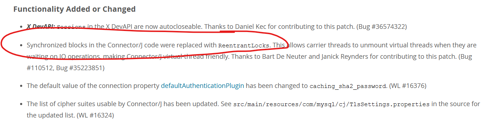

## 들어가며

최근에 상반기의 일정들도 마무리가 되고, 사이드 프로젝트 하나도 종료되면서 관심있던 분야에 대해 새로운 프로젝트를 하나 진행해보기로 했다. 
그 이름은 바로 `AlgoReport` 이다. `프로젝트에 대한 자세한 설명은 구현이 완료되고 작성할 예정`
평소 가독성이 너무 좋아보여서 눈여겨보았던 코틀린을 사용해보기로 했고 
설계를 진행하다보니 사용해야될 오픈소스들도 늘어났다. 
그 중에서도 Java21을 도입하려고 고민한 과정에서 겪었던 고찰을 공유하고자 한다.

우리 프로젝트는 **코틀린(Kotlin) 2.2.0**과 **자바(Java) 21 LTS**를 기반으로 한다. 이 조합을 선택하면서 자연스럽게 코틀린의 **코루틴(Coroutines)과 자바 21의  가상 스레드(Virtual Threads)** 사이에서 어떤 것을, 언제, 왜 사용해야 할지에 대한 고민에 빠졌다.

이 글에서는 자바 21의 가상 스레드가 무엇인지, 기존 스레드와 어떻게 다른지, 
그리고 [AlgoReport 프로젝트](https://github.com/hun425/algoreport)와 같은 I/O 집약적인 애플리케이션에서 코루틴과 가상 스레드를 어떻게 바라보고 적용할 수 있을지에 대한 탐구 과정을 담았다.

### Java 21의 가상 스레드란 무엇인가? (feat. Project Loom)

자바 21에서 정식으로 선보인 가상 스레드는 **'Project Loom'**의 결과물로, **경량 동시성(Lightweight Concurrency)**을 구현하기 위해 탄생했다. 기존 자바 스레드`이제는 플랫폼 스레드(Platform Thread)라 불림)`가 OS 커널 스레드와 1:1로 매핑되어 생성 비용이 비싸고 개수에도 제한이 있었던 반면, 가상 스레드는 **JVM에 의해 관리**되며 훨씬 적은 비용으로 수백만 개까지 생성할 수 있었다.

핵심은 플랫폼 스레드 위에서 수많은 가상 스레드가 동작하는 M:N 모델이라는 점이다.

---

### 가상 스레드는 어떻게 가벼워질 수 있었을까?

가상 스레드가 '가볍다'고 말하는 가장 큰 이유는 **스택 메모리 관리 방식**에 있었다.

- **On-Demand 스택 생성 및 관리**: 기존 플랫폼 스레드는 생성 시점에 고정된 크기(보통 1MB 이상)의 스택 메모리를 할당받았다. 이는 사용 여부와 관계없이 메모리를 점유했다. 하지만 가상 스레드는 처음에는 **아주 작은 스택만 할당**받고, 메서드 호출이 깊어질 때만 **필요에 따라 스택 프레임을 확장**했다.
    
- **동적인 스택 크기 조절**: 만약 스택이 더 커져야 하면, JVM은 스택의 내용을 **힙(Heap) 메모리로 옮겨서 보관**했다. 즉, 스택이 고정된 메모리를 점유하는 것이 아니라, 힙을 활용해 동적으로 크기를 조절함으로써 메모리 사용량을 획기적으로 줄일 수 있었다.
    

---

### 컨텍스트 스위칭 비용이 낮은 이유

컨텍스트 스위칭(Context Switching)은 CPU가 처리할 스레드를 바꾸는 과정에서 발생하는 비용이다. 플랫폼 스레드는 OS 커널 스레드와 1:1로 매핑되기 때문에, 스레드를 전환할 때마다 비싼 비용의 **커널 레벨 컨텍스트 스위칭**이 발생했다.

하지만 가상 스레드는 달랐다. 수많은 가상 스레드는 소수의 플랫폼 스레드 위에서 동작하며, 이들을 스케줄링하는 것은 전적으로 JVM의 역할이었다. 따라서 가상 스레드 간의 전환은 대부분 **JVM 내부에서 사용자 레벨의 저비용 컨텍스트 스위칭**으로 이루어졌다. 커널 스레드와의 매핑이 거의 발생하지 않으니, 비용도 자연스럽게 낮아졌다.

---

### ForkJoinPool과 Work-Stealing 방식

가상 스레드의 스케줄링은 기본적으로 **ForkJoinPool** 위에서 이루어졌다. 이 스케줄러는 **Work-Stealing(작업 훔치기)**이라는 효율적인 방식으로 동작했다.

1. 할 일이 없어진 스레드(A)는 그대로 노는 것이 아니라, 다른 바쁜 스레드(B)의 작업 큐(Work Queue)를 엿봤다.
    
2. 이때 B의 큐에서 **가장 오래된 작업(큐의 앞쪽)을 하나 훔쳐왔다.** 큐의 앞쪽 작업을 가져오는 이유는 간단했다. 방금 들어온 뒤쪽 작업은 아직 분할되지 않은 큰 작업일 가능성이 높고, 앞쪽 작업은 여러 번 분할을 거친 작은 작업일 확률이 높기 때문이었다. `뭔가 그리디하다`
    
3. 작업을 훔친 스레드 A는 그 작업을 실행하며, 전체적인 처리량을 높이고 CPU 자원의 낭비를 막았다.
    

이 방식 덕분에 JVM은 최소한의 플랫폼 스레드로 수많은 가상 스레드의 작업을 효율적으로 처리할 수 있었다.

---

### 가상 스레드가 만능일까? CPU-Bound 작업의 함정

그렇다면 가상 스레드를 사용하는 것이 무조건 효율적이었을까? **그렇지 않았다.**

가상 스레드는 **CPU-Bound(CPU 집약적)** 작업에서는 성능 이점이 거의 없었다. 대규모 계산, 이미지 렌더링, 암호화 등 CPU를 계속해서 사용하는 작업을 수천 개의 가상 스레드로 동시에 실행해봤자, 결국 실제 작업을 처리하는 커널 스레드의 수(보통 CPU 코어 수와 비슷함)만큼만 동시에 실행될 뿐이었다. 오히려 잦은 스케줄링으로 인해 미미한 성능 저하가 발생할 수도 있었다.

---

### 가상 스레드가 I/O-Bound 작업에 유리한 이유

가상 스레드의 진정한 힘은 **I/O-Bound(I/O 집약적)** 작업에서 발휘된다. 그 이유는 **블로킹(Blocking) 시 커널 스레드를 점유하지 않기 때문**이었다.

- **플랫폼 스레드**: 네트워크 요청이나 데이터베이스 쿼리 같은 블로킹 I/O를 호출하면, 해당 스레드와 매핑된 OS 커널 스레드는 작업이 완료될 때까지 **꼼짝없이 대기(Blocked)** 상태가 됐다. 이는 명백한 자원 낭비였다.
    
- **가상 스레드**: JVM은 가상 스레드가 블로킹 I/O를 호출하는 것을 감지하면, 해당 가상 스레드를 잠시 **"파킹(park)"** 시키고, 작업을 처리하던 플랫폼 스레드를 **즉시 반환**했다. 반환된 플랫폼 스레드는 다른 가상 스레드의 작업을 처리하러 갔다. 나중에 I/O 작업이 완료되면, JVM은 파킹했던 가상 스레드를 다시 깨워 다른 플랫폼 스레드에 할당하여 작업을 이어가게 했다.
    

이러한 방식으로 가상 스레드는 I/O 대기 시간 동안 커널 스레드를 낭비하지 않으므로, 적은 수의 스레드로 매우 높은 동시성을 처리할 수 있었다.

---

### 코루틴 vs 가상 스레드: AlgoReport 프로젝트의 선택과 고찰

우리 프로젝트는 solved.ac API를 통해 대량의 데이터를 수집하고, 이를 분석하여 사용자에게 제공하는 전형적인 I/O 집약적 애플리케이션이었다. 따라서 코루틴과 가상 스레드 모두 매력적인 선택지였다.

- **코틀린 코루틴**: 이미 코틀린 생태계에 깊숙이 자리 잡은 비동기 프로그래밍 모델이었다. `suspend` 키워드를 통해 논블로킹 코드를 마치 동기 코드처럼 간결하게 작성할 수 있었으며, 구조화된 동시성(Structured Concurrency)을 통해 복잡한 비동기 로직을 안전하게 관리할 수 있었다. 우리 프로젝트의 `InitialDataSyncSaga`나 `SubmissionSyncSaga`에서 수많은 사용자의 데이터를 병렬로 수집하는 로직에 코루틴을 적용하면, 순차 처리에 비해 성능을 극적으로 향상시킬 수 있었다.
    
- **자바 가상 스레드**: 라이브러리가 아닌 JVM 레벨의 지원이라는 점에서 큰 강점이 있었다. 기존의 블로킹 코드를 거의 수정하지 않고도 동시성을 높일 수 있었다. 예를 들어, `RestTemplate`을 사용하는 기존의 `SolvedacApiClientImpl` 코드를 별다른 수정 없이 가상 스레드 위에서 실행하기만 해도 성능 향상을 기대할 수 있었다.
    

**우리의 결론은 "함께 사용하자"였다.**

- **복잡하고 구조화된 비동기 로직**: 여러 API 호출, 데이터베이스 접근, 이벤트 발행이 얽혀있는 `...Saga` 클래스들처럼 복잡한 비즈니스 흐름에는 **코루틴**의 구조화된 동시성과 `suspend` 함수의 명확성이 더 유리했다.
    
- **단순 I/O 작업 및 기존 코드 활용**: `RestTemplate`이나 JDBC처럼 기존의 블로킹 라이브러리를 활용하는 부분에서는 **가상 스레드**를 사용하여 손쉽게 논블로킹 효과를 얻을 수 있었다.
    

궁극적으로 코틀린 코루틴은 가상 스레드를 디스패처로 활용할 수 있으므로, 두 기술은 대립하는 관계가 아닌 **상호 보완적인 관계**라고 할 수 있었다.

### 마무리하며

1년전쯤 프로젝트에 가상스레드를 도입해보기위해 공부할 때는 mysql connector에서 Synchronized 키워드를 사용하고 있어 가상스레드를 사용하면 오히려 성능이 저하되는 문제가 있었고,`Virtual Thread의 Pinning 문제` 이를 보완하기위해 한 사용자는 Synchronized를 reentrantlock으로 전부 전환시킨 코드를 pr 하기도 했었다.
이때는 이것 때문에 의미가 없다 판단되어 도입을 보류했었는데... 
이번에 다시 알아보니 대부분의 커넥터에서 이 문제를 해결시킨걸 확인했다. 

결국 둘 다 도입하기로 한 결정은 어떻게 보면 개발의 비용을 줄이기 위한 선택인 것 같다.
이게 실제 현업 프로젝트고, 유지보수까지 가야한다면 최악의 선택일 수도 있을 것 같다. `개인프로젝트의 장점?`

가상스레드에 대해서 겉핥기 식으로만 알고있었는데 이번 기회로 더 깊게 알게 되어 좋은 경험이였다! 
역시 실제 프로젝트에서 직접하는 고민이 제일 재밌고 공부가 잘되는거 같다..

### 참고 자료

- [JEP 444: Virtual Threads (OpenJDK)](https://openjdk.org/jeps/444)
- [Virtual Threads (Oracle Help Center)](https://docs.oracle.com/en/java/javase/21/core/virtual-threads.html)
    
- [Coroutines guide (Kotlin 공식 문서)](https://kotlinlang.org/docs/coroutines-guide.html)
    
- [Difference Between Thread and Virtual Thread in Java (Baeldung)](https://www.baeldung.com/java-virtual-thread-vs-thread)

- [connector-j 9.0 변경점](https://dev.mysql.com/doc/relnotes/connector-j/en/news-9-0-0.html)
