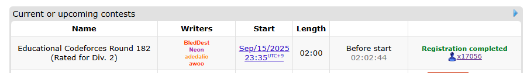
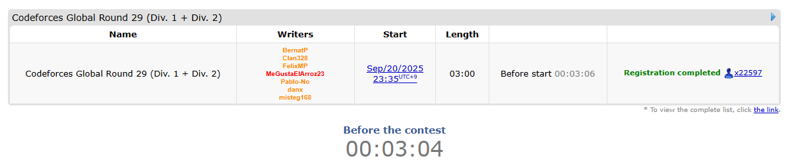
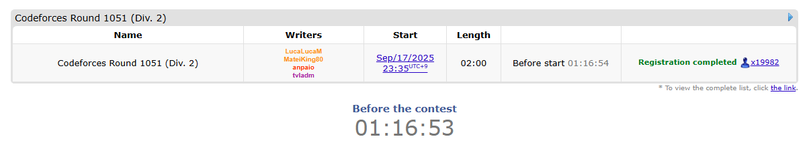
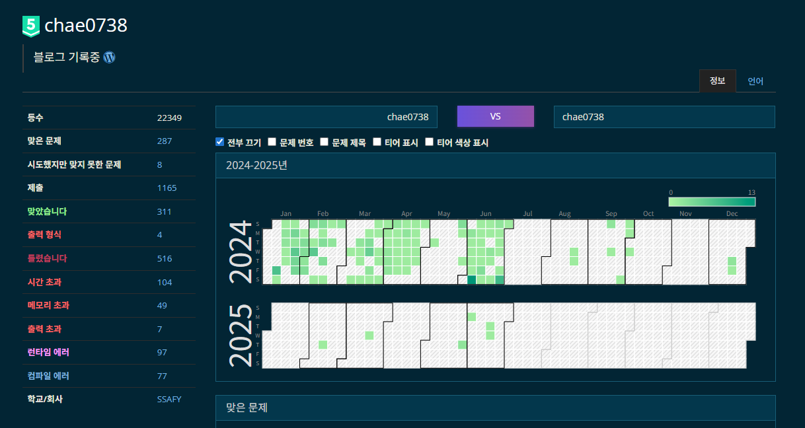
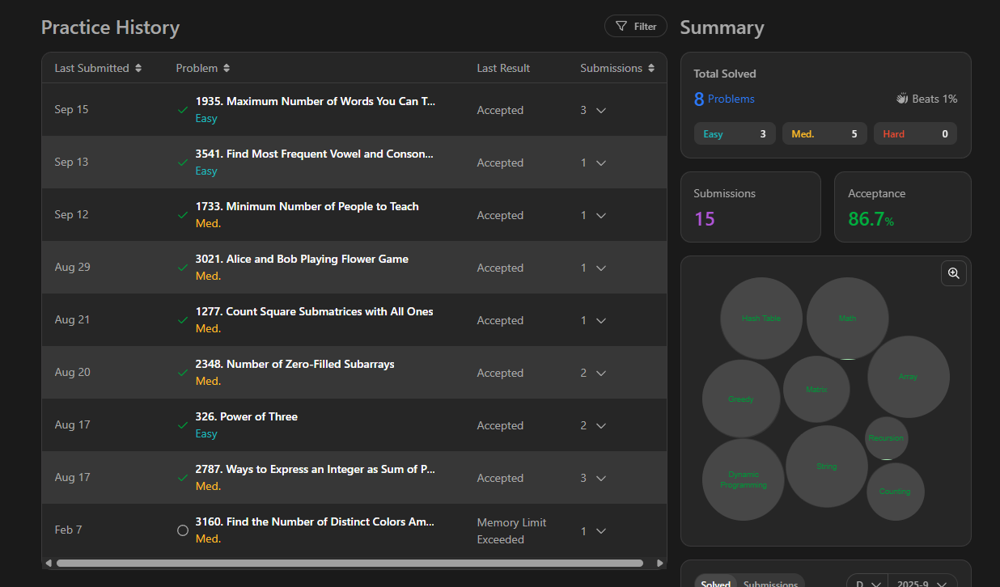
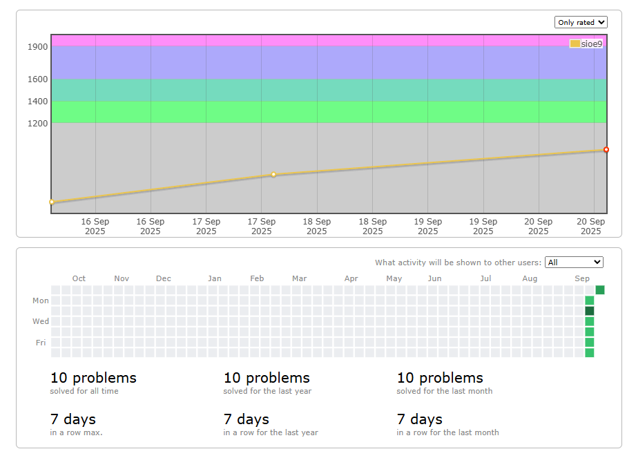
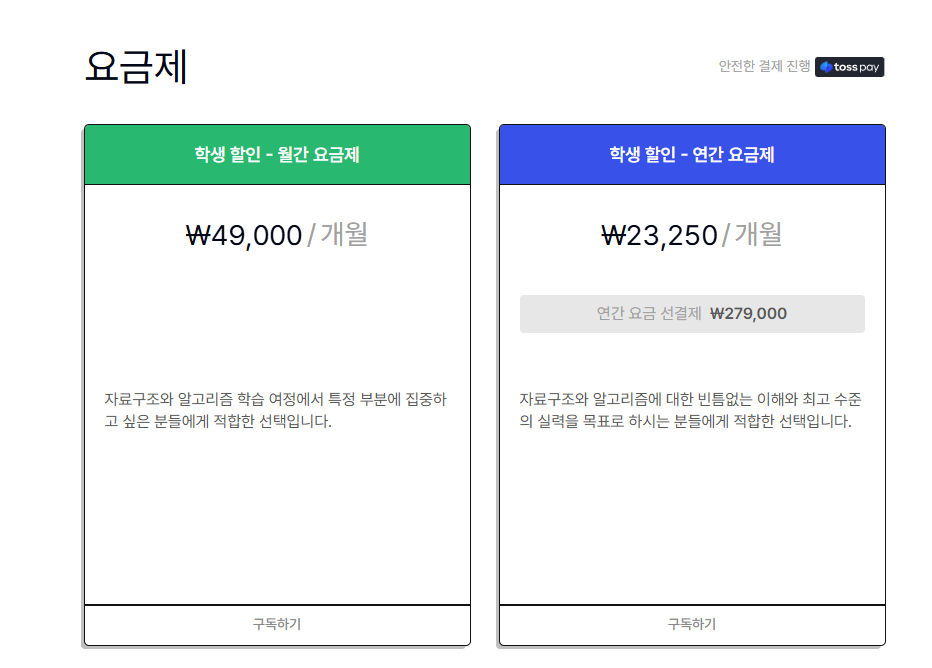

## 들어가며
요즘들어 코틀린에 대해 관심이 많아지면서 학습방법을 찾던 도중...
싸피에서 알고리즘에 처음 **입문**했을때 썼던 방법이 떠올랐다.
그때는 자바가 처음이었지만, 일단 많이 타이핑을 하는게 적응하기에 중요하다고 생각해서 무작정 자바로 알고리즘을 풀기 시작했었다. 
당시에 이 방법이 되게 유효했었기에 최근에는 코틀린으로 알고리즘을 꾸준히 풀게 되었다.
근데 그러던와중 주변 지인들의 추천으로 **코드포스**라는 사이트를 알게되었고 
풀다보니 재밌어서 요즘은 대회마다 꼭 참여해서 풀어보고 있다.

그래서 오늘 글의 주제는 백준과 리트코드 그리고 코드포스를 풀어본 입장에서 **세개의 사이트**가 무슨 차이가 있는지 **개인적으로 느낀 점**을 작성해보고자 한다.

## 백준

한국 개발자라면 안풀어본 사람이 없다고 생각하는 거의 국민 알고리즘 사이트라고 생각한다.
자료구조의 기초를 잡기에도 좋은 문제들이 많고 solved.ac를 사용하면 티어까지 측정할 수 있어서 동기부여도된다. 
하지만 플레 이상부터 티어를 올리기 위해서는 세그먼트 트리, 트라이 같은 특정 자료구조나 알고리즘을 활용하는 문제들이 티어가 높게 측정되어있다. `예시로 BFS 아이디어 응용 문제는 골드 상위 에서 플레 하위지만 세그먼트 트리가 들어가기만 하면 플레로 측정된다`
이러다보니 문제 해결을 위한 아이디어를 향상하기 위해 푼다기 보다는 자료구조를 얼마나 잘 알고 적용할 수 있나에 더 초점을 둔 사이트라고 느끼게 되었다. 

## 리트코드

리트 코드는 최근에서야 이용하고 있기 때문에 많은 데이터가 쌓인건 아니다. 
대략적으로 느끼기에는 “실무 코테 대비”에 최적화된 플랫폼인것 같다. `외국기준`
쉬움/보통/어려움으로 난이도 태깅이 명확하고, 태그/패턴/회사별 필터가 있다는게 장점이다.
물론 외국회사 기준이고 모든걸 이용하려면 유료라는게 큰 단점이다. `심지어 가격도 비쌈..`
대신 데일리 문제라고 매일 한문제씩 사이트에서 정해주는데, 1일 1알고리즘을 하는데는 되게 좋은 사이트 같다.

## 코드포스

코드포스는 앞선 두개의 사이트랑 비교한다면, 자료구조를 알고있는지 보다 이 문제를 해결하기 위한 **아이디어 접근 방식**을 더 중요하게 본다. 그러다보니 대부분의 문제가 다이나믹 프로그래밍, 애드혹, 수학 관련 문제들이 많다. 나도 초기에는 이전에 풀던 알고리즘들과의 결이 많이 달라서 좀 당황했지만 
AI의 도움을 받아 하나하나씩 풀어가고 문제 접근 방식을 고민하다보니 오히려 제일 전성기(?)였던 때보다 다양한 방식으로 문제에 접근해보고 있다는 느낌을 받았다.

## 번외(코드트리)
이전에 싸피에서 B형을 희망하는 사람들에게 아이디를 지원해줘서 알게 된 사이트이다. 
알고리즘을 개념단계과 흐름까지 전부 **시각화**해서 보여줘서 초심자가 이해하기에 매우 도움이 되는 사이트이다. 또한 특징으로는 삼성에서 운영하기때문에 **삼성 코테 기출** 문제들을 전부 풀어볼 수 있다는게 장점이다. 사실 이용만 할 수 있다면 이 사이트가 개념 배우기에는 제일 좋은 사이트인 것 같지만...
제일 문제되는 단점이 비용(가격)이다.

자신이 돈에 여유가 있고, 알고리즘을 기본부터 탄탄하게 다지고 싶다면 해보는걸 추천한다.
대신 제휴대학으로 되어있다면 무료로 사용할 수 있다.

## 정리
한국 기업들의 코테를 뚫기 위해서는 사실 백준하나 만으로도 충분하다. 하지만 최근 오토에버도 플레급 문제가 나올 정도로 점점 코테의 난이도가 상승하고 있는 만큼 준비를 열심히 한다고 도움이 되면 됐지 손해는 안볼거라고 생각한다. 
이번 정리를 계기로 백준으로 기업 코테 통과를 위한 기본 실력을 갖추고, 이후 알고리즘에 더 관심이 생긴다면 코드포스에 입문해보면 알고리즘의 재미를 느낄 수 있지 않을까.. 라고 느꼈다.
덕분에 이전에 사두고 제대로 못읽은 종만북도 코드포스 덕분에 꺼내서 다시 정독하고 있다. 
언젠가는 꾸준히 풀어나간다면 코드포스 레드까진 아니더라도 블루까진 도전 할 수 있지 않을까?
