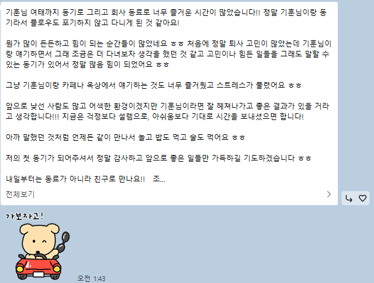

## 들어가며

두 번째 회사를 마무리하게 되었다.
누군가에게는 짧은 기간일 수 있지만, 내게는 생각보다 훨씬 많은 것을 남긴 시간이었다.

이번 글은 단순히 “힘들었다”, “좋았다”를 적기 위한 글은 아니다.
내가 어떤 기대를 가지고 들어갔고, 실제로 무엇을 경험했으며, 그 과정에서 개발자로서 어떤 기준이 더 선명해졌는지를 정리해보려 한다.

## 왜 플로우를 선택했었나

플로우에 합류할 때 내가 중요하게 봤던 것은 분명했다.
기술 방향성과 성장성, 그리고 회사 내부에서 엔터프라이즈 개발자로서 어떤 방향을 가져갈 수 있는지였다.

당시 나는 단순히 “이직에 성공했다”는 것보다,
이 회사에서의 경험이 다음 회사에서도 인정받을 수 있는 형태의 커리어가 될 수 있을지를 더 중요하게 생각했다.

특히 엔터프라이즈 영역은 단순한 기능 개발보다도
고객사 환경, 운영 이슈, 커스터마이징, 안정성, 협업 구조까지 함께 보게 되는 경우가 많아서
짧은 시간 안에도 밀도 있게 성장할 수 있는 영역이라고 생각했다.

실제로 입사 직후 내가 썼던 글에서도,
플로우 엔터팀은 크게 구축과 운영(QA)으로 나뉘어 있었고,
나는 그 안에서 구축(고도화) 쪽이 더 재미있고 성장에 유리하다고 느껴 그 방향에 더 끌렸다고 적었었다.
또 통계 고도화를 맡으며 선임들과 기술적으로 자유롭게 이야기할 수 있었고,
“사람이 복지”라는 말을 체감했다고도 남겼다.

돌이켜보면 그때의 기대는 분명 진심이었다.

## 실제로 경험한 것들

짧은 기간이었지만, 맡았던 일의 밀도는 꽤 높았다.
특히 블로그에도 따로 정리했던 것처럼,
아키텍처를 설계하고 실제 구현까지 직접 이어가는 경험을 할 수 있었던 점은 분명 의미가 컸다.

누군가가 이미 정리해둔 구조 안에서 일부만 수정하는 것이 아니라,
어떤 방식으로 설계를 가져가야 하는지 고민하고,
그 선택이 실제 구현과 운영에서 어떤 영향을 주는지를 직접 체감할 수 있었다.

이 과정에서 통계 고도화, QA, 운영 이슈 대응처럼
겉으로 보기에는 서로 다른 성격의 일들도 결국 하나로 연결되어 있다는 점을 많이 배웠다.

기능은 만드는 것으로 끝나지 않았다.
실제 서비스에서 어떻게 동작하는지,
어떤 환경에서 깨지는지,
누가 어떤 맥락에서 이 기능을 쓰는지까지 봐야 했다.

그리고 그 과정에서 생각보다 많은 배움을 얻었다.

## 가장 크게 배운 것들
### 1. 리눅스 환경에 익숙해지는 과정

이전보다 훨씬 더 운영 환경에 가까운 시선으로 시스템을 보게 되었다.
개발자는 결국 IDE 안에서만 일하는 사람이 아니라,
실행 환경과 로그, 배포 이후의 상태까지 이해해야 하는 사람이라는 걸 더 크게 느꼈다.

처음에는 낯설고 어렵게 느껴졌지만,
오히려 그 과정 덕분에 내가 평소 얼마나 “로컬에서만 돌아가면 된다”는 감각에 익숙했는지를 알게 됐다.

### 2. 백엔드만이 아니라, 프론트까지 포함한 디버깅

이번 회사에서 특히 많이 배운 건 오류를 추적하는 방식이었다.
이전에는 상대적으로 백엔드 관점에서만 문제를 보는 습관이 있었다면,
이번에는 프론트 쪽 이슈까지 포함해서 원인을 좁혀가는 경험을 많이 했다.

실무에서는 문제가 레이어별로 친절하게 나뉘어 오지 않는다.
사용자는 하나의 서비스만 볼 뿐이고,
결국 개발자는 “이건 내 영역이 아니다”라고 선을 긋기보다
문제가 어디서 시작됐는지 끝까지 추적할 수 있어야 한다는 걸 배웠다.

### 3. 개발자들 간의 효율적인 소통

혼자 오래 붙잡고 있는 것이 무조건 좋은 태도는 아니라는 것도 배웠다.
오히려 내가 어디까지 확인했는지,
무엇을 시도했고 무엇이 아직 불확실한지를 명확하게 정리해서 공유하는 것이
훨씬 더 빠르고 건강한 해결 방식이라는 걸 많이 느꼈다.

좋은 개발자는 단순히 코드를 잘 짜는 사람이 아니라,
문제를 같이 푸는 사람이라는 점을 더 분명하게 체감한 시간이었다.

## 고민이 시작된 지점

처음부터 이직을 생각했던 건 아니다.
오히려 막 이직한 직후였기 때문에,
적어도 한동안은 이곳에서 최대한 배우고 자리 잡는 데 집중하고 싶었다.

실제로 사람들에 대한 만족도도 높았다.
특히 동기와 사수분들을 포함한 팀원분들 덕분에 적응도 빠르게 할 수 있었고,
일을 대하는 방식이나 커뮤니케이션 측면에서도 많이 배웠다.

그런데 시간이 지나면서 한 가지 고민이 점점 커졌다.

내가 기대했던 엔터프라이즈 개발자의 방향성과,
회사 내부에서 실제로 흘러가는 방향이 조금씩 다르게 느껴졌다는 점이다.

솔루션 회사라고 생각하고 들어왔지만,
실무를 경험할수록 점점 방향성이 SI에 가까워진다는 인상을 받았다.
물론 엔터프라이즈 비즈니스 자체가 고객 요구사항에 맞춰 움직이는 성격이 강하기 때문에
완전히 분리해서 볼 수는 없겠지만,
그 안에서도 내가 쌓고 싶은 경험의 방향과는 차이가 있다는 생각이 들었다.

여기에 더해, 인정받는 처우라는 측면에서도 고민이 생겼다.
단순히 연봉만의 문제라기보다는,
내가 기여한 만큼 성장하고 인정받을 수 있는 구조인지에 대한 의문이 점점 커졌다.

처음에는 이런 생각을 크게 하지 않았다.
하지만 이전에 면접을 봤던 곳에서 다시 제안을 받게 되면서,
지금의 환경과 앞으로의 방향성을 더 냉정하게 보게 되었다.

결국 이직이라는 건
지금 회사가 무조건 나쁘다거나, 다른 회사가 무조건 좋다거나의 문제가 아니었다.
내가 앞으로 어떤 개발자가 되고 싶은지,
그리고 그 방향으로 갈 가능성이 어디에 더 높은지를 따져보는 문제에 가까웠다.

## 그래도 분명하게 남은 것

그렇다고 해서 플로우에서의 시간이 의미 없었다고 생각하지는 않는다.
오히려 반대다.

짧은 기간이었지만,
아키텍처를 고민하고 직접 구현해본 경험,
리눅스 환경에 적응한 과정,
프론트까지 포함한 디버깅 경험,
그리고 개발자 간의 효율적인 소통 방식은
내가 다음으로 넘어갈 때 분명하게 가져갈 수 있는 자산이 되었다.

무엇보다 좋은 사람들과 함께 일했다는 점은 크게 남는다.
특히 동기와 사수분들, 그리고 팀원분들께는 정말 감사한 마음이 크다.
기술적으로도 많이 도와주셨지만,
그보다도 적응하는 사람을 대하는 태도에서 배운 점이 많았다.

예전에 내가 입사 후기에 “사람이 복지인 이유를 절실히 느꼈다”고 적었는데,
그 말은 지금도 유효하다.
출근 자체에 큰 스트레스를 느끼지 않았고,
좋은 사람들과 함께 일하는 환경이 왜 중요한지 분명히 경험했다.

## 이제 더 중요해진 기준들

아직도 나는 다음 회사를 고를 때
무엇을 가장 우선순위에 둬야 하는지 완전히 정답을 내린 것은 아니다.

성장성, 사람, 기술 방향성, 인정받는 처우.
어느 하나만으로 회사를 판단할 수는 없다는 걸 점점 더 알게 되었다.

다만 예전보다 분명해진 건 있다.

나는 단순히 주어진 일을 처리하는 개발자가 아니라,
문제를 더 명확하게 정의하고,
구조를 고민하고,
실제로 구현하고,
그 과정에서 계속 성장할 수 있는 환경을 원하는 사람이라는 점이다.

그리고 그 성장에는
기술만이 아니라 함께 일하는 사람과 조직의 방향성도 분명히 포함된다는 걸 알게 되었다.

## 마무리하며

두 번째 회사를 마무리한다는 건
단순히 또 한 번 회사를 옮긴다는 의미만은 아닌 것 같다.

이번 시간은
내가 무엇을 기대하는 사람인지,
어떤 환경에서 더 잘 배우는지,
그리고 무엇이 나에게 장기적으로 중요한지
조금 더 선명하게 보여준 시간이었다.

좋은 사람들과 함께할 수 있어서 감사했다.
그리고 그 시간 덕분에
나는 내가 어떤 개발자가 되고 싶은지 조금 더 구체적으로 생각할 수 있게 되었다.
동료들에게는 눈물이 없는 대문자T라는 소리를 많이 들었는데, 위의 카톡을 받고는 눈물이 조금 났다.

짧지만 분명하게 남는 시간이었다.
배운 것들은 가져가고,
아쉬웠던 부분은 다음 선택의 기준으로 삼아보려 한다.
