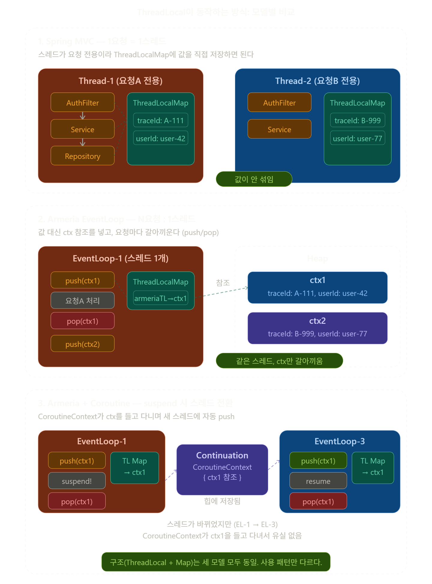

# 들어가며

이직한지 벌써 3주차가 넘어가고 있다.
이전회사까지는 Spring MVC 기반의 동기 환경만 경험했는데, 
지금은 Armeria + Kotlin Coroutines + Spring WebFlux + gRPC 라는 꽤 다른 세계에서 코드를 짜고 있다.
`물론 전 회사들에서는 스레드 기반의 컨트롤을 해본적은 없다..`

그러던 와중 얼마전 개발자 지인들과 기술 얘기를 하다가 ThreadLocal 이야기가 나왔다. 
면접 단골 질문이기도 하고, Spring 내부에서 많이 쓰이는 개념이라 대략적으로는 알고 있었다. 
근데 문득 이런 생각이 들었다.

> "우리 환경에서는 ThreadLocal이 그대로 동작하나?"

EventLoop 모델에서는 하나의 스레드가 여러 요청을 처리하고, 코루틴의 `suspend`에서는 스레드 자체가 바뀔 수도 있으니까. 그래서 공부를 시작했는데, 예상보다 훨씬 깊은 토끼굴이었다. 이 글은 그 여정의 기록이다.

---

# ThreadLocal이란

## 한 줄 정의

**ThreadLocal은 같은 스레드 안에서만 보이는 변수를 만들어주는 도구다.**

여기서 핵심은 "같은 스레드 안에서만"이라는 부분이다. 다른 스레드에서는 절대 안 보인다. 공유가 목적이 아니라 **격리**가 목적이다.

## 왜 필요한가

Spring MVC 모델 `1요청 1스레드 모델을 의미함`에서 로그인 요청을 처리한다고 해보자.

```kotlin
// AuthFilter에서 인증 처리
val userId = parseToken(request)
// 이 userId를 Controller, Service, Repository에서도 써야 한다
```

ThreadLocal이 없으면 이 `userId`를 모든 함수에 매개변수로 줄줄이 넘겨야 한다.

```kotlin
fun handleOrder(req: Request, userId: String, traceId: String) { ... }
fun createOrder(userId: String, traceId: String) { ... }
fun saveOrder(order: Order, traceId: String) { ... }
```

함수 10개 깊이면 10번 전달. 코드가 지저분해진다.근데 ThreadLocal을 쓰면?

```kotlin
// AuthFilter에서 한번 저장
userIdTL.set(userId)

// Service에서 바로 꺼내기 — 매개변수 불필요
val userId = userIdTL.get()
```

**한번 저장하면 같은 스레드 안 어디서든 꺼내 쓸 수 있다.** 그래서 Spring의 `SecurityContextHolder`, `MDC`, `RequestContextHolder`가 전부 ThreadLocal 기반으로 동작하는 것이다.

---

# 내가 헷갈렸던 것 ThreadLocal vs ThreadLocalMap

이 두 개는 이름이 비슷해서 같은 건 줄 알았다. 완전히 다른 거였다.

```
ThreadLocal    = 키 (열쇠)     → 힙에 1개, static final, 모든 스레드가 공유
ThreadLocalMap = 저장소 (사물함) → 스레드마다 각자 1개, 다른 스레드가 못 봄
```

`ThreadLocal.get()` 이 내부적으로 하는 일을 풀어쓰면

```java
public T get() {
    Thread t = Thread.currentThread();       // 현재 스레드 가져오고
    ThreadLocalMap map = t.threadLocals;     // 그 스레드의 Map 가져오고
    return map.get(this);                    // this(나 자신)를 키로 검색
}
```

**열쇠(ThreadLocal)는 모두 같은 걸 쓰지만, 사물함(ThreadLocalMap)이 스레드마다 다르니까 나오는 값이 다른 것이다.** 이 구조는 Java 1.2 때부터 지금까지 한 번도 안 바뀌었다고한다.

---

# 1요청 1스레드 모델에서는 완벽하다

Spring MVC + Tomcat 환경을 떠올려보자.

```
요청A 들어옴 → Thread-1 배정 → 응답 끝날 때까지 Thread-1 독점
요청B 들어옴 → Thread-2 배정 → 응답 끝날 때까지 Thread-2 독점
```

이 환경에서는 **스레드 = 요청**이다. Thread-1의 ThreadLocalMap은 사실상 "요청A의 전용 저장소"인 것이다. 그래서 ThreadLocal에 값을 직접 넣고, 같은 스레드에서 직접 꺼내고, 요청 끝나면 `remove()`하면 된다. 

```
요청 시작 → traceIdTL.set("abc-123")
  → AuthFilter: set
  → Controller: get
  → Service: get  
  → Repository: get
요청 끝 → traceIdTL.remove()
```

여기까지가 ThreadLocal의 원래 의도된 사용 환경이다.

---

# 그런데 EventLoop 모델에서 깨진다

내가 사용하는 Armeria + Netty 환경에서는 상황이 완전히 다르다.

## 문제 1: 한 스레드가 여러 요청을 처리한다

EventLoop 모델에서는 스레드 수가 CPU 코어 수 정도로 적고, 하나의 EventLoop 스레드가 여러 요청을 번갈아 처리한다.

```
EventLoop-1: 요청A 처리 → 요청B 처리 → 요청C 처리 → ...
```

만약 요청A가 ThreadLocal에 traceId를 저장하고 remove()를 하지 않으면, 요청B가 그 값을 읽어버린다. **요청 간 데이터 오염**이 발생한다.

## 문제 2: 코루틴의 suspend에서 스레드가 바뀐다

`suspend fun` 안에서 비동기 I/O(DB 쿼리 등)를 만나면, 코루틴은 현재 스레드를 반환하고 나중에 다른 스레드에서 이어서 실행될 수 있다.

```
EventLoop-1에서: set("abc") → suspend (DB 쿼리)
  ← 스레드 반환!
EventLoop-3에서: resume → get() → null!  ← ThreadLocal 유실
```

`suspend`는 함수가 **진짜로 return**하는 것이다. 현재 스레드의 콜스택에서 완전히 빠져나간다. 나중에 DB 응답이 올 때, 그 응답을 받는 EventLoop(스레드)가 원래 스레드와 다를 수 있다. 다른 스레드의 ThreadLocalMap에는 당연히 값이 없으니까 null이 나온다.

---


## 여기서 잠깐!!!!!

혹시나 말로만 설명하면 이해가 잘 안될까봐 추가적인 이미지를 클로드에게 부탁해서 그려달라고 했다. 
기존 MVC 모델만 알던 사람들은 해당 이미지를 보면 이해하기 더 쉬울거라고 생각한다.




# Armeria는 어떻게 해결하나: push/pop

Armeria의 해결책은 이렇다.

**값들을 하나의 `RequestContext` 객체에 묶어서 힙에 두고, ThreadLocalMap에는 그 참조만 넣고 뺀다.**

```kotlin
// 요청 시작: push = set(ctx)
val ctx = ServiceRequestContext.of(req)  // 힙에 ctx 생성
ctx.attr(TRACE_KEY).set("abc-123")       // ctx 안에 저장
armeriaTL.set(ctx)                        // ThreadLocalMap에 참조 저장

// 비즈니스 로직
val traceId = RequestContext.current().attr(TRACE_KEY)  // ctx에서 꺼냄

// 요청 끝: pop = set(null)
armeriaTL.set(null)                       // ThreadLocalMap에서 참조 제거
```

push/pop이라는 이름이 거창하지만, 실제로는 `set(ctx)` / `set(null)`이다. 같은 EventLoop에서 여러 요청이 오면

```
요청A: set(ctx1) → 로직 → set(null)
요청B: set(ctx2) → 로직 → set(null)
```

같은 ThreadLocalMap에서 참조만 갈아끼우는 것이다. ctx1과 ctx2는 힙에 독립적으로 존재하니까 절대 섞이지 않는다.

---

# 코루틴 환경에서는: CoroutineContext

push/pop만으로는 스레드 전환 문제(문제 2)를 해결할 수 없다. 여기서 Kotlin의 `CoroutineContext`가 등장한다.

가장 쉬운 비유: **ThreadLocal은 스레드에 붙은 주머니, CoroutineContext는 코루틴에 붙은 주머니.**

코루틴은 `suspend`하면 스레드를 떠나서 다른 스레드로 갈 수 있다. 그때 ThreadLocal(스레드 주머니)은 못 가져가지만, CoroutineContext(코루틴 주머니)는 같이 간다.

CoroutineContext는 `Continuation` 객체 안에 들어있다. `suspend`가 일어나면 Continuation이 힙에 저장되고, `resume` 시 Continuation 안의 CoroutineContext에서 ctx를 꺼내 새 스레드의 ThreadLocalMap에 push해준다.

```
suspend 시: pop → ThreadLocalMap 비움. CoroutineContext(힙)에 ctx 살아있음.
resume 시: CoroutineContext에서 ctx 꺼냄 → 새 스레드 ThreadLocalMap에 push.
```

그래서 `RequestContext.current()`가 스레드가 바뀌어도 동작하는 것이다.

---

# pop 해도 ctx가 GC 안 되는 이유

공부하면서 제일 궁금했던 것이 pop 하면 ThreadLocalMap에서 참조가 사라지는데, 그럼 ctx 객체가 GC되버리는거 아닌가? 라는거였다.

답은 간단하다. Continuation이 ctx를 참조하고 있기 때문이다.

```
pop 후:
  ThreadLocalMap → 참조 없음
  Continuation   → ctx 참조 중  ← 살아있으니까 GC 안 됨

resume 후 요청 완료:
  ThreadLocalMap → 참조 없음
  Continuation   → 실행 끝나서 GC 대상
  → ctx를 참조하는 게 아무것도 없음 → ctx도 GC
```

Java GC는 아무도 참조하지 않는 객체만 수거한다. Continuation이 살아있는 한 ctx는 안전하다.

---

# 정리: 모델별 비교

| | Spring MVC | Armeria EventLoop | Armeria + Coroutine |
|---|---|---|---|
| 스레드 : 요청 | 1 : 1 | 1 : N | 1 : N + 스레드 전환 |
| ThreadLocal에 넣는 것 | 값 직접 | ctx 참조 (push/pop) | ctx 참조 (push/pop) |
| 스레드 전환 대응 | 불필요 | 불필요 (같은 스레드) | CoroutineContext 전파 |
| 누수 방지 | remove() 수동 호출 | SafeCloseable + finally | Continuation 생명주기 |

구조(ThreadLocal + ThreadLocalMap)는 셋 다 동일하다. 바뀐 건 "뭘 넣느냐"와 "누가 set/get을 호출하느냐"다.

---

# 마치며

처음에 ThreadLocal을 공부하려고 했을 때, EventLoop 환경에서 시작했더니 "이걸 왜 쓰지?"부터 막혔다. 왜냐하면 내 환경에서는 ThreadLocal이 원래 의도대로 동작하지 않기 때문이다. Armeria의 `RequestContext`와 Kotlin의 `CoroutineContext`가 이미 그 역할을 대체하고 있었다.

돌아가서 1요청 1스레드 모델부터 다시 이해하니까 비로소 전체 그림이 잡혔다. ThreadLocal이 왜 만들어졌고, 왜 EventLoop에서 깨지고, Armeria와 Kotlin이 어떻게 해결했는지의 순서대로 말이다.

지금 내가 쓰는 스택에서 직접 ThreadLocal을 만들어 쓸 일은 없다. 하지만 SLF4J MDC, Micrometer, Armeria 자체가 내부적으로 ThreadLocal을 쓰고 있다. 로그에 traceId가 안 찍히거나, 메트릭이 이상하게 나올 때 이 구조를 모르면 디버깅이 불가능하다.

오랜만에 CS 공부를 하니 더 궁금해진 것들이 많아진 것 같다. `Armeria나 Coroutine의 내부 동작 원리 등`
"프레임워크를 쓰기만 하는 것"과 "왜 그렇게 설계되었는지 아는 것"의 차이에 대한 중요성을 CS 공부 할 수록 배우는 것 같다.
