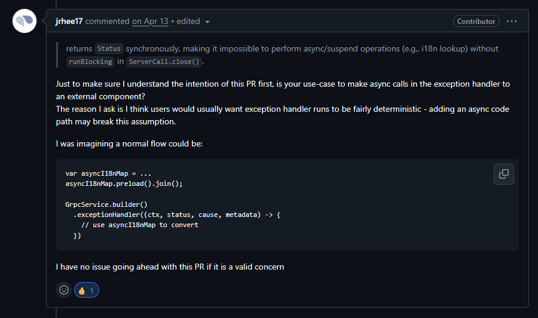
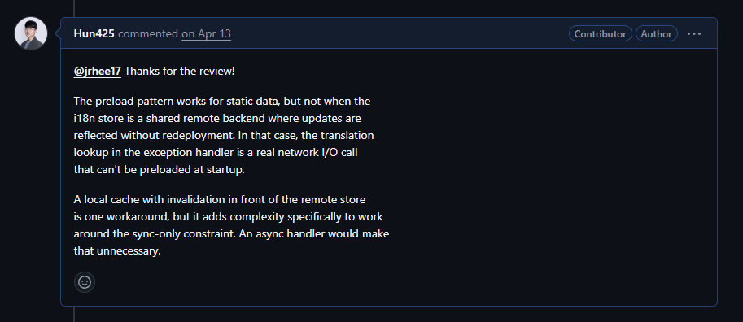
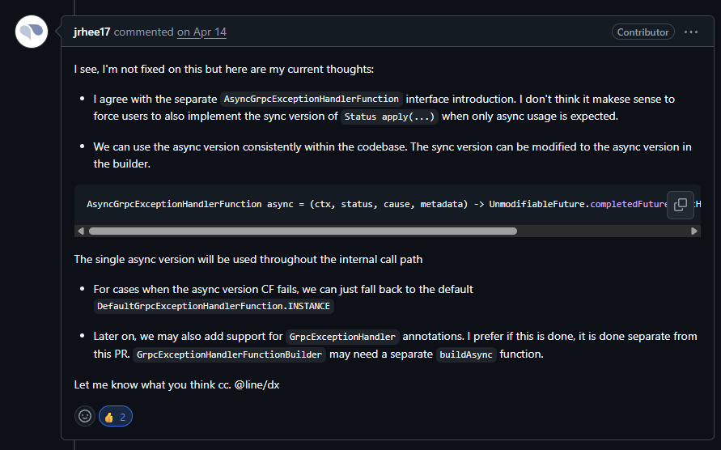
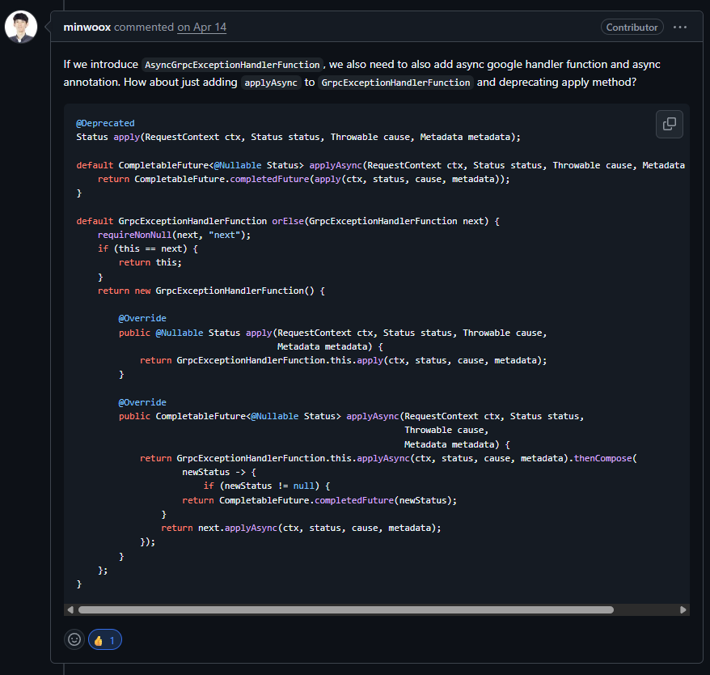
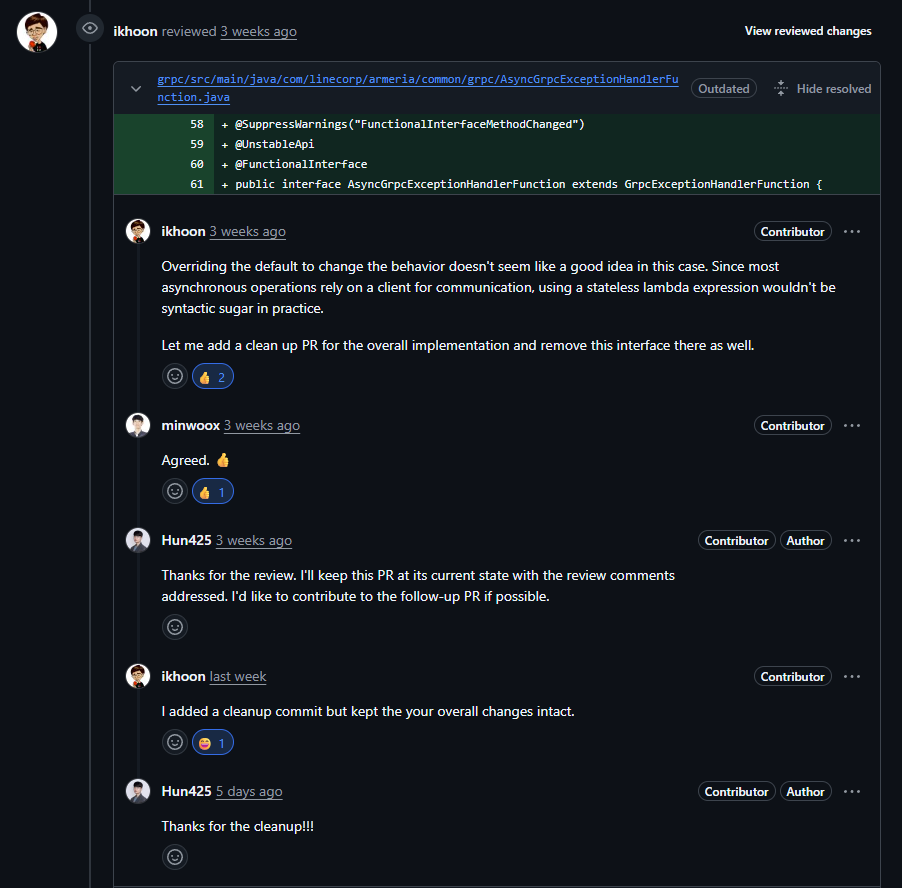

## 들어가며
정말 오랜만에 블로그 글을 쓰는것 같다. 
새로운 회사와 환경, 그리고 기술 스택을 공부하며 적응하는데 힘쓰다보니 약간은 소홀 했던거 같다. 
그러던 와중에서도 신기한? 재밌는? 흥미로운? 일이 하나 생겼다. 
코드 및 설계적으로 깔끔하게 쓰고 싶은 욕심이 오픈소스에 기여까지 하게 된 것이다.
정리하다보니 생각보다 양이 많아서 이번 글에서는 기여로 이어지게 된 흐름 위주로 작성하고 다음에는 기술적 내용을 정리해보려고 한다.

--- 

## PR을 하게 된 계기
현재 회사 코드는 대부분 논블로킹으로 짜여 있다.
Armeria + Kotlin Coroutines + R2DBC + WebFlux
그런데 어느 날 i18n(다국어) 메시지 처리 부분을 들여다보다가 거슬리는 게 보였다.

- gRPC 서비스에서 예외가 던져짐
- `GrpcExceptionHandlerFunction`이 그 예외를 받아 `Status`로 매핑
- 매핑 과정에서 **다국어 에러 메시지를 찾아야 함** - 지금은 메모리 캐시지만, **곧 Redis로 옮겨야 함**
- 그런데 `apply()`는 **동기**, `Status apply(...)` 시그니처라 `runBlocking` 강제

비동기를 해본사람들은 알겠지만, 비동기를 위해 나온 라이브러리가 아니라면 대부분은 동기방식으로 동작을 하게되고 이는 소스 내부에 비동기와 동기가 섞이는 결과가 나타난다. 
이러한 결과가 동기 모델인 1요청 1스레드 모델(spring 기본 모델)에서는 스레드가 잠깐 병목이 생긴다고 큰 문제로 번지지는 않지만, 
Netty의 이벤트 루프와 같은 비동기 모델에서는 하나의 스레드가 다수의 요청을 처리하기 때문에 블로킹이 생기면 전체 시스템의 병목으로 번질 수가 있다.
따라서 이 문제를 해결하기위해 아르메리아 코드를 보았고, GrpcExceptionHandlerFunction 에서 동기밖에 지원하지 않는다는 것을 알게되었다. 

그래서 아르메리아 깃허브 Disscusion에서 메인테이너에게 질문을 올렸다. 

https://github.com/line/armeria/discussions/6693

> 우리가 요래요래 해서 요게 필요한데 이걸 추가하는것에 대해서 어떻게 생각하시나요?

라고 질문을 올렸고  얼마 지나지 않아 답변이 왔다. 

답변을 요약하자면 

> "We need `AsyncGrpcExceptionHandlerFunction`." (우리도 해당 비동기 처리 핸들러가 필요할 것 같다.)

라고 왔다. 

이렇게 오픈소스에 첫 이슈와 PR을 같이 열어보게 되었다.  [#6717](https://github.com/line/armeria/pull/6717)

---

## PR 시작
처음에는 “작게 건드리자”는 생각이었다

처음 PR을 준비하면서 가장 부담스러웠던 건 기존 API를 건드리는 일이었다.

오픈소스 첫 기여였고, Armeria처럼 이미 많은 사용자가 있는 프레임워크의 public API를 바꾸는 건 꽤 조심스러운 일이었다.

그래서 처음 선택한 방향은 단순했다.

기존 `GrpcExceptionHandlerFunction`은 그대로 두고, 비동기 작업이 필요한 사용자를 위해 별도의 async handler interface를 추가하자는 생각이었다.

내 기준에서는 이게 가장 안전해 보였다.

기존 사용자는 아무 영향이 없고, async가 필요한 사용자만 새 API를 쓰면 된다고 생각했기 때문이다.

하지만 이 생각은 리뷰를 거치면서 몇 번 바뀌게 되었다.

---

# 첫 번째 리뷰 - 정말 async가 필요한가?

PR을 올리고 나서 처음으로 크게 생각하게 만든 건 리뷰어의 질문이었다.

요지는 이랬다.

> 예외 핸들러 안에서 외부 컴포넌트를 async로 호출하려는 것이 맞나요?  
> 보통 exception handler는 deterministic하게 동작하길 기대할 수 있습니다.  
> i18n 데이터라면 startup 시점에 preload하고 이후에는 동기적으로 읽으면 안 되나요?

이 질문을 보고 솔직히 마음이 조금 흔들렸다.

처음에는 “비동기 예외 핸들러가 있으면 좋겠다”는 확신이 있었는데, 막상 “그게 정말 필요한가?”라는 질문을 받으니 다시 생각하게 됐다.

preload 방식은 분명 깔끔하다.

애플리케이션 시작 시점에 i18n 데이터를 한 번 로딩해두고, 요청 처리 중에는 메모리에서 동기적으로 읽으면 된다.  
예외 처리 경로에 비동기 복잡도를 넣지 않아도 된다.

프레임워크 입장에서는 이쪽이 더 단순하다.

그래서 다시 우리 상황을 확인했다.

우리가 다루려던 i18n 메시지는 단순한 정적 리소스가 아니었다.  
당장은 아니여도 추후 운영 중에 수정될 수 있고, 배포 없이 반영될 수 있어야 했다.  
그렇다면 startup preload만으로는 요구사항을 만족하기 어려웠다.

물론 캐시와 invalidation을 붙이면 우회할 수 있다.  
하지만 그건 결국 sync-only API에 맞추기 위해 별도의 인프라 복잡도를 추가하는 일이었다.

그래서 답변은 추상적인 원칙이 아니라 실제 use case로 설명했다.

(영어 어렵다....)

> preload는 static data에는 맞지만, 운영 중 수정되는 shared remote backend에는 맞지 않습니다.  
> 이 경우 translation lookup은 실제 network I/O이고, startup 시점에 모두 preload할 수 없습니다.  
> cache + invalidation으로 우회할 수는 있지만, 그건 sync-only 제약을 피하려고 추가하는 복잡도입니다.

이 답변 이후 리뷰어는 async handler의 필요성을 받아들였다.

이때 가장 크게 배운 건 이거였다.

> OSS 리뷰에서 “이게 더 좋아 보입니다”는 의미가 없다.
> “이런 실제 상황에서는 기존 방식으로 해결하기 어렵습니다”가 필요하다.

결국 설계를 설득하는 건 취향이 아니라 구체적인 시나리오였다.

---

# 두 번째 리뷰 - 별도 인터페이스가 정말 좋은가?

async handler의 필요성은 어느 정도 받아들여졌다.

그런데 다음 질문은 API 설계였다.

처음 나는 별도 async interface를 추가하는 방향으로 PR을 만들었다.  
하지만 리뷰어는 다른 방향을 제안했다.

요지는 이랬다.

> 별도 interface를 만들면 그에 맞는 builder, annotation, Google gRPC 변환 경로 등 주변 API도 같이 늘어난다.  
> 차라리 기존 `GrpcExceptionHandlerFunction`에 `applyAsync()`를 추가하는 것이 낫지 않을까?

처음엔 약간 망설였다.

기존 인터페이스를 건드리지 않으려고 일부러 별도 인터페이스를 만들었는데, 오히려 기존 인터페이스에 method를 추가하는 쪽이 낫다는 제안이었기 때문이다.

하지만 생각해보니 맞는 말이었다.

내가 본 건 “기존 코드를 덜 건드리는 것”이었다.  
리뷰어가 본 건 “앞으로 유지해야 할 API 표면적”이었다.

별도 async interface를 만들면 당장은 안전해 보일것이다.
하지만 프레임워크 입장에서는 sync handler와 async handler가 서로 다른 축으로 갈라진다.

그러면 builder에도 두 API가 생기고, annotation도 async 버전을 고민해야 하고, handler chaining도 두 흐름을 모두 고려해야 한다.

반대로 기존 `GrpcExceptionHandlerFunction`에 `applyAsync()`를 추가하면 중심 API는 하나로 유지된다.

기존 사용자는 그대로 `apply()`를 쓰면 되고, async가 필요한 사용자는 `applyAsync()`를 구현하면 된다.  
`applyAsync()`가 값을 주지 않으면 기존 `apply()`로 fallback할 수도 있다.

결국 이 방향으로 설계를 바꿨다.

요약하자면
처음엔 “기존 API를 건드리지 않는 것”이 안전하다고 생각했다.  
하지만 리뷰를 거치며 “API를 여러 갈래로 늘리지 않는 것”이 더 중요한 안정성일 수 있다는 걸 알게 됐다.

이게 두 번째로 크게 배운 점이었다.

> 프레임워크의 public API는 지금 당장의 변경량보다, 앞으로 몇 년 동안 유지해야 할 모양이 더 중요하다.

---
## 세 번째 리뷰 - async 전용 인터페이스가 제거

`applyAsync()`를 기존 `GrpcExceptionHandlerFunction`에 추가한 뒤에도 한 가지 고민이 남았다.

Java에서 람다는 인터페이스의 추상 메서드 하나를 기준으로 동작한다.  
그런데 `GrpcExceptionHandlerFunction`의 추상 메서드는 여전히 기존 동기 메서드인 `apply()`였다.

즉, `applyAsync()`를 추가하더라도 사용자가 async handler를 람다로 깔끔하게 작성하기는 어려웠다.  
async-only handler를 만들려면 결국 `apply()`도 형식적으로 구현해야 했다.

그래서 `AsyncGrpcExceptionHandlerFunction`이라는 별도 인터페이스를 추가했었다.  
의도는 async handler만 더 자연스럽게 작성할 수 있도록 만드는 것이었다.

하지만 이 부분에서 다시 리뷰가 달렸다.

ikhoon님은 이 방식이 이번 경우에는 좋은 선택이 아닐 수 있다고 했다.

요지는 이랬다.

> default method를 override해서 동작을 바꾸는 방식은 좋아 보이지 않는다.  
> 그리고 대부분의 async 작업은 외부 통신을 위한 client에 의존하기 때문에, 
stateless lambda expression으로 작성하는 것이 실제로 큰 syntactic sugar가 되기 어렵다.

처음에는 async 전용 interface가 있으면 사용자 입장에서 더 편할 거라고 생각했다.  
하지만 다시 생각해보니 맞는 말이었다.

예외 핸들러에서 비동기 작업을 한다는 건 보통 단순 계산이 아니다.  
대부분 Redis client, HTTP client, i18n service client 같은 외부 의존성이 필요하다.

그렇다면 실제 사용자는 어차피 상태를 가진 객체를 만들어야 할 가능성이 높다.  
이 경우 async 전용 functional interface를 추가해도, lambda 한 줄로 깔끔하게 끝나는 경우는 많지 않다.

결국 그 interface는 API 표면적만 늘리고, 실제 사용성 이득은 크지 않을 수 있었다.

minwoox님도 이에 동의했고, ikhoon님은 cleanup commit에서 이 interface를 제거하겠다고 했다.

나는 그 방향을 받아들였다.

> Thanks for the review. I'll keep this PR at its current state with the review comments addressed.  
> I'd like to contribute to the follow-up PR if possible.

며칠 뒤 ikhoon님이 cleanup commit을 추가했다.

> I added a cleanup commit but kept your overall changes intact.

이 말이 인상 깊었다.

내가 제안한 전체 방향은 유지됐다.  
다만 그 안에서 불필요한 API는 제거되고, Armeria의 기존 설계에 더 자연스럽게 맞는 형태로 다듬어졌다.

이 경험을 통해 하나 더 배웠다.

편의 API는 “있으면 편해 보인다”만으로는 부족하다.  
실제 사용자가 어떤 형태로 그 API를 쓰게 될지까지 생각해야 한다.

내 입장에서는 “async handler를 더 쉽게 쓰게 해주는 API”였지만, 
메인테이너 입장에서는 “정말 이 API가 추가될 만큼 실질적인 가치가 있는가?”가 더 중요했다.

---

# 마무리

이 PR이 특별했던 이유는 단순히 내 코드가 오픈소스에 들어갔기 때문만은 아니다. `사실 맞긴하다 컨트리뷰터 뱃지보면 뿌듯하긴함`

알고보면 대부분의 오픈소스 기여는 자신의 문제를 해결하기 위해서 직접 제안하는 것 보다 밑의 방식이 훨씬 더 많다.
> issue에 메인테이너가 등록 (설계안을 대부분 정해놓음) > 문제 해결 참여자 모집 > 자신이 하겠다고 제안 > 메인테이너의 승인 후 작업 진행

이번 PR은 내가 현업에서 직접 아르메리아를 사용하면서 겪었던 문제를 해결하기 위해 질문을 구하고 내가 직접 issue와 pr을 등록하다보니 
maintainer와 더 긴밀하게 소통하고, 설계에 관해서 다양한 리뷰를 받아 볼 수 있었다. 

사내에서 느낀 작은 불편함을 그냥 우회하지 않고  왜 이 문제가 프레임워크 차원에서 다뤄질 수 있는지 설명했고,  
메인테이너들과 설계 언어로 대화했고,  그 과정에서 처음 생각했던 설계가 몇 번 바뀌었다.

그게 가장 큰 수확이었다.

이제 회사 코드에서도 아르메리아를 1.40으로 버전업 한다면 예외 응답에 필요한 i18n 메시지를 억지로 blocking하지 않고, 더 자연스러운 비동기 흐름으로 처리할 수 있다. (이건 좀 뿌듯함)

하지만 그보다 더 크게 남은 건 따로 있다.

오픈소스 기여는 완벽한 답을 들고 가는 일이 아니었다.  
문제를 정확히 설명하고, 리뷰를 통해 설계를 더 나은 방향으로 바꿔가는 과정이었다.
또한 나의 생각은 단순히 내가 아는 선에서 내 경험을 기반으로 설계했기 때문에 이러한 생각의 과정을 오픈소스와 맞춰가는 과정이 결국은 코드 리뷰였던 것 같다.  

개발자가 된 이후로 오랜만에 재미와 흥미를 모두 느끼는 경험이 생겨서 더 기억에 남을 것 같다. 
이번을 계기로 내가 사용하는 다양한 오픈소스에 대해서도 관심을 가져보고 공부해봐야겠다는 생각이 들었다.

그리고 영어 공부도 같이 해야겠다.....
