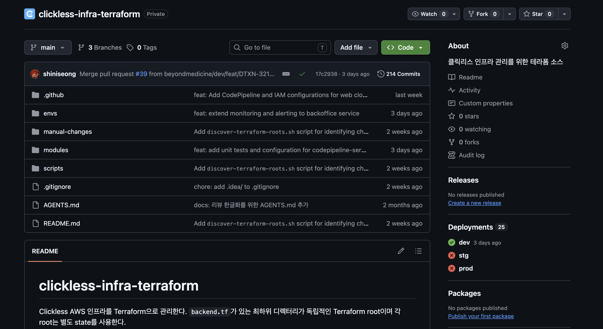

## 들어가며

약 2개월만에 새로운 블로그 글을 쓰는 거 같다. 
이 정도로 길게 블로그 활동을 쉰 적이 없었는데... 회사에 대한 만족도와 새로 주입되는 지식의 양이 높아지다보니 옵시디언에만 대충 정리해두고 따로 올리지를 않았던거 같다. 
하지만 결국은 직접 글을 쓰며 생각을 밖으로 출력하는 연습을 해야 자신의 것이 되는 것 같다.
그래서 다시 꾸준히 개발 관련이든, 회사에 다니며 얻게된 관점에 관한 글들을 써보려한다. 


오늘 소개할 주제는 테라폼(Terraform)이다.
기술의 동작 원리 등에 관한 내용은 나보다 AI나 다른 블로그에 훨씬 정리가 잘 되어 있기때문에 나는 어떤 사고의 흐름으로 이 기술을 선택했는지, 깃과 폴더구조의 세팅은 왜 이렇게 변했는지를 기록해보고자 한다. 

---
## 테라폼이 뭐에요
테라폼의 정의는 `테라폼(Terraform)은 하시코프(Hashicorp)에서 오픈소스로 개발중인 클라우드 인프라스트럭처 자동화 를 지향하는 코드로서의 인프라스트럭처(IaC)도구`이다. 

이렇게만 들으면 당연히 알 수가 없다. 
간단히 말하면 코드로 인프라의 상태를 선언하고 그 코드를 외부 제공자(provider라고 부름)가 읽어 aws를 직접 제어 해주는 기술이다. 

보통 인프라를 처음하면 aws 웹 브라우저를 열고 `요건 어떻게 쓰는거지`를 하나씩 일일히 다 검색해 가며 수동 노가다를 해야한다. 
하지만 테라폼을 쓰면 ? 코드로 개발하는 것 처럼 인프라를 세팅할 수 있다!!!!!
예를들어 우리가 객체를 추상화하고 재사용하는 것 처럼 구현이 가능해진다. 
그리고 가장 좋은점은... 대 AI 시대에 AI의 검토를 받을 수 있다(코드로 세팅하니깐)
오히려 인간이 놓칠 수 있는 실수를 잘 잡아준다.


## 왜 테라폼을 쓰게 됐나요
우리 회사는 인프라를 이전에 외주를 맡겼었다. (나 입사 전임)
그러다보니 흔히 아는 완벽하지 않은 작업이 있었고 약간의 문제들이 지금까지 공존하고 있는 중이였다.
그래서 그걸 고치는 기회에 앞으로 작업하는 인프라들을 위와 같은 장점을 가진 테라폼으로 적용해 볼 적기라고 생각했다. 

## 기본 세팅
초기에 세팅한 폴더 구조는 구글의 테라폼 공식 문서를 많이 참조했다. 
일반적인 환경별 브랜치 전략과는 다르게, 테라폼은 s3에 state를 최종 원천으로 두고 작동하는 특이한 방식이기 때문에 main을 기준으로한 수평적인 브랜치로 관리했다. 

또한 dev에서 구축한 인프라가 stg, prod에 동일하게 적용될 경우가 대다수일 것이기 때문에 
modules라는 폴더를 두고 변수명만 환경별 폴더에 정의했다. 

깃허브에 리뷰를 위한 plan 봇, apply 자동화 및 환경별 검증 플로우를 만들고 나니 기본적이 세팅이 완료되었다.



---

## 근데 이 구조가 오래 못 갔다

위 구조는 스택이 다섯 개일 때 만든 것이다.
`internal-alb`
`error-slack-alert`
`metric-slack-alert`
`deploy-slack-notify`
`bastion-sg`

이때 까지는  괜찮아 보였다. 모듈은 재사용되고, 환경은 갈려 있고, 새 환경은 값만 바꾸면 된다고 생각했다.

그런데... 문제가 보이기 시작한 건 스택이 늘어나면서였다.

---

## 이름이 곧 전부인 구조

평평한 구조에서는 **스택 이름 하나가 그 스택에 대한 모든 정보를 담아야 한다.**

`bastion-sg` 라는 폴더를 보고 알 수 있는 게 뭘까?

- 이게 네트워크 영역인가 보안 영역인가?
- 전 서비스가 쓰는 건가, 특정 서비스만 쓰는 건가?
- 이걸 건드리면 뭐가 같이 흔들리나?

이름만 봐서는 하나도 모른다. 결국 **만든 사람만 안다.**

스택이 다섯 개일 땐 그냥 다 외우면 된다. 근데 늘어나면 이름에 정보를 욱여넣게 된다.
`shared-network-internal-alb-apne2` 같은 방식 으로 말이다.....

이때부터 디렉토리가 있는데 이름으로 **계층**을 표현하기 시작하면 안티 패턴이라고 의심하게 되었다. 
(좀 찜찜함이 생김)

---

## 진짜 한계는 따로 있었다

결정적인 순간은 백오피스 서비스가 생겼을 때였다.

사수분이 추가 인프라 작업을 하면서 같이 리뷰를 하는 와중 발견됐다.

근데 백오피스는 그 서비스 전용 Cognito가 필요했다. 평평한 구조에 넣으면 이름이 이렇게 된다.
```
envs/dev/internal-alb/         ← 공용
envs/dev/error-slack-alert/    ← 공용
envs/dev/backoffice-cognito/   ← 접두어로 소속을 표시하기 시작
```
여기서 멈칫했다. 백오피스가 커지면 backoffice-rds, backoffice-s3 가 줄줄이 붙을 텐데, 
그건 앞에서 찜찜하다고 했던 "이름으로 계층을 표현하는" 그 방식 그대로다.

서비스가 넷이고 각각 스택 두세 개씩만 생겨도 열 개가 넘게 한 줄로 나열된다. 그때 뭐가 공용이고 뭐가 특정 서비스 것인지는 이름 접두어를 외우고 있어야만 안다.

정리하면 처음 구조의 한계는 이거였다.

>환경(dev/stg/prod)이라는 축은 있는데, 소유 주체라는 축이 없었다.


---

## 그래서 축을 늘렸다

바뀐 구조는 이렇다.

```text
envs/<env>/
  bootstrap/                             ← 테라폼이 돌기 위해 먼저 있어야 하는 것
  live/<리전>/
    shared/<도메인>/<스택>/              ← 전 서비스 공용
    micro-services/<서비스>/<스택>/      ← 그 서비스 전용
```

축이 셋 늘었다. 하나씩 보면

**① bootstrap vs live**

기준은 하나다.

> 이게 없으면 나머지 테라폼이 **실행 자체가 안 되는가?**

state를 저장할 S3 버킷, CI가 AWS에 붙을 때 쓰는 IAM 역할 같은 것들이 여기 해당한다. ALB나 알림 스택은 없어도 테라폼은 잘 돈다. 근데 state 버킷이 없으면 `terraform init`부터 실패한다.

"중요한가"가 아니라 **"선행하는가"** 가 기준인 셈이다. 

그래서 이 둘은 파이프라인이 다르다.

```text
live       PR → plan 봇 → 머지 → 자동 apply
bootstrap  그 파이프라인이 돌기 위한 전제 → 자동 apply 대상이 아님
```

실제로 CI는 bootstrap과 live를 한 PR에 섞으면 실패시킨다. 섞이면 순환이 생기기 때문이다. bootstrap이 만드는 것들(state 저장소, CI 권한) **위에서** 그 자동 apply가 도니까.

다만 지금 bootstrap 폴더는 비어 있다. state 버킷은 아직 손으로 만들고, OIDC 역할은 `scripts/`의 셸 스크립트를 1회 실행해서 만든다. 둘 다 성격상 명백히 bootstrap인데 아직 테라폼 밖에 있는 셈이라, 이 축이 실제로 값을 하는 건 걔들을 코드로 가져온 다음일 것 같다.

**② shared vs micro-services**

위에서 말한 영향 범위 축이다. 이제 경로만 보고 안다.

```text
.../shared/network/internal-alb/             ← 전 서비스 영향
.../micro-services/backoffice-service/auth/  ← 백오피스만
```

PR에 뜬 경로가 `shared/` 로 시작하면 리뷰어가 한 번 더 본다. 이름을 몰라도 된다.

**③ 리전**

지금 우리 리전은 서울 하나다. 그래서 이 층은 당장 아무것도 안 한다.

하지만... 현재 영문화·독문화가 1순위 과제라 **미국과 독일 리전이 예정되어 있다.**

리전이 갈리면 같은 스택이 리전마다 하나씩 생긴다. 서울 internal ALB, 미국 internal ALB, 독일 internal ALB.
평평한 구조에서 이걸 표현하려면 결국 이름에 넣는 수밖에 없다.

```text
envs/dev/internal-alb-apne2/
envs/dev/internal-alb-use1/
envs/dev/internal-alb-euc1/
```

앞에서 찜찜하다고 했던 **"이름으로 계층을 표현하는"** 그 지점으로 정확히 돌아간다.

그래서 리전 축은 안 쓸 축을 미리 연 게 아니라, 이미 정해진 요구를 먼저 반영한 쪽에 가깝다.

---

그리고 축 세 개와는 별개로, 모듈도 같이 도메인별로 갈렸다.

```text
modules/network/internal-alb/
modules/observability/error-slack-alert/
modules/auth/cognito/
modules/platform/ec2/bastion-sg/
```

---

## 옮기는 건 쉽다

이만큼 크게 바꾸면서 제일 걱정한 게 이거였다.

> 폴더를 옮기면 테라폼이 기존 리소스를 지우고 다시 만들려고 하지 않을까?

라이브로 돌고 있는 ALB를 상대로 그러면 큰일이다. 그런데 plan을 떠보니 아무 일도 안 일어났다.

이유는 테라폼이 리소스를 **디스크 경로로 기억하지 않기** 때문이다. 
신원은 두 가지로 정해진다.

- backend의 `key` : 어느 state를 보는가
- 모듈 호출 이름 : 그 state 안에서 어느 주소인가

이번 이동에서는 둘 다 안 건드렸다.

|             | before                                     | after                                                          |
| ----------- | ------------------------------------------ | -------------------------------------------------------------- |
| backend key | `dev/internal-alb/terraform.tfstate`       | 동일                                                             |
| 모듈 호출명      | `module "internal_alb"`                    | 동일                                                             |
| 바뀐 것        | `source = "../../../modules/internal-alb"` | `source = "../../../../../../../modules/network/internal-alb"` |

상대경로 한 줄만 바뀌었다. 루트 모듈이 디스크 어디에 있든 테라폼은 관심이 없다.

다만 이 상대경로는 좀 걸린다. `../` 가 **일곱 개**다. 세어보고 쓰는 사람도 없고, 리뷰에서 이게 맞는지 확인할 방법도 없다.

찾아보니 이 정도로 깊은 구조를 쓰는 곳들은 대부분 terragrunt 같은 래퍼를 같이 쓴다. 그 래퍼가 "여기서 루트까지 몇 단계인지"를 계산해주기 때문에 `../` 를 손으로 셀 일이 없다.

이것도 도입을 고려해보고 있다.

---

## 대신 추후 고려해야 하는 것

근데 이게 괜찮았던 이유가 **key를 안 바꿨기 때문**이고, 거기서 다음 문제가 생긴다.

이제 경로와 state key가 어긋난다.

```text
경로:  envs/dev/live/ap-northeast-2/shared/network/internal-alb
key:   dev/internal-alb/terraform.tfstate
```

폴더만 보고는 이 스택의 state가 S3 어디에 있는지 알 수 없다. `backend.tf`를 열어봐야 한다.

그리고 재구조화 이후에 새로 만든 스택은 새 규칙으로 key를 지었다.

```text
dev/micro-services/backoffice-service/auth/terraform.tfstate
```

즉 지금 key가 두 기준으로 갈려 있다.

여기까지는 좀 지저분한 정도인데, **리전이 들어오면 얘기가 달라진다.** 지금 key에는 리전이 없다.

```text
dev/internal-alb/terraform.tfstate    ← 이게 서울 것이라는 정보가 어디에도 없다
```

미국 리전에 internal ALB를 만들 때 선택지는 둘이다.

- 새 리전만 key에 리전을 넣는다 → 서울만 리전이 빠진 비대칭이 영구히 남는다
- 서울 것도 key를 옮긴다 → `terraform init -migrate-state`. 진짜 state 이전이라 **고민을 해봐야한다**

추후 꼭 반영해야 될 점이다.

---

## 그래서 배운 것

구조를 바꾸면서 제일 걱정했던 건 아무 일도 아니었고, 정작 중요한 고민점은 다른 곳에 있었다.

- **디렉토리 변경**:  테라폼은 경로를 안 봐서 상관이 없다. 
- **state key**:  한번 정하면 바꾸는 게 비싸다. 지금 두 기준이 섞여 있고, 리전이 들어오기 전에 정리해야 한다
- **그 구조를 전제하던 자동화**: 경로 규칙이 CI에 박혀 있어서 같이 갈아엎어야 했다

폴더 구조는 "그냥 정리"처럼 보이는데, 실제로는 **state 식별자와 자동화의 전제를 같이 건드리는 결정**이었다.

## 느낀점 

이번 글에는 최대한 어떤 선택을 할 때의 내 생각을 담아보려고 노력했다. 
특히 테라폼을 도입하기위해 내 상황에 맞는 다양한 기준으로 고민해 본 것이 정말 뜻 깊은 경험이였다고 생각한다.
또한 지금 구조가 무조건 정답이라고도 생각하지 않는다. 
왜냐하면 엔지니어링과 코딩은 다른 영역이기 때문이다.  `스터디에서 읽은 책 문구 인용해봄 ㅋㅋ`
앞으로도 요구상황과 상황에 맞춰서 최적의 답을 위해 또 계속 고민할 것이고, 그러다보면 성장할 거라고 믿는다.

---

## 참고

- [Gruntwork — 브랜치로 환경 가르는 것이 안티패턴인 이유](https://www.gruntwork.io/blog/how-to-manage-multiple-environments-with-terraform-using-branches)
- [HashiCorp — Workspaces (멀티계정엔 디렉토리 + 별도 backend)](https://developer.hashicorp.com/terraform/language/state/workspaces)
- [Mercari — Securing Terraform monorepo CI](https://engineering.mercari.com/en/blog/entry/20220121-securing-terraform-monorepo-ci/)
- [GitHub Actions에서 AWS OIDC 쓰기](https://docs.github.com/en/actions/deployment/security-hardening-your-deployments/configuring-openid-connect-in-amazon-web-services)
